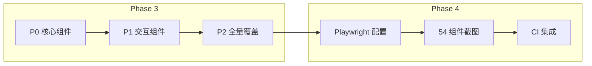

# 组件自动化测试 + 视觉回归测试方案

## 一、现状分析

### 现有组件特点

[`kangaroo-mobile`](../packages/kangaroo-mobile) 的 54 个组件绝大多数是 **Vant 4 的薄封装层**：

| 类型 | 示例 | 特点 | 占比 |
|------|------|------|------|
| **极简封装** | [`Tag.vue`](../packages/kangaroo-mobile/src/components/tag/Tag.vue) | 仅 `<VanTag v-bind="$attrs"><slot /></VanTag>` | ~30% |
| **属性转发** | [`Badge.vue`](../packages/kangaroo-mobile/src/components/badge/Badge.vue) | 显式声明 props → 转发到 Vant 组件 | ~50% |
| **带逻辑封装** | [`CountDown.vue`](../packages/kangaroo-mobile/src/components/count-down/CountDown.vue) | 有 ref / computed / emit 自定义逻辑 | ~20% |

### 测试优先级

```
高优先级（带自定义逻辑的组件）→ 中优先级（属性转发）→ 低优先级（极简封装）
```

---

## 二、Phase 3：组件自动化测试

### 技术栈

| 工具 | 用途 | 已安装 |
|------|------|--------|
| `vitest` | 测试运行器 | ✅ |
| `@vue/test-utils` | Vue 组件挂载/断言 | ✅ |
| `happy-dom` | DOM 环境（轻量） | ✅ |

### 测试策略

#### 分层测试

```
渲染测试 ─→ 默认渲染正确 / Props 传递正确 / Slots 渲染正确
交互测试 ─→ 点击/输入事件 / emit 事件验证
边界测试 ─→ 空状态 / 极限值 / 错误状态
```

#### 组件优先级矩阵

| 优先级 | 组件 | 原因 | 预估用例数 |
|--------|------|------|-----------|
| 🔴 P0 | `CountDown` | 时序逻辑（start/pause/reset） | 8 |
| 🔴 P0 | `Form` + `Field` | 表单验证、交互复杂 | 10 |
| 🔴 P0 | `Calendar` | 日期选择、范围选择逻辑 | 8 |
| 🟡 P1 | `Picker` / `TimePicker` / `Area` | 选择器交互 | 6 each |
| 🟡 P1 | `Uploader` | 文件上传交互 | 5 |
| 🟡 P1 | `Dialog` / `Toast` | 命令式调用 | 5 each |
| 🟡 P1 | `Search` | 输入/清除/搜索事件 | 5 |
| 🟢 P2 | `Badge` / `Tag` / `Cell` | 纯展示组件 | 3 each |
| 🟢 P2 | `Button` / `Switch` / `Rate` | 简单交互 | 3 each |
| 🟢 P2 | 其余 30+ 个组件 | 极简封装 | 2 each |

### 示例测试

```typescript
// Badge.test.ts
import { describe, it, expect } from 'vitest';
import { mount } from '@vue/test-utils';
import Badge from '../Badge.vue';

describe('Badge', () => {
  it('应渲染默认插槽内容', () => {
    const wrapper = mount(Badge, { slots: { default: '通知' } });
    expect(wrapper.text()).toContain('通知');
  });

  it('max 属性应截断数值', () => {
    const wrapper = mount(Badge, { props: { content: 100, max: 99 } });
    expect(wrapper.text()).toContain('99+');
  });

  it('content 为 0 且 show-zero 为 false 时应隐藏', () => {
    const wrapper = mount(Badge, { props: { content: 0, showZero: false } });
    expect(wrapper.find('.van-badge').exists()).toBe(false);
  });
});
```

### 目录结构

```
packages/kangaroo-mobile/src/components/
├── badge/
│   ├── Badge.vue
│   ├── index.ts
│   └── __tests__/
│       └── Badge.test.ts
├── count-down/
│   ├── CountDown.vue
│   └── __tests__/
│       └── CountDown.test.ts
└── ...
```

---

## 三、Phase 4：视觉回归测试

### 技术选型

| 方案 | 选择 |
|------|------|
| **Playwright** | ✅ 截图+交互+CI 一体化 |
| Puppeteer | ❌ |
| Chromatic | ❌ 收费 |

### 安装

```bash
pnpm add -D -w @playwright/test
npx playwright install chromium
```

### 组件快照测试

```typescript
// test/visual/badge.spec.ts
import { test, expect } from '@playwright/test';

test('Badge 默认渲染', async ({ page }) => {
  await page.goto('http://localhost:5173/playground/#/badge');
  await expect(page).toHaveScreenshot('badge-default.png');
});
```

### 全组件截图

```typescript
const COMPONENTS = [
  'badge', 'button', 'cell', 'count-down',
  'dialog', 'form', 'icon', 'tag',
  // ... 所有 54 个组件
];

COMPONENTS.forEach(name => {
  test(`${name} 组件截图`, async ({ page }) => {
    await page.goto(`http://localhost:5173/playground/#/${name}`);
    await page.waitForLoadState('networkidle');
    await expect(page).toHaveScreenshot(`${name}.png`);
  });
});
```

---

## 四、实施步骤

| 步骤 | 内容 | 预计测试数 |
|------|------|-----------|
| **3.1** | P0 组件测试（CountDown / Form / Calendar） | ~26 |
| **3.2** | P1 组件测试（Picker / Uploader / Dialog...） | ~32 |
| **3.3** | P2 组件测试（其余 30+ 组件基本覆盖） | ~60 |
| **4.1** | Playwright 安装 + 配置 + 首个截图 | — |
| **4.2** | 54 个组件全量截图 + baseline | 54 截图 |
| **4.3** | CI 流水线集成 | — |


