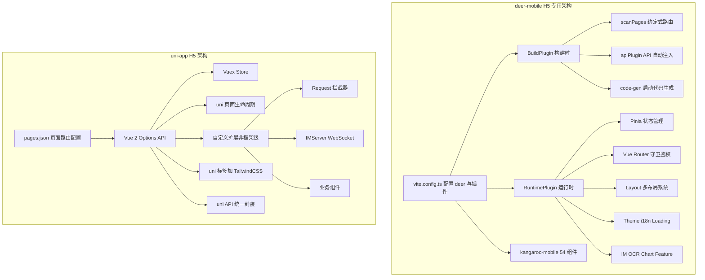
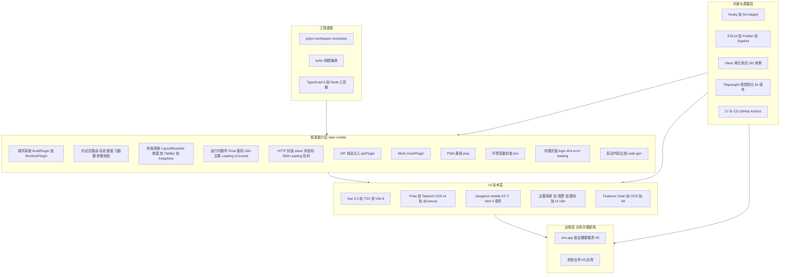
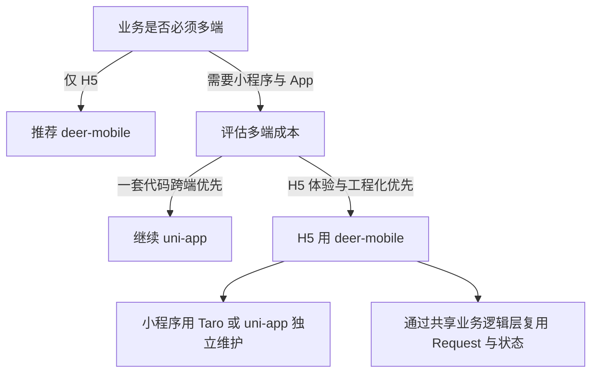
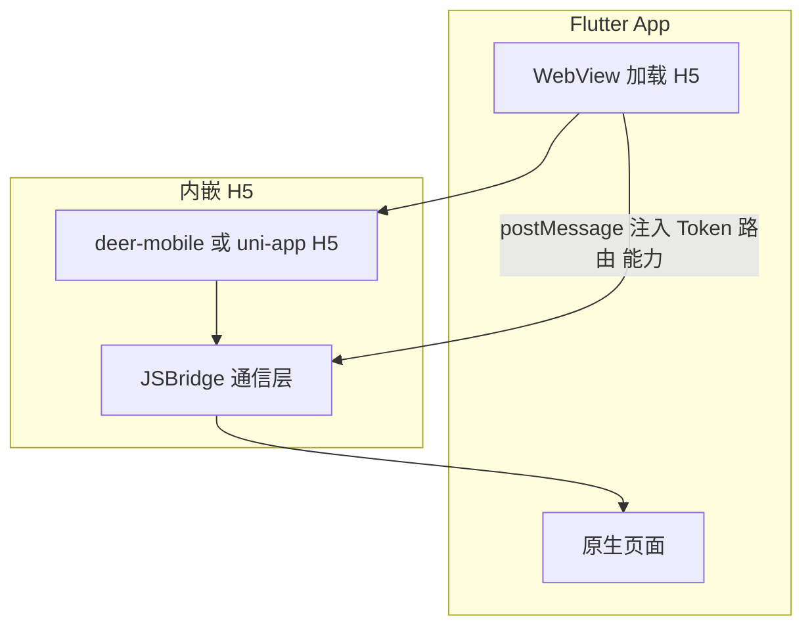
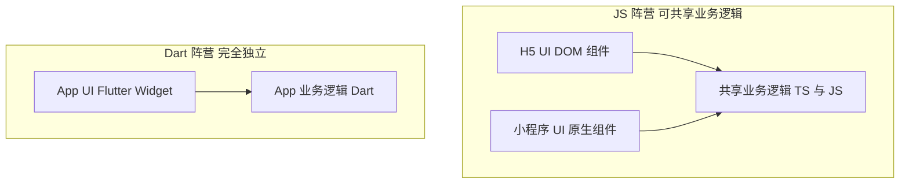
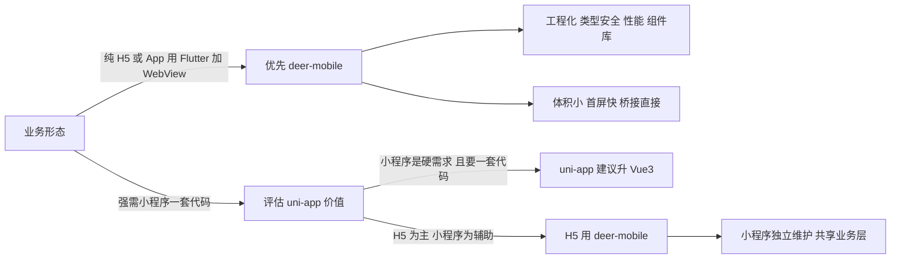

# Deer Mobile vs uni-app 做 H5 — 对比分析与决策建议

> **分析日期**：2026-08-06
> **分析对象**：
> - **deer-mobile**（当前框架，v0.1.31）：Vite 8 + Vue 3.5 + TypeScript 6，**对标 Umi 插件化 + 借鉴 Next.js 约定式路由、页面预加载与秒开性能理念** 的 H5 框架
> - **uni-app**（业务项目 `YH-RM-FD-H5-WEB-develop-2.0` 所用）：DCloud 跨端框架，Vue 2.6 + webpack 5 + Vuex 3
> **分析范围**：① 纯 H5 场景的通用对比；② 结合现有业务迁移背景的多端影响；③ **App 端采用 Flutter + H5（WebView 内嵌）** 前提下的优劣势
> **结论速览**：**纯 H5 场景下 deer-mobile 在工程化、类型安全、性能、企业级能力上全面占优；uni-app 的不可替代价值在于「一套代码多端」**。在 **App 用 Flutter + WebView 内嵌 H5** 的前提下，uni-app 的 App 端价值被 Flutter 替代，其多端价值收窄为「小程序一套代码」——这使 **deer-mobile 做 H5 的性价比进一步上升**。

## 目录

| # | 章节 | 要点 |
|---|------|------|
| 〇 | 行业参照：大厂如何处理多端 | 互联网大厂 + 头部医疗软件厂商的多端策略 |
| 一 | 背景与定位 | deer-mobile 双对标（Umi + Next.js）与 uni-app 现状 |
| 二 | 纯 H5 场景：全维度对比 | 20+ 维度对比、插件系统、复刻可行性、开盒即用架构全景 |
| 三 | 结合迁移背景：多端影响 | Flutter+H5、uni-app Vue2/Vue3、三端 UI 与业务逻辑解耦 |
| 四 | 使用 deer-mobile 的优势 | 秒开 / 框架级插件系统 / 组件库 / 测试等 |
| 五 | 使用 deer-mobile 的劣势 / 风险 | H5-only、自研生态、技能门槛 |
| 六 | uni-app 的致命劣势 | 蓝牙 / 后台运行 / 合规信创 / 原生能力 |
| 七 | deer-mobile 全部功能 vs uni-app 逐项对比 | 40 项功能含优势方标注 |
| 八 | 成本与工作量评估 | 方案成本 / 迁移工作量 / 双端维护 / 团队技能 |
| 九 | 决策建议 | 三场景决策 + 推荐拆分方案 |
| 十 | AI 接入可行性对比 | 三端解耦 vs uni-app 接入 AI 的可行性、时间成本 |
| 十一 | 结论 | 总结 + 三端工作量类比 |

---

## 〇、行业参照：大厂如何处理多端（App / 小程序 / H5）

> **核心结论先行**：主流大厂**普遍放弃「一套代码三端」的激进路线**，转向「**各端 UI 独立、共享业务逻辑层**」——与本文 3.7 的结论一致。

| 大厂 / 项目 | App 端 | 小程序端 | H5 端 | 多端策略 |
|---|---|---|---|---|
| 微信（kbone） | 原生 | 原生小程序 | Web 框架 | kbone：Web ↔ 小程序同构桥接，非统一 UI |
| 腾讯 | 原生 + 部分 RN | 原生小程序 | Vue/React + 自研 | 各端独立，Web 与小程序走 kbone 桥接 |
| 京东（Taro 出品方） | RN / 原生 | Taro 小程序 | Taro H5 | Taro（React）编译 H5 + 小程序；App 另用 RN/原生 |
| 美团 | 原生 / RN | 原生小程序 | Vue/React + 自研 | 小程序原生为主、H5 独立，业务逻辑层共享 |
| 阿里（rax） | Weex / 原生 | rax 小程序 | rax H5 / Web | rax 跨 H5 + 小程序 + Weex，App 非 Flutter |
| 闲鱼（阿里） | **Flutter** | 原生小程序 | Web | App 用 Flutter，小程序 / Web 各自独立 |
| 字节跳动 | 原生 / 自研 | 原生 + 自研 | Web | 自研跨端工具链 |
| 快手 | 自研（KFlutter 等） | 原生小程序 | Web | 自研跨端 |
| 百度（度小满等） | **Flutter** | 原生小程序 | Web | App 用 Flutter，小程序原生 |
| 滴滴 | 自研小程序容器 | 原生 | Web | 自研容器化多端 |
| 中小团队常见 | uni-app（App 壳 + WebView 显示 H5） | uni-app | uni-app | 「一套代码多端」路线，App 体验打折 |

**行业趋势总结**：

1. **大厂几乎不用 uni-app 处理核心业务多端**——因为 uni-app 的 App 端「壳 + WebView 显示 H5」体验差，不符合大厂对 App 体验的要求；大厂 App 用**原生 / RN / Flutter**，小程序用**原生或 Taro/rax**，H5 用 **Vue/React**。
2. **Taro 是「小程序 + H5」共享的主流方案**（React 阵营），但它**不跨 App**；App 另用 RN/原生/Flutter。
3. **Flutter 是「App 端 iOS/Android 跨平台」的主流**，但**不跨 H5/小程序**——与 3.7 的结论完全吻合：App（Dart）与 H5/小程序天然隔离。
4. **「共享业务逻辑层」是大厂多端的共识**：各端 UI 独立，通过 npm 包/仓库共享 API 定义、状态模型、工具函数、协议层。
5. **对本次选型的映射**：**H5 用 deer-mobile + App 用 Flutter + 小程序独立（Taro/原生）+ 共享业务逻辑层** 正是大厂主流路线；uni-app「一套代码多端」是中小团队/工具类产品的选择，代价是 App/H5 体验与工程化。

> **一句话**：你的「H5 用 deer-mobile + App 用 Flutter + 小程序独立 + 共享业务逻辑层」正是行业主流做法；uni-app 的「一套代码多端」反而不是大厂主流的路径。

### 医疗行业多端处理特点（补充参照）

**总体画像**：
- 医疗信息化（HIS / EMR / 互联网医院）是 **B 端 + C 端混合业态**；
- **B 端（医生 / 院内系统）以 Web（B/S）为主**，跑在浏览器或内嵌 WebView，**H5 是绝对主力**；
- **C 端（患者）** 为 App + 微信/支付宝小程序 + H5 三端并存；
- 行业特性：**合规（等保 / 医保 / 实名）/ 数据安全 / 国产化信创优先**，技术栈偏保守；对 App 原生能力（支付、人脸识别、推送）依赖高。

| 厂商类型 | 代表 | App 端 | 小程序端 | H5 端 | 策略 |
|---|---|---|---|---|---|
| 互联网医疗平台 | 平安好医生、微医、丁香医生 | 原生 / RN / Flutter | 原生或 Taro | Web 框架 | 多端独立，共享服务端 API |
| 云医院 / 互联网医院 | 卫宁、创业慧康、东华医为 | 原生 / 混合壳 | 原生 | Web（B/S 为主） | 院内 Web 为主，C 端独立 App + 小程序 |
| HIS / 智慧医院厂商 | 东软、金蝶医疗、众阳 | 原生（院内移动医护） | 原生 | Web（B/S 绝对主力） | 以 H5/Web 为核心，移动端为补充 |
| 中小医疗 SaaS | 各类 HIS / 随访 / 轻问诊 | uni-app 或原生 | uni-app 或原生 | Vue / uni | 部分用 uni-app 求快 |

**医疗行业关键差异点（与互联网大厂不同）**：
1. **B 端 Web 化更彻底**：医生 / 院内系统几乎全 Web（B/S），**H5 是主力形态**，很少用 App 承载；
2. **C 端多端独立**：患者端 App 需强原生能力（支付 / 医保 / 人脸 / 推送），小程序独立，H5 常做活动页 / 分享页；
3. **合规驱动保守**：对「一套代码多端」这类激进方案接受度低，宁可用**成熟稳定、可审计的独立栈**；
4. **对本次选型的含义**：医疗业态的 H5（院内 + 患者）占比高、质量要求高 → **用 deer-mobile 做 H5 与医疗行业「Web 化」趋势吻合**；App（患者端）用 Flutter 也符合头部医疗平台做法；小程序独立开发符合行业惯例。

---

## 一、背景与定位

### 1.1 deer-mobile（当前框架）

| 维度 | 现状 |
|------|------|
| **定位** | 企业级移动端 **H5 专用** 框架（**对标 Umi 插件化 + 借鉴 Next.js 约定式路由、页面预加载与极速启动理念**） |
| **技术栈** | Vite 8 + Vue 3.5 + TypeScript 6（全量类型安全，支持 TSX） |
| **路由** | 约定式扫描 [`scanPagesPlugin`](../packages/deer-mobile/plugins/scan-pages-plugin/index.ts)，支持动态/嵌套路由 + 路由元数据 |
| **插件系统** | BuildPlugin 8 钩子 + RuntimePlugin 12 钩子（[`types.ts`](../packages/deer-mobile/src/runtime/types.ts)） |
| **布局系统** | LayoutResolver + 嵌套布局链 + TabBar + KeepAlive + 滚动恢复 |
| **状态管理** | Pinia + persistedstate 自动持久化 |
| **HTTP** | 自研 HttpClient（axios）：token 注入、业务状态码、SM4 加密、Loading 队列、登录超时 |
| **UI 组件库** | [`kangaroo-mobile`](../packages/kangaroo-mobile) 54 个 Vant 4 二次封装组件 + 图标 + 暗黑主题 |
| **Feature 模块** | IM（`createIMPlugin` + `@im/sdk`）、OCR（`useCamera`/`useOCR`）、Chart（echarts） |
| **移动端适配** | [`flexible.ts`](../packages/deer-mobile/src/utils/flexible.ts:28) 运行时 rem 动态缩放（375 基准 / 960 上限） |
| **工程能力** | Mock、PWA 离线、i18n、运行时主题切换、vConsole、Vitest + Playwright 视觉回归 |
| **业务落地** | [`chs-app`](../apps/chs-app/vite.config.ts) 居民健康服务 H5，25+ 页面，TabBar 四 Tab（首页/沟通/消息/我的） |

**设计理念（对标与借鉴）**：

**A. 对标 Umi —— 插件化应用框架**
- **可编程插件系统**：构建时 `BuildPlugin` + 运行时 `RuntimePlugin` 双体系，基础设施可作插件横切复用（对齐 Umi 的 IApi 体系）。
- **Provider 嵌套**：`rootContainer` / `innerProvider` / `outerProvider`（对齐 Umi rootContainer）。
- **插件间通信 + Preset 组合**：`RuntimeContext.data` 数据空间、`registerMethod` / `callMethod`、多插件组合成一键 preset。

**B. 借鉴 Next.js —— 约定式 + 预加载 + 秒开**
- **文件系统约定式路由**：新增页面文件即出路由（`src/pages/*.tsx` 自动扫描，支持动态 / 嵌套 / 元数据，类 Next.js pages 约定）。
- **页面预加载（prefetch）**：路由级预取，页面代码预先加载，跳转即点即开、秒开切换。
- **启动秒开 / 极速打开**：静态 import 预载消除 HTTP 瀑布 + 并行 fetch 远程路由不阻塞启动，`router.isReady()` 仅 ~20ms，首屏极速可交互。
- **切页即时**：页面资源预载 + prefetch 双管齐下，路由切换零等待。
- **内置页面与错误处理**：login / 404 / error / loading 开箱即用（类 Next.js 内置 404/error 页）。
- **约定优先、零配置**（convention over configuration）：页面 / 布局 / API / Mock 目录约定即生效，业务方只写业务。

**C. Vite 生态 —— 现代工程化**
- 极速 HMR（Vite 8）+ 全量 TS/TSX 类型安全 + 按需 tree-shaking、体积可控。

### 1.2 uni-app（现有业务项目所用）

| 维度 | 现状 |
|------|------|
| **定位** | **跨端框架**（一套代码编译到 H5 / 微信、支付宝、百度、抖音、QQ、快手小程序 / App） |
| **技术栈** | Vue 2.6.x（Options API；uni-app 亦支持 Vue 3）、webpack 5（vue-cli-service）、Vuex 3 |
| **路由** | `pages.json` 静态声明 + uni 内置路由 |
| **HTTP** | luch-request / flyio + axios |
| **UI** | kangaroo-mobile v1 + @dcloudio/uni-ui |
| **移动端适配** | uni-app H5 内置运行时 rem 动态缩放（`rpxCalcBaseDeviceWidth: 375`） |
| **IM** | @im/sdk + @im/uni + socket.io 心跳/重连 |
| **特色** | 条件编译 `#ifdef H5 / MP-WEIXIN` 等处理多端差异；uni 统一 API（`uni.request`/`uni.setStorageSync` 等） |

---

## 二、纯 H5 场景：全维度对比

### 2.1 总体架构对比

### 2.2 全维度对比表

| 维度 | deer-mobile（H5） | uni-app（H5） | 结论 |
|------|-------------------|---------------|------|
| **跨端能力** | ❌ H5-only | ✅ H5 / 小程序 / App | uni-app 独有价值；纯 H5 无影响 |
| **构建工具** | Vite 8（rolldown 生产构建） | webpack 5（vue-cli-service） | deer-mobile 更快、更现代 |
| **Vue 版本** | Vue 3.5（Composition API） | Vue 2.6（Options API） | deer-mobile 领先一代 |
| **TypeScript** | ✅ 全量 TS + TSX | ❌ 未使用（JS + .d.ts） | deer-mobile 类型安全优势明显 |
| **JSX** | ✅ @vitejs/plugin-vue-jsx | ❌ 不支持 | deer-mobile 可写 TSX |
| **路由** | 约定式扫描 + 动态/嵌套 + 元数据 + 服务端路由合并 | pages.json 静态声明 | deer-mobile 更自动化 |
| **路由守卫** | ✅ auth-plugin 全局守卫 + 参数校验 | ❌ 无全局守卫 | deer-mobile 更强 |
| **状态管理** | Pinia + 自动持久化 | Vuex 3 手动持久化 | deer-mobile 更优 |
| **HTTP 封装** | 自研 HttpClient：token/状态码/SM4/Loading 队列/续约 | luch-request + 拦截器 | deer-mobile 更完善 |
| **API 模块** | 自动扫描 + DI 注入（`useApi()`） | 手动 import | deer-mobile 特色 |
| **UI 组件** | kangaroo-mobile 54 个 Vant 4 组件 | kangaroo-mobile v1 + uni-ui | deer-mobile 组件质量/维护度更高 |
| **移动端适配** | 运行时 rem 缩放（375 基准） | 内置运行时 rem 缩放（机制相同） | 两者等价（同源方案） |
| **平台 API** | 直接用浏览器 API（localStorage/WebSocket/camera） | uni 统一 API（跨端抽象） | H5 场景 deer-mobile 更直接、无抽象层 |
| **页面生命周期** | Vue 生命周期 + 插件钩子 | uni 生命周期（onLoad/onShow/onReachBottom） | H5 场景两者均够用 |
| **框架级插件系统** | ✅ BuildPlugin 8 构建时钩子 + RuntimePlugin 12 运行时钩子 + 插件通信/Provider 嵌套/路由守卫注册 | ❌ 无框架级插件 API；仅有 Vite/webpack 底层插件、easycom 组件自动引入、uni_modules 包、条件编译 | **deer-mobile 核心差异化优势** |
| **页面/导航配置** | routeMeta 元数据 + 布局系统 | pages.json 声明式（导航栏/下拉刷新） | uni-app 声明式更省心；deer-mobile 需自定义 |
| **多端差异处理** | 无此概念（纯 H5） | 条件编译 `#ifdef` | uni-app 为多端而生 |
| **PWA / 离线** | ✅ pwa() 插件封装 vite-plugin-pwa | ❌ 无内置（H5 需自行接） | deer-mobile 占优 |
| **Mock** | ✅ mockPlugin 中间件 | ❌ 无内置 | deer-mobile 占优 |
| **构建产物** | 纯 Web 静态资源（HTML/JS/CSS） | H5 产物带 uni 运行时；另产小程序包 | deer-mobile 更轻、部署更自由 |
| **包体积/性能** | 按需 tree-shaking + 静态 import，isReady ~20ms | uni 运行时较大，H5 体积偏高 | deer-mobile 占优 |
| **调试** | Vite HMR + vConsole 插件 | H5 一般，需配合小程序开发者工具 | deer-mobile H5 体验更佳 |
| **测试** | Vitest 单元 + Playwright 视觉回归 | 无/弱 | deer-mobile 占优 |
| **工程规范** | ESLint + Prettier + Husky + lint-staged（monorepo 根） | 有 ESLint/Stylelint | 基本持平 |
| **浏览器兼容** | 未显式声明 | `Android>=7, iOS>=9` | 均需明确基线 |

### 2.3 关键差异详述（H5 视角）

**① 构建与类型体系（差异最大）**
deer-mobile 是 Vite 8 + 全量 TypeScript + TSX，开发时类型提示、重构安全、HMR 秒级；uni-app 业务项目是 Vue 2.6 + webpack，构建慢、无类型保障。**纯 H5 开发体验 deer-mobile 显著领先。**

**② 路由与页面组织**
deer-mobile 用文件系统自动扫描生成路由（新增页面零配置，[`routeMeta`](apps/chs-app/src/pages/user/index.tsx:9) 声明标题/布局/鉴权）；uni-app 需手动维护 `pages.json`。H5 场景下约定式路由更省心，但 uni-app 的 pages.json 也带来了**声明式导航栏/页面级配置**（deer-mobile 需自己用布局系统实现）。

**③ 移动端适配——两者其实是同一方案**
之前分析确认 uni-app H5 是通过**运行时动态改 `<html>` font-size** 做 rem 缩放（非 build-time 插件）；deer-mobile 的 [`setupFlexible`](packages/deer-mobile/src/utils/flexible.ts:28) 与之完全同源（375 基准 / 960 上限）。**这一点不是差异项，而是等价项。**

**④ 平台 API**
纯 H5 下，deer-mobile 直接用浏览器 API（`localStorage`、`WebSocket`、`getUserMedia` 摄像头、PWA Service Worker），没有 uni 的跨端抽象层，**能力更底层、无额外运行时开销**；代价是没有 `uni.setStorageSync` 这类统一 API，跨端复用业务逻辑时需要自己抽一层。

**⑤ 体积与性能**
uni-app H5 产物包含 uni 框架运行时（处理多端抽象），体积偏大；deer-mobile 是纯 Vite 产物，可按需 tree-shaking、静态 import 优化，配合 PWA 离线缓存，**H5 性能与体积占优**。

**⑥ 框架级插件系统——uni-app 不具备的能力**
deer-mobile 是「可编程的插件化框架」（对标 Umi）：构建时 `BuildPlugin` 提供 8 个钩子（`modifyConfig`/`modifyRoutes`/`addRuntimePlugin`/`addEntryCode`/`addMiddleware` 等），运行时 `RuntimePlugin` 提供 12 个钩子（`onAppCreated`/`onRouterCreated`/`onRouterReady`/`onPageEnter`/`patchRoutes`/`onError` 等），并支持插件间通信（`RuntimeContext.data`）、Provider 嵌套、路由守卫注册——**基础设施可作为插件被横切复用**。uni-app 没有等价的**框架级插件 API**：它只能借助底层 Vite/webpack 插件、easycom 组件自动引入、uni_modules 功能包、条件编译、全局 mixin 等弱机制扩展，**无法以统一的钩子体系编排启动流程、注入路由、接入守卫**。这是 deer-mobile 在架构层面的核心差异化优势（IM / OCR / Chart 三个 Feature 正是以插件/组合式形式接入的）。

**⑦ 构建时插件 vs 运行时插件：什么功能用哪个？**

**判断原则**：
- **构建时插件**（Node.js 端，`BuildPlugin`）：凡是**要改产物、改配置、改路由表、注入外部 SDK/代码/中间件**的能力 → 在构建时注入。
- **运行时插件**（浏览器端，`RuntimePlugin`）：凡是**要在浏览器运行时干预流程**（应用初始化、Provider 包裹、路由守卫、埋点、动态路由、错误处理）的能力 → 在运行时注入。
- 两者通过 `addRuntimePlugin()` 打通：构建时插件可以把运行时插件注册进产物。

**功能映射表**：

| 功能需求 | 插件阶段 | 钩子 / API | deer-mobile 已实现示例 |
|---------|---------|-----------|----------------------|
| 修改应用配置 / 主题 | 构建时 | `modifyConfig` | `deer()` 的 config/theme/env |
| 调整 / 新增路由表 | 构建时 | `modifyRoutes` | `scanPagesPlugin` 注入 404 兜底 |
| 注入启动代码 / 入口 | 构建时 | `onGenerate` + `addEntryCode` / `addImport` | `setup-plugin` 的 code-gen |
| 注入 HTML 外链 SDK | 构建时 | `addHTMLScript` / `addHTMLHeadScript` | 注入 IM / 微信 / 统计 JSSDK |
| 开发期 Mock / 代理 | 构建时 | `addBeforeMiddlewares` | `mockPlugin` |
| 监听配置变更自动重生成 | 构建时 | `addTmpGenerateWatcherPaths` | 路由文件变更自动重扫 |
| 构建产物处理（PWA / manifest） | 构建时 | Vite 插件封装 | `pwa()` 插件 |
| 全局 Provider 包裹 | 运行时 | `rootContainer` / `innerProvider` / `outerProvider` | `themeRuntimePlugin`（CSS 变量 Provider） |
| 应用初始化注入 | 运行时 | `onAppCreated` | pinia / i18n / api / IM 插件 |
| 路由守卫（鉴权 / 登录跳转 / 参数校验） | 运行时 | `onRouterCreated` + `addRouterGuard` | `authRuntimePlugin`、`loadingRuntimePlugin` |
| 启动后预取 / 初始化 | 运行时 | `onRouterReady` / `onBeforeMount` / `onMounted` | — |
| 页面埋点（PV / 停留时长） | 运行时 | `onPageEnter` / `onPageLeave` / `onRouteChange` | page-stats 示例 |
| 基于权限动态路由 | 运行时 | `patchRoutes` | — |
| 全局错误上报 | 运行时 | `onError` | — |
| 动态布局切换 | 运行时 | `addLayout` / `setLayout` | 多租户布局场景 |

**真实功能拆解示例（埋点统计 + 登录态）**：
- **构建时插件**：`addHTMLScript` 注入统计 SDK；`modifyRoutes` 为所有页面注入统一 `routeMeta`（title/keepAlive）。
- **运行时插件**：`onPageEnter` 上报 PV；`onRouterCreated` 注册守卫校验登录态并跳转登录页；`onError` 上报异常。
- 这两类插件可通过 `describe()` + `registerMethod`/`callMethod` 组合成一个「业务 preset」，在 `deer({ plugins: [...] })` 一键启用——**这正是 uni-app 用 mixin/手写拦截器难以体系化做到的能力**。

### 2.4 反向验证：用 uni-app 复刻 deer-mobile 复杂能力的可行性

> **问题**：deer-mobile 的这些复杂能力，能否用 uni-app 实现？难度多大？

**A. 业务能力 —— uni-app 可实现，难度低-中**

| deer-mobile 能力 | uni-app 实现方式 | 难度 | 说明 |
|---|---|---|---|
| HTTP 封装（拦截器/SM4/Loading 队列/token） | luch-request/flyio + 拦截器（纯 JS） | 🟢 低 | 业务项目已验证 |
| 鉴权守卫 | mixin + 自定义 navigate 封装判断 | 🟡 中 | 能实现但分散、无统一守卫 |
| i18n | @dcloudio/uni-i18n（Vue3 可 vue-i18n） | 🟢 低 | 业务项目已有 |
| 运行时主题切换 | H5 用 CSS 变量；小程序端受限 | 🟡 中 | H5 低、跨端高 |
| IM / WebSocket | uni.connectSocket + @im/uni（已有） | 🟢 低 | 业务项目已验证 |
| OCR / 摄像头 | uni.chooseImage + 权限封装 | 🟢 低-中 | uni 跨端封装较好 |
| vConsole | H5 注入 | 🟢 低 | — |
| Mock | dev server 中间件或 axios 层 mock | 🟢 低-中 | 可做 |
| Loading 动画 | H5 自建 / uni.showLoading | 🟢 低 | — |

**B. 工程能力 —— 可实现但受 uni 编译器约束，难度中**

| deer-mobile 能力 | uni-app 实现方式 | 难度 | 说明 |
|---|---|---|---|
| 约定式路由 | 脚本/Vite 插件扫描 pages 生成 pages.json | 🟡 中 | 生成可行，但无动态路由 |
| 布局系统（嵌套/TabBar/KeepAlive） | 自定义组件 + 原生 tabBar；小程序无 KeepAlive | 🟡 中 | 嵌套/缓存体验难对齐 |
| API 自动注入 | node 脚本扫描或手动注册 | 🟡 中 | 可近似 |
| PWA 离线 | 手动接入 workbox/vite-plugin-pwa（uni 不内置） | 🟡 中 | 需操作 uni 编译产物 |

**C. 框架级能力 —— 难实现或不可对齐，难度高**

| deer-mobile 能力 | uni-app 可行性 | 难度 | 说明 |
|---|---|---|---|
| 框架级插件系统（Build 8 + Runtime 12 + 通信/Provider/守卫） | ❌ 无构建时插件 API（Vue2 仅 webpack 插件）；只能自建「伪 PluginManager」用 mixin/生命周期分发 | 🔴 高 | 深度与一致性达不到、无框架保障 |
| 运行时动态路由 / 服务端路由合并 | ❌ 小程序端不支持动态 addRoute；H5 端 hack 有限 | 🔴 高 | 跨端几乎不可行 |
| Provider 嵌套（rootContainer/innerProvider） | ⚠️ 用全局 mixin/自定义组件近似 | 🔴 高 | 无标准机制 |
| 路由守卫统一注册 | ⚠️ mixin 分散判断 | 🟡 中-高 | 无守卫体系 |
| Vite 8 构建优化（rolldown/tree-shaking/静态 import） | ⚠️ 受限于 uni 编译器（Vue2 是 webpack） | 🔴 高 | 无法对齐 |
| 全量 TS + TSX | ⚠️ uni-app Vue3 支持 TS，但 TSX 有限 | 🟡 中-高 | Vue2 无 |
| Vitest + Playwright 视觉回归 | ⚠️ 业务可测；组件测试需 mock uni 内置组件 | 🟡 中-高 | H5 可行 |

**结论**：
- **约一半能力（业务层）uni-app 确实都能实现**，因为这些本质是业务代码，且业务项目已验证（HTTP / IM / i18n 等）。
- **但框架级 / 工程级能力（插件系统、动态路由、Provider 嵌套、构建优化、测试体系）要么受限于 uni-app 编译器/运行时无法对齐，要么只能「自建一套更弱的轮子」**——成本高、可持续性差，且未来升级 uni-app 还要重新适配。
- **本质**：uni-app 是「编译器 + 跨端运行时」，价值在跨端编译而非应用框架能力；deer-mobile 是「可编程应用框架」。**用 uni-app 复刻 deer-mobile = 在受编译器约束的环境里重复造一个更弱、更不稳定、与上游绑定更深的轮子**——这正是 deer-mobile 的架构价值所在。

### 2.5 deer-mobile 整体架构全景（开盒即用）

**开盒即用能力清单（接入 `deer()` 插件即可获得）**：

| 开盒能力 | 说明 |
|---|---|
| **工程底座** | pnpm workspace monorepo + turbo 一键 build/dev/test；TypeScript 6 全量类型 |
| **约定式路由** | 新增页面文件即出路由，支持动态 / 嵌套 / 元数据 / 参数校验 |
| **多布局** | LayoutResolver + 嵌套链 + TabBar + KeepAlive + 滚动恢复，routeMeta 一行指定 |
| **插件式注入** | BuildPlugin 8 构建时 + RuntimePlugin 12 运行时，即插即用、可组合 preset |
| **请求层** | HttpClient：自动 token / 业务状态码 / SM4 加密 / Loading 队列 / 登录超时 |
| **API 自动注入** | apiPlugin 扫描 src/api 生成 virtual:api，useApi 类型安全调用 |
| **鉴权** | authRuntimePlugin 全局守卫 + 页面级 auth，未登录自动跳登录页 |
| **状态管理** | Pinia + persistedstate 自动持久化，useUserStore 开箱即用 |
| **国际化** | vue-i18n 框架层 + kangaroo UI 层双语言，语言切换自动同步 |
| **主题** | 品牌色 CSS 变量 + 暗黑模式，useTheme 运行时切换 |
| **Mock** | mockPlugin 开发期 API 模拟，mock 目录自动扫描 |
| **PWA** | pwa() 零配置离线 + manifest + 自动更新 |
| **Loading** | deer:loading 顶部进度条，路由切换自动显隐 |
| **Features** | Chart（echarts）/ OCR（实名认证）/ IM（@im/sdk 即时通讯）按需启用 |
| **UI 组件** | kangaroo-mobile 54 个 Vant 4 组件 + 图标 + UI i18n |
| **质量保障** | Husky + lint-staged + ESLint/Prettier + Vitest + Playwright + CI/CD |

> **一句话**：业务方只需在 vite.config 里配置 `deer({ ... })` 并写页面 / 组件，其余工程化、框架能力、质量保障全部开盒即用——这是 uni-app「编译器」路线无法提供的「可编程应用框架」体验。**传统 H5 靠手写拼装，deer-mobile 靠框架赋能：把 H5 从「能跑的网页」提升到「企业级、可维护、秒开的应用」，是开发方式的代际变革。**

---

## 三、结合迁移背景：多端影响分析

### 3.1 现状：业务项目是多端架构

现有 `YH-RM-FD-H5-WEB-develop-2.0` 的目标平台是 **H5 + 微信/支付宝/百度/抖音/QQ/快手小程序 + App**。这是它选择 uni-app 的根本原因——**一套代码多端**。

### 3.2 若 H5 切到 deer-mobile 的多端影响

| 影响点 | 说明 |
|--------|------|
| **H5 端** | 完全可用，且工程化/性能/类型安全更强（chs-app 已验证） |
| **小程序端** | ❌ deer-mobile 不产小程序包；小程序需另建项目（uni-app 或 Taro/原生），**H5 与小程序的业务代码需各自维护** |
| **App 端** | ❌ 同理，App（H5 套壳可勉强复用 H5，但原生能力弱） |
| **统一 API 层** | uni 的 `uni.request/setStorageSync/connectSocket` 等统一 API 是跨端基础；deer-mobile 没有，跨端时业务侧 API 调用要各写一份 |
| **IM 能力** | 好消息：deer-mobile 已内置 `createIMPlugin`（`@im/sdk` + web-socket/web-request 插件），与业务项目 `@im/sdk` 同源，**H5 端 IM 可平滑迁移** |
| **条件编译** | uni-app 用 `#ifdef H5/MP-WEIXIN` 处理端差异；deer-mobile 无此机制，端差异靠「独立项目」隔离 |

### 3.3 多端决策树

### 3.4 三种可行方案对比

| 方案 | 说明 | 优点 | 代价 |
|------|------|------|------|
| **A. 全量 uni-app** | 维持现状，H5 也留在 uni-app | 多端一套代码，改动最小 | H5 工程化弱、Vue2 旧、性能/体积差；即便 uni-app 升 Vue3 也难追 Vite8 工程体验 |
| **B. H5 用 deer-mobile + 小程序独立维护** | H5 迁移到 deer-mobile；小程序另起项目（Taro/uni-app），共享业务逻辑层 | H5 体验/工程化最优；两端各用最适合的工具 | 两套代码、两套维护；需抽共享层（request/状态/工具）控制成本 |
| **C. H5 用 deer-mobile + 小程序渐进复用** | H5 先行，小程序在需要时再建，尽量复用 API/Store/工具 | 分阶段投入、风险可控 | 依赖团队自建共享层纪律 |

### 3.5 前提更新：App 端采用 Flutter + H5（WebView 内嵌）

> **新增前提**：App 不再由 uni-app 编译原生包，而是 **Flutter 原生壳 + WebView 内嵌 H5**。此前提直接削弱了 uni-app 的 App 端价值。

#### 影响分析

| 影响点 | 说明 |
|--------|------|
| **uni-app 的 App 端价值消失** | App 由 Flutter 承担，uni-app 的 App 编译能力不再被需要；其多端价值收窄为「**小程序一套代码**」 |
| **H5 角色升级为 App 核心载体** | Flutter 壳内 WebView 加载 H5，H5 的性能、体积、与原生桥接能力权重显著上升 |
| **JSBridge 成为关键** | Flutter ↔ H5 需通过 postMessage / JSSDK 注入通信（登录态、Token、路由、返回键、摄像头、文件等能力） |
| **首屏加载更敏感** | WebView 场景对包体积与首屏时间更敏感，H5 越轻越好 |

#### Flutter WebView 场景下 uni-app H5 的优劣

| 维度 | 结论 |
|------|------|
| **优势** | 若小程序也要共享同一套代码，uni-app 可同时产出 H5 + 小程序，少维护一套实现 |
| **劣势** | 产物带 uni 运行时，体积大、首屏慢（WebView 下更吃亏）；`uni.request`/`uni.xxx` 封装的 API 与 Flutter JSBridge 之间多一层适配；Vue2 旧、工程化弱 |

#### Flutter WebView 场景下 deer-mobile H5 的优劣

| 维度 | 结论 |
|------|------|
| **优势** | 纯浏览器 DOM + 标准 WebView 集成直接，JSSDK 注入/postMessage 无障碍；体积小、首屏快，契合 WebView 诉求；工程化/类型/性能强 |
| **劣势** | 若还需小程序则需另建项目（可通过共享业务逻辑层控制成本） |

### 3.6 补充对比：uni-app 继续用 Vue2 vs 升级 Vue3

> **背景**：若决定保留 uni-app，还需在「继续 Vue 2.6」与「升级 uni-app Vue 3 + Vite」之间选择。当前业务项目是 Vue 2.6 + webpack。

#### 对比表

| 维度 | uni-app + Vue 2（现状） | uni-app + Vue 3 + Vite | 结论 |
|------|------------------------|------------------------|------|
| **Vue 版本** | Vue 2.6（Options API；Vue 2 已停止新功能开发，进入维护期） | Vue 3.x（Composition API + `<script setup>`，官方主推） | Vue3 是唯一演进方向 |
| **构建工具** | webpack 5（vue-cli-service，构建慢） | Vite（uni-app CLI + vite 插件，HMR 快） | Vue3 工程体验更好 |
| **状态管理** | Vuex 3（需手动持久化） | Pinia / Vuex 4（官方推荐 Pinia） | Vue3 更优 |
| **TypeScript** | 支持弱（Options API 下需额外装饰器方案） | 原生 TS 支持好、类型推断完整 | Vue3 明显占优 |
| **H5 性能** | 虚拟 DOM 旧、运行时体积大 | 更快虚拟 DOM + tree-shaking、体积更小 | Vue3 更优 |
| **H5 产物** | 带 uni 运行时 + Vue2 runtime，体积大、首屏慢 | 产物更小、首屏更快，接近 Vite 工程体验 | Vue3 更优（但仍带 uni 运行时） |
| **跨端支持** | 各端支持成熟稳定（多年打磨） | 早期个别端滞后，现已基本齐全（微信/支付宝/百度/抖音/QQ/快手/App） | 基本对齐，个别边缘端需验证 |
| **生态与维护** | DCloud 已停止新增能力，插件/组件市场以 Vue3 优先 | 主推方向，新组件（uv-ui）与文档以 Vue3 优先 | Vue3 长期更安全 |
| **组件库兼容** | 业务项目 kangaroo-mobile v1（Vue2 版） | 需换 Vue3 版组件库（kangaroo-mobile Vue3 版 / Vant / uv-ui） | **升级最大工作量在组件层** |
| **迁移成本** | — | 需改造：Options→Composition、v-model 与 API 变更、filter 移除、Vuex→Pinia、组件库更换 | 中等偏高，业务代码越多成本越高 |
| **与 deer-mobile 的差距** | H5 端差距很大（Vue2+webpack 全面落后） | H5 端差距缩小，但仍带 uni 运行时与跨端抽象 | 即便升 Vue3，纯 H5 仍不如 deer-mobile |

#### 结论

- **若保留 uni-app**：**强烈建议升级到 Vue 3 + Vite**，否则 H5 端持续承受 Vue2 技术债 + 停止维护的双重风险；升级时**组件库迁移是最大工作量**。
- **但即便 uni-app 升到 Vue 3**，纯 H5 场景其工程化/体积/性能仍弱于 deer-mobile（Vite 8 原生 + 纯 Web 产物），只是缩小差距、无法抹平。
- **因此该对比不影响主结论**：能接受多端折中的前提下，H5 仍以 deer-mobile 为最优。

### 3.7 关键前提：三端 UI 与业务逻辑均解耦，跨端可共享范围极小

> **用户确认的技术事实**：三端不仅 UI 层完全不同、天然解耦，**业务逻辑层也分两个语言阵营**，跨端真正能共享的范围非常小。

**三端技术栈全景**：

| 端 | 语言 | 渲染层 | UI 组件体系 |
|---|---|---|---|
| H5 | TS / JS | WebKit 浏览器 DOM（HTML/CSS/JS） | DOM 组件（Vant / kangaroo-mobile / Tailwind） |
| 小程序 | TS / JS | 小程序原生视图层（WXML 自定义组件，DTS 声明式） | 小程序原生组件库 |
| App | **Dart** | Flutter 自绘（Skia / Impeller） | Flutter Widget |

**要点 1：uni-app 的 H5 / App 渲染真相——体验打折**
- uni-app **强制把 uni 标签编译成 H5（HTML）**，浏览器里显示的就是这套 H5；
- uni-app 的 App 端若采用 **H5 模式 = 原生壳 + WebView 套壳显示 H5**，**性能 / 交互 / 滚动 / 原生能力调用都明显差于原生**，体验明显打折；
- 也就是说 uni-app 跨端并不等于「三端都最优体验」，App 端往往是「能用但体验差」，H5 端也只是「能跑但不快」。

**要点 2：UI 层完全不耦合**
- Vant 是 DOM 组件进不了小程序；小程序自定义组件进不了 Flutter；Flutter Widget 也变不成 H5 DOM；
- 三端 UI 各写各的，**任何框架都无法让 UI 跨端复用**（uni-app 的 uni 标签也只是编译映射，复杂交互仍需各端适配）。

**要点 3：业务逻辑层也分两个语言阵营，App 完全隔离**
- **JS 阵营**：H5（TS/JS）+ 小程序（TS/JS）→ 业务逻辑（API / 状态 / 工具 / IM 配置）**可以共享**，这是 7.3「共享业务逻辑层」的**真实边界**；
- **Dart 阵营**：App（Flutter/Dart）→ **H5 / 小程序的 TS/JS 业务逻辑与工具方法完全无法复用**，必须用 Dart 重写；
- 所以「共享业务逻辑层」只覆盖 **H5 + 小程序**，**App 端无论 UI 还是业务逻辑都需 Dart 独立实现**。

**由此得出的结论**：

1. **跨端可复用的只有「H5 ↔ 小程序」的业务逻辑**（同为 TS/JS）；**App（Flutter/Dart）在 UI 与业务逻辑上都与另外两端完全隔离**，不存在复用关系。
2. **uni-app 的「一套代码多端」实际价值被进一步压缩**：它只解决了「业务逻辑 + 编译映射」，UI 层仍要各端适配，且 App 端 H5 模式体验差、原生模式又是另一套工程。
3. **对选型的含义**：
   - **H5 端**：UI 必须独立写，直接用最适合 H5 的技术栈（deer-mobile + Vant），体验与工程化最优；
   - **App 端**：Flutter 自绘 + Dart 业务逻辑，与 H5 完全无关，**H5 用什么框架对 App 毫无影响**（也避免了 uni-app「壳 + WebView 套壳显示 H5」的差体验）；
   - **小程序端**：UI 独立（原生组件 / Taro），业务逻辑可与 H5 共享 TS/JS。
4. **对 7.3「共享业务逻辑层」的边界修正**：共享层的适用范围是 **H5 + 小程序**（JS/TS），**不含 App**——App 端需要独立的 Dart 业务实现；实际维护成本 = 「H5 + 小程序」双份 JS 实现 + 「App」一份 Dart 实现。

---

## 四、使用 deer-mobile 的优势

1. **现代技术栈，全量类型安全**：Vite 8 + Vue 3.5 + TS 6 + TSX，重构安全、HMR 快、开发体验领先 uni-app（Vue2/webpack）一代。
2. **企业级工程能力开箱即用**：约定式路由、双插件系统（Build 8 + Runtime 12）、多布局 + TabBar + KeepAlive、Pinia 持久化、鉴权守卫、i18n、运行时主题、Loading、SM4 加密、业务状态码体系。
3. **UI 组件库齐全**：kangaroo-mobile 54 个 Vant 4 组件，主题/暗黑/图标/UI 层 i18n 一应俱全，质量与维护度高于业务项目 v1 组件库。
4. **框架级插件系统（uni-app 不具备）**：BuildPlugin 8 构建时钩子 + RuntimePlugin 12 运行时钩子 + 插件间通信/Provider 嵌套/路由守卫注册，基础设施可作为插件横切复用；已沉淀 IM / OCR / Chart 三个 Feature 模块（`features/`）按统一模式接入。uni-app 无等价框架级插件 API，只有底层构建插件与 easycom 等弱机制。
5. **H5 秒开 · 性能与体积可控**：页面预加载（prefetch）+ 静态 import 预载消除 HTTP 瀑布 + 并行初始化（isReady ~20ms），启动秒开、切页即时；按需 tree-shaking + PWA 离线缓存，体积与体验可控。
6. **测试完备**：Vitest 单元测试（192 用例）+ Playwright 视觉回归，可长期保障质量。
7. **部署自由**：纯 Web 静态产物，任意 CDN / 服务器 / 网关即可上线，无 uni 运行时体积包袱。
8. **与团队技能匹配**：统一 Vue 3 技术栈；TSX 支持意味着未来可平滑演进（React 组件/更复杂工程），无跨端抽象的心智负担。
9. **真实业务验证**：chs-app 已落地 25+ 页面，IM / OCR / 实名 / 健康档案等关键链路已跑通。

---

## 五、使用 deer-mobile 的劣势 / 风险

1. **H5-only，无多端能力**：不产小程序包 / App 包；若业务必须多端，需另建项目，两套代码维护。
2. **自研框架，生态小**：没有 uni-app 的社区、插件市场、海量教程；招聘/上手/踩坑成本高，长期依赖团队自身维护。
3. **无跨端统一 API 抽象**：需直接用浏览器 API；若未来跨端，业务侧 API 调用需各端重写（或自建能力层）。
4. **页面级配置缺失**：没有 pages.json 式声明（原生导航栏、下拉刷新等页面级配置），需通过布局系统与 routeMeta 自行实现。
5. **框架仍在迭代**：成熟度约 60-95%，个别能力（如某些业务组件、兼容性边界）需团队自补 Bug 与特性。
6. **浏览器兼容基线未声明**：需要显式定义 Android / iOS 版本策略并补充 polyfill。
7. **深度定制门槛**：充分利用插件系统/虚拟模块需具备 Vite 插件开发能力，团队需具备相应技能。

---

## 六、uni-app 的致命劣势（设备能力 / 合规 / 后台运行）

> 前面章节侧重架构 / 工程层面，本节聚焦 **uni-app 在「设备能力 / 合规 / 后台」上的致命劣势**——尤其在医疗 / 健康场景（蓝牙医疗设备、后台采集、合规审计）可能成为硬伤。

**① 蓝牙（BLE）——医疗硬件场景的致命点**
- uni-app App 端（壳套 WebView）蓝牙能力极弱：WebView 内几乎无法稳定调用原生蓝牙，需自写原生插件（uni 原生插件开发门槛高、维护成本高）；
- 复杂 BLE 场景（多设备连接、双模、低功耗协议、固件升级 OTA）在 uni-app 上基本不可行；
- 对比：**原生 App（Flutter / 原生 + 原生蓝牙插件）** BLE 能力强、稳定；H5 端 Web Bluetooth API 支持有限（Chrome 限定、需 HTTPS），医疗场景基本不可依赖；
- **结论**：若业务涉及医疗设备 / 可穿戴连接（血压计 / 血氧 / 体脂秤等），uni-app 与 H5 都无法胜任，必须原生——这是架构级致命点。

**② 后台运行——壳套 WebView 的硬伤**
- uni-app App（H5 模式）页面基于 WebView，**切后台即挂起**，无法执行后台任务；
- 后台定位、后台播放、后台下载、离线推送接收、常驻心跳（IM 收消息）都不可靠；
- 对比：**原生 App** 可通过 iOS/Android 后台模式常驻（定位 / 播放 / 推送 / 前台服务）；
- **结论**：需要后台能力（尤其医疗实时监测、IM 保活）时必须原生。

**③ 合规 / 信创 / 供应链**
- **合规审计**：医疗 / 政企对等保、数据本地化、隐私合规（个保法）、代码审计要求高；uni-app 的跨端抽象与 HBuilderX 云打包增加审计黑盒；
- **数据出境 / 供应链**：DCloud 云打包涉及代码上传，政企 / 医疗项目常有「去 DCloud 化」诉求；DCloud 非国产信创第一梯队；
- **打包可控性**：本地离线打包配置繁琐、版本锁定风险，云打包可控性差；
- 对比：自研 / 原生栈产物可控、可审计、可信创适配。

**④ 原生能力 / 系统级能力**
- 推送（离线推送需各厂商 SDK）、定位（后台）、生物识别（指纹 / 人脸）、NFC、支付（微信 / 支付宝 / 银联）、相机深度调用、传感器——uni-app App 端弱或需原生插件；
- 原生（Flutter / 原生）系统级能力完整、稳定。

**⑤ 性能与稳定性**
- WebView 渲染性能弱于原生（长列表、动画、内存）；
- 不同 ROM（小米 / 华为 / OPPO）兼容性、后台保活、推送通道适配差。

**⑥ 安全**
- WebView 易 JS 注入、抓包、反调试难、代码混淆弱；原生可做强加固（加固 / 混淆 / 防调试）。

**对本次选型的含义**：
- 这些「致命劣势」**全部落在 uni-app 的 App 端**（H5 端本就是 Web，不存在蓝牙 / 后台 / 原生能力诉求）；
- 你的方案 **App 用 Flutter 原生**正好绕开这些硬伤（蓝牙 / 后台 / 合规 / 原生能力都归 Flutter 承担）；
- H5 端（deer-mobile）本就不需要这些能力（浏览器场景）；小程序端（uni-app）本身也受平台限制（小程序蓝牙 / 后台同样受限，但那是平台特性、非 uni-app 独有）。

> **一句话**：uni-app 的致命劣势集中在 **App 端设备能力（蓝牙 / 后台 / 合规 / 原生）**，而这些恰恰由「App 用 Flutter 原生」的方案天然规避——这是拆分方案的另一大价值点。

---

## 七、deer-mobile 全部功能 vs uni-app 逐项对比

> 数据来源：[`framework-comparison.md`](plans/framework-comparison.md) 的能力清单，逐项对照 uni-app 的对应能力/实现方式、可实现性与难度。

### 7.1 框架核心层（deer-mobile vs uni-app）

| deer-mobile 功能 | 优势方 | uni-app 对应能力 / 实现方式 | 可实现性 | 难度 | 说明 |
|---|---|---|---|---|---|
| 单元测试框架（Vitest 4，192 tests） | 🦌 deer-mobile 占优 | Jest/vitest 测业务逻辑 | ⚠️ 部分 | 🟡 中-高 | uni 内置组件/生命周期需大量 mock，成本高于纯 Vue3 |
| 组件测试自动生成脚本 | 🦌 deer-mobile 占优 | 无对应；需自建脚本 + mock | ⚠️ | 🟡 中-高 | 需处理 uni 内置组件 mock |
| 视觉回归测试（Playwright，34 组件截图） | 🦌 deer-mobile 占优 | H5 端 Playwright；小程序需专属框架 | ⚠️ 部分 | 🟡 中 | 仅 H5 可对齐，小程序复杂 |
| 运行时主题切换（CSS 变量 + 暗黑 + useTheme） | 🦌 deer-mobile 占优 | H5 CSS 变量可行；小程序端 CSS 变量受限 | ⚠️ | 🟡 中 | 跨端方案不统一 |
| Vite 8 构建（rolldown/TS6） | 🦌 deer-mobile 占优 | Vue3 版基于 Vite 但受 uni 编译器封装；Vue2 是 webpack | ⚠️ | 🔴 高 | 无法完全对齐 |
| 插件系统 v5（Build 8 + Runtime 12） | 🦌 deer-mobile 占优 | 无框架级插件 API；只能自建伪 PluginManager | ❌ 不可对齐 | 🔴 高 | 框架级差异核心 |
| 约定式路由（src/pages 扫描） | 🦌 deer-mobile 占优 | 脚本生成 pages.json | ⚠️ 部分 | 🟡 中 | 生成可行，无运行时动态 |
| 动态路由（[id].tsx） | 🦌 deer-mobile 占优 | pages.json 无动态段；需脚本列举 | ⚠️ | 🟡 中 | — |
| 路由元数据（routeMeta） | 🦌 deer-mobile 占优 | pages.json 部分（style/navigationStyle） | ⚠️ 部分 | 🟡 中 | 无统一元数据 |
| 路由参数校验 | 🦌 deer-mobile 占优 | 无内置；onLoad 手写校验 | ⚠️ | 🟡 中 | 分散 |
| 嵌套路由 | 🦌 deer-mobile 占优 | pages.json 无嵌套；自定义布局实现 | ⚠️ | 🟡 中-高 | H5 勉强，小程序难 |
| 多布局自动扫描 | 🦌 deer-mobile 占优 | 无；手动管理布局组件 | ⚠️ | 🟡 中 | — |
| 布局系统（Resolver/嵌套/插槽/KeepAlive/滚动恢复） | 🦌 deer-mobile 占优 | 自定义组件近似；小程序无 KeepAlive | ⚠️ 部分 | 🟡 中-高 | 缓存/嵌套体验难对齐 |
| HTTP 封装（token/状态码/SM4/Loading 队列） | ⚖️ 持平（能力等价） | luch-request/flyio + 拦截器 | ✅ | 🟢 低-中 | 业务项目已验证 |
| API 自动扫描 + DI 注入 | 🦌 deer-mobile 占优 | node 脚本扫描或手动注册 | ⚠️ | 🟡 中 | 可近似 |
| 鉴权系统（守卫 + page-level auth） | 🦌 deer-mobile 占优 | mixin + navigate 封装判断 | ⚠️ | 🟡 中 | 分散、无统一守卫 |
| 内置页面（login/404/error/loading） | 🦌 deer-mobile 占优 | 需手写；无 404 兜底概念 | ⚠️ | 🟢 低-中 | — |
| 代码注入（virtual:setup-app 生成） | 🦌 deer-mobile 占优 | 无虚拟模块机制；手写 main.js 逻辑 | ⚠️ | 🟡 中 | — |
| Mock API（mockPlugin 中间件） | ⚖️ 持平（都能实现） | dev server 中间件或 axios 层 mock | ✅/⚠️ | 🟢 低-中 | 可做 |
| PWA 离线（pwa() 封装） | 🦌 deer-mobile 占优 | 手动接入 workbox，uni 不内置 | ⚠️ | 🟡 中 | 需操作 uni 编译产物 |
| 状态管理（Pinia + persist） | 🦌 deer-mobile 占优 | Pinia 支持 + 自定义持久化；Vue2 用 Vuex3 | ✅（Vue3）/⚠️（Vue2） | 🟢 低-中 | uni Vue2 侧是 Vuex3 手动持久化 |
| 脚手架 CLI（create-deer-mobile） | ⚖️ 持平（形态不同） | HBuilderX / uni CLI 模板 | ✅ | 🟢 低 | 不同形态 |
| 启动性能优化（并行 fetch + 静态 import，isReady ~20ms） | 🦌 deer-mobile 占优 | 无远程路由；启动流程由 uni 运行时控制 | ⚠️ | 🟡 中 | — |
| 移动端适配（setupFlexible 运行时 rem） | ⚖️ 等价（同源方案） | 内置同源方案（375 基准） | ✅ | 🟢 低 | 等价 |
| 业务状态码体系（712/205/209 等） | ⚖️ 持平（业务代码） | 业务代码实现（业务项目已有） | ✅ | 🟢 低 | — |
| SM4 加解密 | ⚖️ 持平（纯 JS） | 纯 JS 可复用 sm-crypto | ✅ | 🟢 低 | — |
| 环境变量封装（env 选项 + 类型声明生成） | 🦌 deer-mobile 略优 | .env + Vite 模式；无类型声明生成 | ⚠️ | 🟢 低-中 | uni 无类型声明生成 |
| 全局 Loading 动画（NProgress 式插件） | 🦌 deer-mobile 占优 | H5 自建；小程序 uni.showLoading | ⚠️ | 🟢 低 | — |
| 文档站点（VitePress 17 篇） | ⚖️ 持平（形态不同） | DCloud 官方文档 + 插件市场 | ✅ | 🟢 低 | 不同形态 |
| 国际化 i18n（框架层 vue-i18n） | ⚖️ 持平（都能实现） | @dcloudio/uni-i18n（已有） | ✅ | 🟢 低 | — |
| Tailwind CSS v4 集成 | 🦌 deer-mobile 略优 | Tailwind 3 + weapp-tailwindcss（已有） | ✅/⚠️ | 🟡 中 | v4 原生；uni 跨端需 weapp 适配 |
| @vueuse/core | ⚖️ 持平（都能用） | 可直接用（Vue3） | ✅/⚠️ | 🟢 低 | Vue2 注意兼容 |
| ESLint/Prettier（monorepo 0 error 0 warning） | ⚖️ 持平（都能配置） | 可配置 ESLint/Prettier | ✅ | 🟢 低 | — |

### 7.2 kangaroo-mobile 组件库层

| deer-mobile 功能 | 优势方 | uni-app 对应能力 / 实现方式 | 可实现性 | 难度 | 说明 |
|---|---|---|---|---|---|
| 图标系统（Iconify + Vant 兜底） | ⚖️ 持平（都能实现） | iconfont / uni-icons / 自定义 | ✅ | 🟢 低 | — |
| UI 层 i18n（Vant Locale 封装） | 🦌 deer-mobile 略优 | 组件库自带多语言；uni-ui 部分支持 | ⚠️ | 🟡 中 | Vant Locale 完整 |
| 主题系统（CSS 变量 + Vant 覆盖 + 暗黑） | 🦌 deer-mobile 占优 | H5 CSS 变量；小程序受限 | ⚠️ | 🟡 中 | 跨端不统一 |
| 54 组件封装（Vant 4 二次封装） | 🦌 deer-mobile 占优（H5） | 需 uni 跨端组件库（uv-ui/uview-plus 等）或自封装 uni 组件 | ✅（换库）/⚠️（自封装） | 🔴 中-高 | H5 质量/维护度高；若需跨端则 uni 换库可行 |
| Demo 质量整改 / Playground | ⚖️ 持平（都有 demo） | 各组件库自带 demo | ✅ | 🟢 低 | — |
| 构建体积分析（visualizer） | ⚖️ 持平（都能接入） | Vite/webpack 均可接入 | ✅ | 🟢 低 | — |
| CI/CD（GitHub Actions 双 job） | 🦌 deer-mobile 略优 | 可配置；小程序构建需额外工具链 | ⚠️ | 🟡 中 | uni 小程序构建需额外工具链 |

### 7.3 汇总

| 类别 | ✅ 可实现 | ⚠️ 部分/受约束 | ❌ 不可对齐 | 优势分布 |
|---|---|---|---|---|
| 框架核心（33 项） | ~11 项 | ~19 项 | 1-2 项（插件系统；小程序动态路由） | 🦌 deer-mobile 占优/略优 ~23 项 · ⚖️ 持平 ~10 项 · 📱 uni-app 0 项 |
| 组件库（7 项） | 3 项 | 3 项 | 1 项（54 组件跨端复刻成本极高） | 🦌 deer-mobile 占优/略优 4 项 · ⚖️ 持平 3 项 · 📱 uni-app 0 项 |

**要点**：可「等价实现」的多为**纯业务/纯 JS 能力**（HTTP、SM4、状态码、i18n、Mock、Pinia、适配）；难对齐的全部是**框架级/工程级/Web 专属能力**（插件系统、动态路由、虚拟模块、布局缓存、Vant 组件库）。**把 deer-mobile 全部能力搬到 uni-app ≈ 重新开发一个更弱、受编译器约束的框架 + 换掉整套组件库**，成本与风险显著高于直接使用 deer-mobile。

---

## 八、成本与工作量评估

> 说明：以下成本以**相对工作量评级**（🟢 低 / 🟡 中 / 🔴 高）表达，不涉及具体工时，聚焦维度对比。

### 8.1 三种方案的总成本对比

| 方案 | 一次性迁移成本 | 长期维护成本 | 技术债 | 说明 |
|---|---|---|---|---|
| A. 全量 uni-app（维持现状） | 🟢 低（基本不动） | 🟡 中-高 | 🔴 高 | Vue2 停止维护，跨端抽象 + 旧工具链成本持续累积 |
| B. H5 迁 deer-mobile + 小程序独立维护 | 🔴 中-高（H5 迁移一次性） | 🟡 中（双端同步） | 🟢 低 | 各端用最适合工具，长期工程质量更高 |
| C. H5 迁 deer-mobile + 小程序渐进复用 | 🟡 中（分期投入） | 🟡 中 | 🟢 低 | 分阶段、风险可控 |

### 8.2 H5 迁移工作量分解（uni-app → deer-mobile）

| 迁移项 | 复杂度 | 说明 |
|---|---|---|
| Vue2 Options → Vue3 Composition + TSX | 🔴 高 | 语法/响应式/生命周期全面改写，**最大工作量** |
| uni 标签（view/text/scroll-view）→ 浏览器 DOM / Vant 组件 | 🟡 中 | 模板重写 + 组件替换 |
| Vuex 3 → Pinia | 🟢 低-中 | store 重写，持久化更简单 |
| luch-request → HttpClient | 🟡 中 | 需对齐 token / SM4 / 状态码 / loading 队列 |
| kangaroo-mobile v1 → v4 版 | 🟡 中 | 组件 API 对齐 + 主题重配 |
| IM（@im/sdk 同源） | 🟢 低 | `createIMPlugin` 直接接入，几乎零迁移 |
| 移动端适配 | 🟢 低 | 同源 rem 方案，成本≈0 |
| 多机构 / 运行配置 | 🟡 中 | 需 AppConfig profile 补充 |

### 8.3 双端维护成本（H5 + 小程序）

| 维度 | 说明 |
|---|---|
| 代码数量 | 「H5 + 小程序」两套 TS/JS 代码（UI 各自实现 + 共享业务层）；**App 端另需一套 Dart 实现，与 H5/小程序完全不共享** |
| 控本手段 | 抽**共享业务逻辑层**（Request / 状态 / 工具函数 / IM 配置）——**仅覆盖 H5 + 小程序（JS/TS，见 3.7）**；UI 层本就无法跨端共享；App 用 Dart 独立实现 |
| 变更成本 | 每次业务变更需两端同步实现 + 双端测试 |
| 长期收益 | 各端用最合适工具链，H5 端工程质量与体验显著更高 |

### 8.4 团队技能要求对比

| 技能 | deer-mobile 方案 | uni-app 方案 |
|---|---|---|
| Vue 版本 | Vue 3 + Composition API | 现状 Vue 2（需迁移 Vue 3 才可持续） |
| TypeScript | **必需**（全量 TS + TSX） | 可选（Vue2 支持弱） |
| 构建与插件 | Vite 8 + 插件/虚拟模块开发（深度定制时） | uni 编译器 + 条件编译 + 各端开发者工具 |
| 测试 | Vitest + Playwright 视觉回归 | H5 可测；组件测试需 mock uni 组件 |
| 关键技能缺口 | 需具备 Vue3 / TS / Vite 工程化能力 | 需具备跨端调试 / 条件编译能力 |

### 8.5 成本维度结论

- **一次性成本**：H5 迁移 deer-mobile 的**最大工作量在语法/页面改造（Vue2→Vue3 + TSX）**；适配与 IM 近乎零成本是重要加分项。
- **长期成本**：deer-mobile 方案技术债低、工程质量高；uni-app 现状持续累积 Vue2 技术债。
- **双端成本**：双端是最大持续成本，**共享业务逻辑层是控本关键**。
- **团队约束**：团队技能是最大前置条件——deer-mobile 路线要求补齐 Vue3 / TS / Vite 能力；若团队以 Vue2 为主，需安排能力建设或渐进引入（chs-app 已证明小范围试点的可行性）。

---

## 九、决策建议

- **若业务仅做 H5，或 App 用 Flutter + WebView 内嵌 H5** → **推荐 deer-mobile**。纯 H5 维度它没有明显短板，且在 WebView 场景下体积小、首屏快、JSBridge 集成直接，性价比更高。
- **若小程序是硬性交付要求且希望一套代码（H5 + 小程序）** → uni-app 仍是最直接选项（其 App 端价值在 Flutter 方案下已不需要）；**但若保留 uni-app，务必升级到 Vue 3 + Vite（见 3.6），切勿继续停在 Vue 2** —— Vue 2 已停止新功能开发，H5 端会持续承受技术债与维护风险。
- **折中方案（推荐给当前场景）** → **H5 用 deer-mobile（chs-app 已验证）+ App 用 Flutter 内嵌该 H5**；小程序按需另建项目，通过**共享业务逻辑层**（Request 封装、状态、工具函数、IM 配置）控制 H5 与小程序的双端成本。deer-mobile 的 IM 基于 `@im/sdk` 与业务项目同源，H5 端 IM 可低成本迁移，是切换的最大加分项。（三端 UI 与业务逻辑均解耦：H5 与小程序可共享 TS/JS 业务层，App 用 Dart 独立实现，见 3.7）
- **成本提醒（见 8）**：H5 迁移的一次性成本集中在 Vue2→Vue3 语法/页面改造；双端维护是最大持续成本，务必用「共享业务逻辑层」控制；**团队技能缺口（Vue3 / TS / Vite）是最大前置约束**，需在投入前评估或渐进建设。

---

## 十、AI 接入可行性对比（三端解耦 vs uni-app 一套）

### 10.1 三端解耦（三套框架 + 各端示例）接入 AI 的可行性对比

**问题**：三端分开开发（H5 一套 deer-mobile / 小程序一套 uni-app / App 一套 Flutter），各自提供示例代码后接入 AI；与 uni-app「一套代码出三端」再接入 AI，哪个可行性更高？

**结论先行**：**三端解耦 + 各端示例的 AI 可行性更高**——AI 对「纯净主流技术栈」（Vue3/TS/Vite、Flutter/Dart）的语料最充分、生成命中率最高；uni-app 的跨端「方言」（uni 标签 / 条件编译 / uni API）恰是 AI 语料短板。

| 维度 | 三端解耦（deer-mobile + uni-app + Flutter 各一套） | uni-app 一套出三端 |
|---|---|---|
| **AI 语料丰富度** | 高：Vue3/TSX/Vite 与 Flutter/Dart 是 AI 训练最充分的栈 | 中-低：uni 标签 / 条件编译 / uni API 方言语料少，且 Vue2/Vue3 版本混杂 |
| **上下文聚焦度** | 高：每次生成只针对单一技术栈，无跨端噪音 | 低：AI 输出常混入条件编译块、端差异处理，需人工校验 |
| **生成正确率 / 可用率** | 高：纯净栈生成代码命中率高 | 中-低：方言代码易出错、需反复修正 |
| **示例 / few-shot 质量** | 高：各端有成熟官方示例（Vant/kangaroo demo、Flutter 官方、uni 模板） | 低：跨端示例少且多为 demo 级 |
| **可验证性** | 高：H5 有 TS 全量类型 + Vitest + Playwright；App 有 Dart 静态类型 + widget test | 中-低：跨端产物端上自动化测试难，AI 生成后验证成本高 |
| **AI 工程化（prompt / 规则 / 测试）** | 高：可针对各端建专属 prompt / 规则 / 测试 | 低：单一代码库但方言复杂，规则难统一 |
| **潜在劣势** | 业务逻辑三处维护（可借共享业务逻辑层缓解） | 业务逻辑一处维护（仅业务层有优势，UI 层仍各端适配） |

### 10.2 时间成本：接入 AI 大幅稀释 uni-app「一次出三端」的优势

**逻辑**：
1. uni-app 的核心卖点是「**写一次 → 出三端**」，省的是「重复编写的时间」；
2. **接入 AI 后，这个卖点被大幅削弱**：
   - 三端解耦方案要写三份，但**三份都是干净主流栈（Vue3/TSX、Dart）**，AI 生成命中率高、每份大幅提速，三份总量被 AI 摊薄；
   - uni-app 一套只需写一份，但 **uni 方言 AI 生成效率低（要反复修正）+ 各端 UI 复杂交互仍要分别适配 + 跨端产物难验证**——这份「一份编写」里被 AI 省掉的部分有限；
3. **净效果**：AI 让「多写几份」的成本急剧下降，而「修方言 + 各端适配 + 返工」的成本下降有限——**uni-app 的时间优势被抹平甚至反超**。

**时间成本类比（相对倍数，非精确工时）**：

| 方案 | 无 AI 相对量 | 接入 AI 后相对量 | 说明 |
|---|---|---|---|
| 三端解耦（deer-mobile + uni-app 小程序 + Flutter） | 3 份工作（各端最优、返工少） | ~1.2（3 份 × 高倍速） | AI 对纯净栈生成快，返工少（TS 类型 / Vitest / Playwright / Dart 类型可验证） |
| uni-app 一套出三端 | ~1 份编写 + 适配/返工 | ~1.0-1.3（1 份 × 低倍速 + 适配/返工） | AI 对方言栈提速有限，且各端 UI 适配与修错仍要人 |

**关键洞察**：
- **AI 时代的价值从「少写代码」转向「代码质量与生态语料」**：uni-app 的「写一次」优势在 AI 可自动生成后贬值；三端解耦的「干净栈 + 高质量示例 + 强可验证」反而被 AI 放大（生成质量更高、更可信）。
- **uni-app 一套出三端 + AI 的场景下，AI 生成的多端代码要同时满足各端编译约束**，出错面更大、修错成本高，省下的「写」又被「修」吃回。

**要点**：
1. **uni-app 的「AI 一次改三端」只在纯业务逻辑层成立**——UI 层本就无法跨端复用（见 3.7），复杂交互仍需各端适配，AI 同样要分别处理。
2. **三端解耦的前提**：各端有成熟示例与组件库（H5：deer-mobile / kangaroo-mobile；App：Flutter 官方示例；小程序：uni-app 模板），并建立**共享业务逻辑层**（API 类型 / 状态 / 工具用 TS 定义、npm 包共享）——这样 AI 在业务层的生成也能跨端复用。
3. **工程实践**：为各端配置独立的 AI 规则（`.cursorrules` / 项目级 prompt），结合各端类型检查与测试，AI 生成的可用率与维护安全性显著更高。

> **一句话**：AI 更喜欢「干净的单一技术栈 + 高质量示例」——三端解耦正符合这一偏好，AI 可行性更高；uni-app 的跨端方言是 AI 的「水土不服」区。

---

## 十一、结论

1. **纯 H5 维度，deer-mobile 全面占优**：技术栈（Vite8+Vue3+TS）、工程化（约定式路由/插件系统/布局/Pinia）、企业能力（鉴权/i18n/SM4/PWA/Mock）、组件库（54 组件）、性能与测试均领先 uni-app（Vue2+webpack）。
2. **uni-app 的核心优势是跨端，但在 Flutter + H5 的 App 方案下被进一步削弱**：App 端由 Flutter 承担后，uni-app 的多端价值收窄为「小程序一套代码」；此时其 H5 端「重、旧、慢」的代价更不值得。**若仍要保留 uni-app，也应升级到 Vue 3 + Vite 而非停在 Vue 2（见 3.6）**。
3. **deer-mobile 最大短板是 H5-only 与自研生态**：是否可接受，取决于「小程序需求强度」与「团队自我维护能力」。
4. **最优路径（当前语境）**：**H5 用 deer-mobile + App 用 Flutter 内嵌该 H5**，小程序按需独立维护并通过共享业务层对冲，而非让 H5 继续被 uni-app 的旧技术栈拖累。
5. **反向验证（见 2.4）**：deer-mobile 的复杂能力约一半（业务层）uni-app 能复刻，但框架级能力（插件系统 / 动态路由 / Provider 嵌套 / 构建优化 / 测试体系）受限于 uni-app 编译器无法对齐，只能自建更弱的轮子——这正是 deer-mobile 的架构价值所在。
6. **成本维度（见 8）**：H5 迁移一次性成本可控（语法改造为主、适配与 IM 近乎零成本），长期技术债低；**双端维护与团队技能（Vue3/TS/Vite）是两大持续成本**，可通过共享业务层 + 渐进能力建设对冲。
7. **三端 UI 与业务逻辑均解耦（见 3.7）**：H5（DOM）/ 小程序（DTS 原生组件）/ App（Flutter Widget）UI 层互不复用；**业务逻辑层也分阵营**——仅 H5 与小程序（TS/JS）可共享，App（Dart）完全独立。这使「H5 用 deer-mobile + App 用 Flutter + 小程序独立」的拆分方案更合理，也进一步压缩了 uni-app「一套代码多端」的价值（其 App 端 H5 模式还是「壳 + WebView 套壳」的差体验）。
8. **AI 可行性（见 10）**：接入 AI 后，uni-app「一次出三端」的核心优势被大幅稀释，三端解耦的 AI 生成效率与质量反而更高。

### 11.1 三端工作量类比（相对倍数，非精确工时）

> 以下为**相对工作量倍数**（以各场景「最优/最少」方案为 1.0 基准），用于横向对比「时间体感」，非精确工时承诺。

| 场景 | 方案 | 相对工作量 | 说明 |
|---|---|---|---|
| **做 H5** | deer-mobile（H5 原生技术栈） | **1.0**（基准） | 工程化开盒（路由/鉴权/HTTP/i18n/组件/Mock）省去大量自建；Vite HMR 快 |
| | uni-app | ~1.3 倍 | uni 标签/uni API 有学习成本；H5 产物体积大、调试慢；工程化弱需自建；若同时写小程序还受条件编译心智负担 |
| **做 App** | Flutter + H5（内嵌 WebView） | **1.0**（基准，质量导向） | 原生壳 + JSBridge + Dart 业务，初期投入大但体验/性能/长期质量高 |
| | uni-app（壳 + WebView 显示 H5） | 短期 ~0.8 倍、长期累计更高 | 出 App 快（一套代码直接出包），但体验差、原生能力弱，性能/交互返工成本会吃掉省下的时间 |
| **做小程序** | uni-app | **1.0**（基准） | uni-app 在小程序端是主流方案，Vue 语法复用 + 多端编译是其强项 |
| | 原生小程序（WXML） | ~1.2 倍 | 需学小程序专属语法、无 Vue 语法复用；Taro（React）约 1.1 倍 |

**总体类比**：
- **全量 uni-app（一套代码三端）**：单看每端「出活快」，但 **H5 体验/工程弱 + App 壳套 WebView 体验差**，体验与性能的「返工 / 打磨」会显著吃掉初期省下的时间，且 Vue2 技术债持续累积。
- **推荐路线（deer-mobile H5 + Flutter App + uni-app 小程序）**：H5 端最省（1.0）、App 端质量导向（长期更省）、小程序端用 uni-app 最快（1.0）——**各端各用最优工具，总量相当，但质量与长期维护显著更高**。

