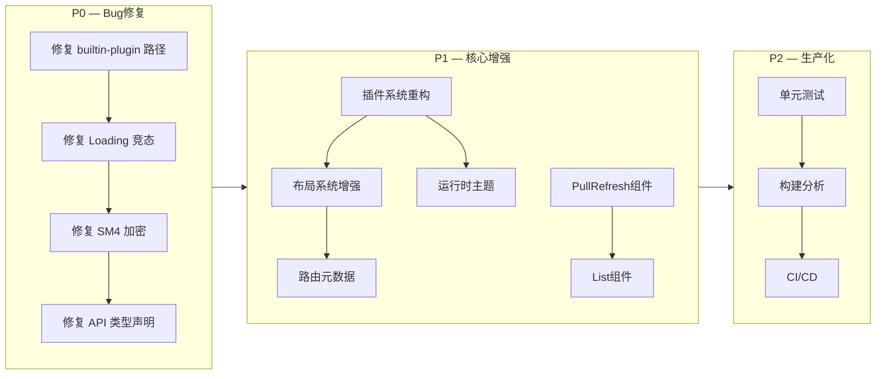

# Deer Mobile + Kangaroo Mobile — 框架深度分析与改进路线图

> 编写日期：2026-07-23
> 基于对 `deer-mobile@0.1.31` + `kangaroo-mobile@0.0.1` 完整源码的逐文件分析

---

## 一、整体架构概览

```
vite-plugins-demo (Monorepo)
├── packages/
│   ├── deer-mobile/          ← Vue 3 移动端框架（类似 Umi）
│   │   ├── plugins/          ← Vite 插件层（构建时）
│   │   │   ├── config-plugin    配置管理 + FrameworkPlugin 注册
│   │   │   ├── setup-plugin     启动代码生成（虚拟模块 virtual:setup-app）
│   │   │   ├── scan-pages-plugin 约定式路由扫描（virtual:routes）
│   │   │   ├── api-plugin        API 自动扫描 + DI 注入（virtual:api）
│   │   │   ├── mock-plugin       Mock API（Vite Dev Server 中间件）
│   │   │   ├── auth-plugin       路由守卫注入
│   │   │   ├── builtin-plugin    内置页面（login/404/error/loading）
│   │   │   ├── pinia-plugin      Pinia 状态管理注入
│   │   │   ├── i18n-plugin       vue-i18n 集成
│   │   │   └── _shared.ts        插件共享状态（全局变量）
│   │   ├── src/
│   │   │   ├── layouts/       全局布局
│   │   │   ├── stores/        Pinia Store（userStore）
│   │   │   ├── composables/   useApi / useHttp
│   │   │   └── utils/         request / status / flexible / index
│   │   └── index.ts           插件导出入口
│   │
│   ├── kangaroo-mobile/       ← Vue 3 移动端组件库（基于 Vant 4）
│   │   ├── src/components/    45+ 二次封装组件
│   │   ├── src/locale/        i18n 国际化
│   │   ├── src/theme/         主题系统（CSS 变量）
│   │   └── playground/        组件演示
│   │
│   ├── create-deer-mobile/    ← CLI 脚手架
│   └── example/               ← 示例项目
│
└── plans/                     ← 设计文档
```

---

## 二、🚨 框架层核心短板（P0 — 架构缺陷）

### 2.1 插件系统设计过于初级

**涉及文件：** [`packages/deer-mobile/plugins/config-plugin/index.ts:93`](../packages/deer-mobile/plugins/config-plugin/index.ts#93)

当前 `FrameworkPlugin` 接口：

```typescript
interface FrameworkPlugin {
  name: string;
  onImport?: () => string;   // 返回 import 语句字符串
  onRuntime?: () => string;  // 返回运行时执行代码字符串
}
```

**具体问题：**

| 问题 | 影响 | 严重程度 |
|------|------|---------|
| 插件只能通过字符串拼接注入代码，无生命周期钩子 | 插件无法在 `onAppCreated`、`onRouteChange`、`onPageEnter` 等时机执行逻辑 | 🔴 高 |
| 无异步初始化支持 | 需要先 fetch 远程配置再启动的插件无法实现 | 🔴 高 |
| 无插件优先级/依赖顺序机制 | `getFrameworkPlugins()` 返回顺序不可控，插件间依赖无法保证 | 🟡 中 |
| 插件间无法通信/共享数据 | 无共享上下文，插件各自为政 | 🟡 中 |
| 运行时插件（动态增删）完全缺失 | 无法实现动态加载的插件机制 | 🟡 中 |

**对比 Umi 插件系统：** Umi 提供 `modifyRoutes`、`onGenerateFiles`、`addRuntimePlugin`、`addEntryCode`、`addBeforeMiddlewares` 等 50+ API 钩子，当前框架仅实现 `addEntryCode` 的等价物。

**修复建议：**
- 设计完整的插件生命周期（构建时 `onInit` → `modifyConfig` → `modifyRoutes` → `onGenerateFiles` + 运行时 `onAppCreated` → `onRouterReady` → `onRouteChange` → `onError`）
- `onRuntime` 改为注册运行时插件函数而非拼接代码字符串
- 提供 `modifyRoutes`、`addLayout`、`addStore`、`addRouterGuard` 等语义化钩子
- 支持 `async onRuntime(app)` 异步初始化

---

### 2.2 布局系统过于简单

**涉及文件：** [`packages/deer-mobile/src/layouts/index.tsx`](../packages/deer-mobile/src/layouts/index.tsx)

当前只有**单个全局布局**，通过 `noNavPages` 配置隐藏导航栏。

**缺失能力：**

| 能力 | 当前状态 | 需要实现 |
|------|---------|---------|
| 嵌套布局 | ❌ 无 | `/user/profile` 继承 `/user` 布局 |
| 页面级布局选择 | ❌ 无 | 在页面文件中声明 `layout: 'blank'` |
| 布局插槽 | ❌ 无 | 页面自定义 header/footer 内容 |
| 布局过渡动画 | ❌ 无 | 路由切换时布局内容过渡 |
| 布局缓存 | ❌ 无 | 离开再回来时保持滚动位置 |
| TabBar 布局 | ❌ 无 | 底部导航栏与路由联动 |

**建议方案：**

```
路由配置扩展：
{ path: '/user/profile', component: ..., layout: 'user-layout' }

支持 layouts/ 目录下多布局文件：
layouts/
  index.tsx      (默认全局布局)
  user.tsx       (用户模块布局)
  blank.tsx      (空白布局，用于 login)
  tabs.tsx       (带 TabBar 布局)
```

---

### 2.3 路由系统功能单薄

**涉及文件：** [`packages/deer-mobile/plugins/scan-pages-plugin/index.ts`](../packages/deer-mobile/plugins/scan-pages-plugin/index.ts)

只做了最基础的约定式路由扫描（`src/pages/**/*.tsx` → 路由表）。

**缺失能力：**

| 能力 | 现状 | 业界标准 (Umi/Nuxt) |
|------|------|---------------------|
| 路由元数据 (title, roles, layout, auth) | ❌ | ✅ |
| 路由守卫扩展点（允许多插件注册） | ❌ 仅 auth-plugin 硬编码注入 | ✅ |
| 路由过渡动画 | ❌ | ✅ transition 配置 |
| 滚动行为恢复 | ❌ | ✅ scrollBehavior |
| 路由级代码分割优化 | ⚠️ 动态 import 无魔法注释 | ✅ webpackChunkName |
| TabBar 路由联动 | ❌ | ✅ 自动高亮 |
| 路由参数校验 | ❌ | - |
| 嵌套路由（子路由支持） | ❌ | ✅ 目录嵌套对应路由嵌套 |

**具体代码问题：**

[`scan-pages-plugin/index.ts:57`](../packages/deer-mobile/plugins/scan-pages-plugin/index.ts#57) — 文件路由被插件路由覆盖，但无警告：
```typescript
fileRoutes.forEach((r) => routeMap.set(r.path, { ...r, type: 'file' }));
pluginRoutes.forEach((r) => routeMap.set(r.path, { ...r, type: 'plugin' }));
// 如果有冲突，用户完全不知情
```

**建议实现步骤：**
1. 在页面文件中支持 `export const routeMeta = { ... }` 导出
2. 新建 `virtual:route-meta` 虚拟模块收集所有元数据
3. 支持 `layouts/` 多布局文件自动扫描
4. 路由过渡动画配置（结合 Vue `<Transition>`）
5. 滚动位置恢复（利用 `router.options.scrollBehavior`）

---

### 2.4 启动流程缺少切面能力

**涉及文件：** [`packages/deer-mobile/plugins/setup-plugin/index.ts`](../packages/deer-mobile/plugins/setup-plugin/index.ts)

生成的启动代码是扁平的顺序执行，插件无法注入到生命周期特定阶段。

**当前启动流程：**
```
fetch 远程路由 → 创建 router → 创建 app → 执行插件运行时 → app.use(router) → app.mount()
```

**问题：**
- 插件无法注册 `router.beforeEach` / `router.afterEach` 钩子
- 没有 `onBeforeMount` / `onMounted` 等应用生命周期
- fetch 路由失败时仅弹 Toast，无重试/降级策略
- 启动流程不可扩展

**建议改为事件驱动启动：**
```typescript
// 启动流程触发事件
lifecycle.emit('beforeCreateRouter')
lifecycle.emit('afterCreateRouter')
lifecycle.emit('beforeCreateApp')
lifecycle.emit('afterCreateApp')
lifecycle.emit('beforeMount')
lifecycle.emit('afterMount')
```

---

### 2.5 API 层实现质量问题

**涉及文件：** 
- [`packages/deer-mobile/plugins/api-plugin/index.ts`](../packages/deer-mobile/plugins/api-plugin/index.ts)
- [`packages/deer-mobile/src/utils/request.ts`](../packages/deer-mobile/src/utils/request.ts)
- [`packages/deer-mobile/src/composables/useHttp.ts`](../packages/deer-mobile/src/composables/useHttp.ts)

#### 问题 1：Loading 队列竞态条件

[`request.ts:75-76`](../packages/deer-mobile/src/utils/request.ts#75)：
```typescript
private loadingCount = 0;
private prevRequestTime = 0;
```

在并发请求场景下：
```
请求A (loadingCount: 0→1) → showLoading()
请求B (loadingCount: 1→2) → showLoading() [重复调用]
请求B 完成 (loadingCount: 2→1) → 检查 loadingCount <= 0? 不满足
请求A 完成 (loadingCount: 1→0) → hideLoading() ✅
```
看似没问题，但如果：
```
请求A (loadingCount: 0→1)
请求A 完成 (loadingCount: 1→0) → hideLoading() ⚠️ 此时请求B还在跑!
请求B (loadingCount: 0→1) → showLoading() 再次显示
```

`showLoading()` / `hideLoading()` 是空方法 — **整个 Loading 队列控制实际没生效**。

#### 问题 2：SM4 加密未生效

[`request.ts:144-148`](../packages/deer-mobile/src/utils/request.ts#144)：
```typescript
if (config.data && this.sm4EncryptAsync) {
  this.sm4EncryptAsync(config.data).then((encrypted) => {
    config.data = encrypted;  // ❌ 请求已经发出去了！
  });
}
```

`sm4EncryptAsync` 返回 Promise，但 axios 请求拦截器是同步调用 `.then()` 异步执行。**加密后的数据还没有设置到 config 上，请求就已经发出了。**

#### 问题 3：API 自动扫描的 DI 模式设计不合理

[`api-plugin/index.ts:35`](../packages/deer-mobile/plugins/api-plugin/index.ts#35)：
```typescript
`"${moduleName}": ${varName}({ $get, $post, $put, $delete })`
```

要求用户按约定导出：
```typescript
export default ({ $get, $post, $put, $delete }) => ({...})
```

但：
- **没有任何类型提示**告诉用户这个签名
- `$get`/`$post` 等是 `any` 类型，丢失 TypeScript 类型
- 不支持 `src/api/` 子目录
- 硬编码了业务 API（[line 51-53](../packages/deer-mobile/plugins/api-plugin/index.ts#51)）

---

### 2.6 builtin-plugin 路径 Bug（运行时必报错）

**涉及文件：** [`packages/deer-mobile/plugins/builtin-plugin/index.ts:33`](../packages/deer-mobile/plugins/builtin-plugin/index.ts#33)

```typescript
const currentDir = path.dirname(fileURLToPath(import.meta.url));
const filePath = path.resolve(currentDir, `plugins/builtin-plugin/pages/${name}.tsx`);
```

**问题：** `import.meta.url` 指向 esbuild 打包后的产物路径。打包后 `index.js` 在 `deer-mobile/` 根目录，而 `plugins/builtin-plugin/pages/` 目录在 source 中。当安装到用户项目 `node_modules/deer-mobile/` 后，**运行时一定会报 ENOENT 错误**，因为打包后的目录结构不包含 `plugins/builtin-plugin/pages/`。

**修复方案：** 将内置页面文件通过 esbuild 的 `--loader` 或 `--inject` 打包进产物，或将页面内容内联为字符串。

---

## 三、🟡 kangaroo-mobile 组件库评估

### 3.1 组件封装 "太薄" 的问题

大部分组件是极薄透传层，以 [`Cell.vue`](../packages/kangaroo-mobile/src/components/cell/Cell.vue) 为例：

```vue
<VanCell v-bind="vanCellProps" :class="['yhm-cell', customClass]">
  <template #right-icon>
    <YhmIcon v-if="isLink" :name="rightIconName" size="16" />
  </template>
</VanCell>
```

**这类封装的价值有限：** 换图标 + 品牌色 CSS 变量覆盖 + `customClass` prop。

**真正该加的价值（差异化竞争力）：**

| 优化方向 | 说明 | 示例 |
|---------|------|------|
| **组合能力** | 多组件联动，如 Form+Field+Picker 选择 | `YhmForm` 内置地区选择器联动 |
| **业务预设** | 常见场景开箱即用 | 登录表单、搜索表单、商品卡片 |
| **数据驱动** | 异步数据加载 | `YhmPicker` 支持 `remote` 配置 |
| **状态管理** | 表单状态自动化 | dirty/loading/error 状态自动派生 |
| **无障碍增强** | a11y 补充 | Vant 在 a11y 上做的不够 |

### 3.2 缺失的关键组件

| 组件 | 重要程度 | 场景 | Vant 4 是否内置 |
|------|---------|------|---------------|
| **PullRefresh** 下拉刷新 | 🔴 P0 高 | 列表页刷新 | ✅ Vant 内置 |
| **InfiniteScroll/List** 无限滚动 | 🔴 P0 高 | 长列表分页加载 | ✅ Vant 内置 |
| **IndexBar** 索引栏 | 🟡 P1 中 | 通讯录、城市选择 | ✅ Vant 内置 |
| **Sidebar** 侧边导航 | 🟡 P1 中 | 分类筛选 | ✅ Vant 内置 |
| **NumberKeyboard** 数字键盘 | 🟡 P1 中 | 支付、验证码 | ✅ Vant 内置 |
| **PasswordInput** 密码输入 | 🟡 P1 中 | 支付密码 | ✅ Vant 内置 |
| **CountDown** 倒计时 | 🟢 P2 低 | 验证码倒计时 | ✅ Vant 内置 |
| **WaterMark** 水印 | 🟢 P2 低 | 安全场景 | ✅ Vant 内置 |
| **QRCode** 二维码 | 🟢 P2 低 | 分享/支付 | ✅ Vant 内置 |
| **FloatingPanel** 浮动面板 | 🟢 P2 低 | 底部交互面板 | ✅ Vant 内置 |

这些组件 Vant 4 都内置了，但 kangaroo-mobile 尚未封装。

---

## 四、🔴 P0 优先级修复清单（影响功能正确性）

| # | 问题 | 文件 | 影响 |
|---|------|------|------|
| 1 | `builtin-plugin` 路径计算错误 | [`builtin-plugin/index.ts:33`](../packages/deer-mobile/plugins/builtin-plugin/index.ts#33) | 安装后内置页面无法加载 |
| 2 | `HttpClient` Loading 竞态条件 | [`request.ts:75-76`](../packages/deer-mobile/src/utils/request.ts#75) | 并发请求下 Loading 状态错乱 |
| 3 | SM4 加密未生效（异步执行但请求同步发出） | [`request.ts:144-148`](../packages/deer-mobile/src/utils/request.ts#144) | 数据以明文传输 |
| 4 | `api-plugin` DI 模式无类型声明 | [`api-plugin/index.ts:35`](../packages/deer-mobile/plugins/api-plugin/index.ts#35) | 开发者无类型提示 |
| 5 | 无全局错误边界 | 框架入口 | 组件渲染错误导致白屏 |
| 6 | 无单元测试 | 整个框架 | 核心模块不可测试 |

---

## 五、🟠 P1 核心能力增强清单

| # | 能力 | 说明 | 涉及文件 |
|---|------|------|---------|
| 1 | **插件系统重构** | 设计完整生命周期钩子 | [`config-plugin/index.ts`](../packages/deer-mobile/plugins/config-plugin/index.ts) |
| 2 | **布局系统增强** | 嵌套布局、页面级布局选择 | [`layouts/index.tsx`](../packages/deer-mobile/src/layouts/index.tsx) |
| 3 | **路由元数据支持** | title/layout/auth/transition | [`scan-pages-plugin/index.ts`](../packages/deer-mobile/plugins/scan-pages-plugin/index.ts) |
| 4 | **路由过渡动画** | 页面切换过渡 | setup-plugin + layouts |
| 5 | **滚动行为恢复** | 离开页面保持滚动位置 | layouts |
| 6 | **运行时主题切换** | 动态切换 primaryColor/darkMode | config-plugin + theme |
| 7 | **下拉刷新 PullRefresh** | kangaroo-mobile 补充 | 新增组件 |
| 8 | **无限滚动 List** | kangaroo-mobile 补充 | 新增组件 |
| 9 | **全局 errorHandler** | Vue 错误捕获 | setup-plugin |

---

## 六、🟡 P2 生产化准备清单

| # | 能力 | 说明 |
|---|------|------|
| 1 | **vitest 单元测试** | 覆盖 HttpClient、scanPagesPlugin、status 等 |
| 2 | **组件测试** | @vue/test-utils 覆盖核心组件 |
| 3 | **构建体积分析** | vite-plugin-inspect + rollup-plugin-visualizer |
| 4 | **CI/CD** | GitHub Actions 自动测试 + 发布 |
| 5 | **环境变量封装** | VITE_APP_* 统一管理 |
| 6 | **TypeScript 类型导出** | 所有插件/组件类型导出到用户项目 |

---

## 七、🟢 P3 体验提升清单

| # | 能力 | 说明 |
|---|------|------|
| 1 | **文档站点** | VitePress 搭建组件文档 + API 参考 |
| 2 | **页面加载骨架屏** | 路由切换时自动显示骨架屏 |
| 3 | **PWA 离线支持** | Service Worker + 缓存策略 |
| 4 | **脚手架模板选择** | create-deer-mobile 支持 TS/JS、是否含示例 |
| 5 | **Bundle 分析报告** | 构建后自动输出体积报告 |

---

## 八、改进路线图（按依赖顺序）



---

## 九、关键源码位置速查

| 功能模块 | 核心文件 | 行数 | 关键代码 |
|---------|---------|------|---------|
| 插件接口定义 | [`config-plugin/index.ts`](../packages/deer-mobile/plugins/config-plugin/index.ts) | 93-98 | `interface FrameworkPlugin` |
| 插件共享状态 | [`_shared.ts`](../packages/deer-mobile/plugins/_shared.ts) | 1-12 | 全局变量存储 |
| 启动代码生成 | [`setup-plugin/index.ts`](../packages/deer-mobile/plugins/setup-plugin/index.ts) | 34-91 | 虚拟模块代码模板 |
| 路由扫描 | [`scan-pages-plugin/index.ts`](../packages/deer-mobile/plugins/scan-pages-plugin/index.ts) | 30-91 | fast-glob 扫描 pages 目录 |
| API 扫描注入 | [`api-plugin/index.ts`](../packages/deer-mobile/plugins/api-plugin/index.ts) | 17-57 | DI 注入模式 |
| Mock 中间件 | [`mock-plugin/index.ts`](../packages/deer-mobile/plugins/mock-plugin/index.ts) | 74-142 | Vite Dev Server 中间件 |
| 路由守卫 | [`auth-plugin/index.ts`](../packages/deer-mobile/plugins/auth-plugin/index.ts) | 7-35 | transform 注入 |
| 内置页面加载 | [`builtin-plugin/index.ts`](../packages/deer-mobile/plugins/builtin-plugin/index.ts) | 16-44 | **有路径 Bug** |
| 全局布局 | [`layouts/index.tsx`](../packages/deer-mobile/src/layouts/index.tsx) | 1-40 | 单布局模式 |
| HTTP 封装 | [`request.ts`](../packages/deer-mobile/src/utils/request.ts) | 1-377 | **Loading 竞态 + SM4 未生效** |
| 状态码体系 | [`status.ts`](../packages/deer-mobile/src/utils/status.ts) | 1-90 | 1xx/2xx 业务状态码 |
| 移动端适配 | [`flexible.ts`](../packages/deer-mobile/src/utils/flexible.ts) | 1-57 | rem 动态缩放 |
| 用户 Store | [`userStore.ts`](../packages/deer-mobile/src/stores/userStore.ts) | 1-31 | Pinia + persist |
| i18n UI 层 | [`locale/index.ts`](../packages/kangaroo-mobile/src/locale/index.ts) | 1-221 | Vant Locale 封装 |
| 主题系统 | [`theme/index.less`](../packages/kangaroo-mobile/src/theme/index.less) | 1-85 | CSS 变量 + 暗黑模式 |
| 脚手架 | [`create-deer-mobile/index.js`](../packages/create-deer-mobile/index.js) | - | CLI 模板生成 |
