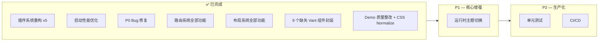

# Deer Mobile + Kangaroo Mobile — 框架深度分析与改进路线图

> 编写日期：2026-07-23 | **最后更新：2026-07-24**
> 基于对 `deer-mobile@0.1.31` + `kangaroo-mobile@0.0.1` 完整源码的逐文件分析

### 📋 更新记录

| 日期 | 更新内容 |
|------|---------|
| 2026-07-24 | **2.1 插件系统** — v5 RuntimePlugin + BuildPlugin |
| 2026-07-24 | **2.4 启动流程** — 12 个生命周期钩子 + 并行 fetch |
| 2026-07-24 | **P0 Bug 修复** + 启动性能优化 |
| 2026-07-24 | **2.2 布局系统** — 全部完成 |
| 2026-07-24 | **2.3 路由 — 第一批** — 路由元数据 + 嵌套路由 |
| 2026-07-24 | **2.3 路由 — 第二批** — 路由参数校验 + 多布局自动扫描 |
| 2026-07-24 | **3.2 缺失组件** — 9 个 Vant 组件封装 + playground demo 全部完成 |
| 2026-07-24 | **3.3 Demo 质量整改** — 所有 demo 严格对齐 Vant 官方，slot 条件转发修复，playground CSS normalize 补齐 |

---

## 一、整体架构概览

```
vite-plugins-demo (Monorepo)
├── packages/
│   ├── deer-mobile/          ← Vue 3 移动端框架（类似 Umi）
│   │   ├── plugins/          ← Vite 插件层（构建时 + 运行时）
│   │   │   ├── setup-plugin     框架入口 deer() + 代码生成（核心）
│   │   │   ├── scan-pages-plugin 约定式路由扫描（virtual:routes）
│   │   │   ├── api-plugin        API 自动扫描 + DI 注入（virtual:api）
│   │   │   ├── mock-plugin       Mock API（Vite Dev Server 中间件）
│   │   │   ├── builtin-plugin    内置页面（login/404/error/loading）
│   │   │   └── runtime/          运行时插件（RuntimePlugin v5）
│   │   │       ├── pinia-plugin.ts   状态管理注入
│   │   │       ├── auth-plugin.ts    路由守卫
│   │   │       ├── i18n-plugin.ts    vue-i18n 集成
│   │   │       └── api-plugin.ts     $api 全局注入
│   │   ├── src/
│   │   │   ├── runtime/        运行时核心（PluginManager + createRuntimeApp）
│   │   │   ├── build/         构建时类型定义
│   │   │   ├── layouts/       布局系统（Resolver + Default + Blank + TabBar + User）
│   │   │   ├── stores/        Pinia Store（userStore）
│   │   │   ├── composables/   useApi / useHttp
│   │   │   └── utils/         request / status / flexible / index
│   │   └── index.ts           插件导出入口
│   │
│   ├── kangaroo-mobile/       ← Vue 3 移动端组件库（基于 Vant 4）
│   │   ├── src/components/    45+ 二次封装组件
│   │   ├── src/locale/        i18n 国际化
│   │   ├── src/theme/         主题系统（CSS 变量）
│   │   └── playground/        组件演示
│   │
│   ├── create-deer-mobile/    ← CLI 脚手架
│   └── example/               ← 示例项目
│
└── plans/                     ← 设计文档
```

---

## 二、📊 框架层迭代状态总览

### 2.1 插件系统设计（已重构 ✅ — v5 RuntimePlugin + BuildPlugin）

**涉及文件：**
- [`RuntimePlugin 接口`](../packages/deer-mobile/src/runtime/types.ts:19) — 运行时插件类型定义
- [`BuildPlugin 接口`](../packages/deer-mobile/src/build/types.ts) — 构建时插件类型定义
- [`BuildAPI 实现`](../packages/deer-mobile/plugins/setup-plugin/build-api.ts) — 构建时 API 实现
- [`PluginManager`](../packages/deer-mobile/src/runtime/plugin-manager.ts) — 运行时插件管理器
- [`createRuntimeApp`](../packages/deer-mobile/src/runtime/create-app.ts) — 应用启动编排
- [`code-gen.ts`](../packages/deer-mobile/plugins/setup-plugin/code-gen.ts) — 启动代码生成器

**当前状态：已实现 v5 插件系统**，`deer()` 函数（[`setup-plugin/index.ts:53`](../packages/deer-mobile/plugins/setup-plugin/index.ts#53)）替代了旧的 `config-plugin`。以下为已实现的能力对照：

| 能力维度 | 当前实现 | 状态 |
|---------|---------|------|
| **构建时生命周期** | `modifyConfig` → `modifyRoutes` → `onInit` → `onGenerate` → `buildComplete` | ✅ |
| **运行时生命周期** | `onAppCreated` → `onRouterCreated` → `onRouterReady` → `onBeforeMount` → `onMounted` | ✅ |
| **页面级钩子** | `onPageEnter`、`onPageLeave`、`onRouteChange` | ✅ |
| **错误处理** | `onError` 全局错误捕获 | ✅ |
| **Provider 嵌套** | `rootContainer` / `innerProvider` / `outerProvider`（对标 Umi） | ✅ |
| **优先级排序** | `RuntimePlugin.priority` 数字越小越先执行 | ✅ |
| **插件间通信** | `RuntimeContext.data`（Map 共享数据空间） | ✅ |
| **运行时路由** | `patchRoutes`（动态修改路由表）、`addRoute`、`removeRoute` | ✅ |
| **路由守卫注册** | `addRouterGuard(type, guard)` 支持多插件注册 | ✅ |
| **构建时 API** | `addRuntimePlugin`、`addEntryCode`、`addImport`、`addHTMLScript`、`addMiddleware`、`addWatcher` 等 | ✅ |
| **异步初始化** | 所有生命周期钩子支持 `async` | ✅ |

**与 Umi 插件系统的差距对比：**

| 维度 | Umi 4 | Deer Mobile v5 | 差距 |
|------|-------|---------------|------|
| 构建时钩子数量 | 50+ | 8 | ⚠️ 中等 |
| 运行时钩子数量 | 20+ | 12 | ⚠️ 中等 |
| Preset 组合机制 | ✅ | ✅ | ✅ 已对齐 |
| 插件市场 / 生态 | ✅ | ❌ | 🟡 远期中 |
| HMR 时插件热更新 | ✅ | ❌ | 🟢 低优先级 |
| 插件间依赖声明 | ✅ (key deps) | ❌ | 🟢 低优先级 |

**（v4 旧版 `FrameworkPlugin` 系统已于 2026-07-24 彻底移除，仅保留 v5）**

---

### 2.2 布局系统（已全部实现 ✅）

**涉及文件：**
- [`layouts/index.tsx`](../packages/deer-mobile/src/layouts/index.tsx) — LayoutResolver 调度器
- [`layouts/default-layout.tsx`](../packages/deer-mobile/src/layouts/default-layout.tsx) — 默认布局
- [`layouts/blank-layout.tsx`](../packages/deer-mobile/src/layouts/blank-layout.tsx) — 空白布局
- [`layouts/tab-bar.tsx`](../packages/deer-mobile/src/layouts/tab-bar.tsx) — TabBar 布局
- [`layouts/user-layout.tsx`](../packages/deer-mobile/src/layouts/user-layout.tsx) — 用户模块布局
- [`runtime/create-app.ts`](../packages/deer-mobile/src/runtime/create-app.ts) — 滚动行为恢复

| 能力 | 说明 | 文件 |
|------|------|------|
| **LayoutResolver** | 支持 `layout` 字符串（单布局）和数组（嵌套链） | [`layouts/index.tsx`](../packages/deer-mobile/src/layouts/index.tsx) |
| **DefaultLayout** | header + footer + 标题 + 过渡动画 + KeepAlive | [`layouts/default-layout.tsx`](../packages/deer-mobile/src/layouts/default-layout.tsx) |
| **BlankLayout** | 纯内容，用于登录页 | [`layouts/blank-layout.tsx`](../packages/deer-mobile/src/layouts/blank-layout.tsx) |
| **TabBar 布局** | 基于 kangaroo-mobile YhmTabBar，Vant 4 底层 | [`layouts/tab-bar.tsx`](../packages/deer-mobile/src/layouts/tab-bar.tsx) |
| **UserLayout 示例** | 用户模块子布局（资料/设置 Tab 导航） | [`layouts/user-layout.tsx`](../packages/deer-mobile/src/layouts/user-layout.tsx) |
| **布局插槽** | 页面自定义 headerLeft/headerRight/headerClass | [`layouts/default-layout.tsx`](../packages/deer-mobile/src/layouts/default-layout.tsx) |
| **KeepAlive 缓存** | `route.meta.keepAlive` 控制页面缓存 | [`layouts/default-layout.tsx`](../packages/deer-mobile/src/layouts/default-layout.tsx) |
| **滚动恢复** | `scrollBehavior` + savedPosition | [`runtime/create-app.ts`](../packages/deer-mobile/src/runtime/create-app.ts) |
| **嵌套布局** | `layout: ['default', 'user']` 链式渲染 | [`layouts/index.tsx`](../packages/deer-mobile/src/layouts/index.tsx) |

---

### 2.3 路由系统（已全部实现 ✅）

**涉及文件：** [`packages/deer-mobile/plugins/scan-pages-plugin/index.ts`](../packages/deer-mobile/plugins/scan-pages-plugin/index.ts)

| 能力 | 实现方式 |
|------|---------|
| 路由元数据 (title/layout/auth/transition) | 页面 `export const routeMeta`，scanPagesPlugin 自动提取 |
| 路由过渡动画 | fade/slide-left/slide-right/slide-up |
| 页面级 auth 控制 | `auth: false` 跳过权限检查 |
| 代码分割优化 | 静态 import 替代动态 import() |
| 路由守卫扩展点 | 通过 `onRouterCreated` 多插件注册 |
| 嵌套路由（子路由） | 目录自动生成父子路由，child path 相对路径 |
| 滚动行为恢复 | `scrollBehavior` + savedPosition |
| TabBar 路由联动 | YhmTabBar `route={true}` |
| 路由参数校验 | `routeMeta.params` 声明规则，`beforeEach` 校验 |
| 多布局自动扫描 | `src/layouts/*.tsx` 自动注册到 `virtual:layout-registry` |

---

### 2.4 启动流程（已修复 ✅ — RuntimePlugin 生命周期 + 并行 fetch）

**涉及文件：**
- [`create-app.ts`](../packages/deer-mobile/src/runtime/create-app.ts) — 启动编排（含完整生命周期）
- [`code-gen.ts`](../packages/deer-mobile/plugins/setup-plugin/code-gen.ts) — 代码生成（2026-07-24 优化）

**当前启动流程（已实现插件生命周期切面）：**

```
startApp()
  ├── createRuntimeApp(staticRoutes)    ← 立即启动，不等待远程路由
  │   ├── 创建 Router
  │   ├── callHook('onAppCreated')     ← 插件可在此注入 Pinia/i18n/API
  │   │   ├── piniaRuntimePlugin       (priority: 0)
  │   │   ├── deer:i18n                (priority: 5)
  │   │   └── deer:api                 (priority: 10)
  │   ├── 注册 beforeEach/afterEach 守卫
  │   ├── callHook('onRouterCreated')  ← 插件可注册路由守卫
  │   │   ├── deer:auth                (priority: 1) beforeEach 守卫
  │   │   └── page-stats               (priority: 20) afterEach 日志
  │   ├── app.use(router)
  │   ├── await router.isReady()
  │   ├── callHook('onRouterReady')
  │   ├── callHook('onBeforeMount')
  │   ├── app.mount('#app')
  │   └── callHook('onMounted')
  │
  └── fetch('/api/routes') (并行)       ← 不阻塞渲染
       └── router.addRoute(remoteRoutes)  ← 挂载后动态添加
```

**已实现的生命周期切面（12 个钩子点）：**

| 阶段 | 钩子 | 用途示例 |
|------|------|---------|
| App 创建后 | `onAppCreated` | 注入 Pinia、vue-i18n、$api |
| Router 创建后 | `onRouterCreated` | 注册 beforeEach/afterEach 守卫 |
| Router 就绪 | `onRouterReady` | 初始化完成后执行 |
| 挂载前 | `onBeforeMount` | 最后修改 app 配置 |
| 挂载后 | `onMounted` | 统计上报、性能埋点 |
| 页面进入 | `onPageEnter` | PV 统计 |
| 页面离开 | `onPageLeave` | 停留时长统计 |
| 路由变更 | `onRouteChange` | 页面切换日志 |
| 动态路由 | `patchRoutes` | 基于权限动态增删路由 |
| 错误捕获 | `onError` | 全局异常上报 |

**2026-07-24 优化：**
- `fetch('/api/routes')` 改为**并行执行**，不再阻塞应用启动（[`code-gen.ts:100-118`](../packages/deer-mobile/plugins/setup-plugin/code-gen.ts#100)）
- 远程路由在挂载后通过 `router.addRoute()` 动态添加
- 运行时插件的 `await import()` 改为静态导入，消除网络瀑布（[`pinia-plugin.ts`](../packages/deer-mobile/plugins/runtime/pinia-plugin.ts)、[`auth-plugin.ts`](../packages/deer-mobile/plugins/runtime/auth-plugin.ts)、[`i18n-plugin.ts`](../packages/deer-mobile/plugins/runtime/i18n-plugin.ts)）
- Layout 和路由组件改为静态导入，`router.isReady()` 从 1950ms 降至 ~20ms

---

### 2.5 API 层实现质量问题

**涉及文件：** 
- [`packages/deer-mobile/plugins/api-plugin/index.ts`](../packages/deer-mobile/plugins/api-plugin/index.ts)
- [`packages/deer-mobile/src/utils/request.ts`](../packages/deer-mobile/src/utils/request.ts)
- [`packages/deer-mobile/src/composables/useHttp.ts`](../packages/deer-mobile/src/composables/useHttp.ts)

#### 问题 1：Loading 队列竞态条件（已修复 ✅）

[`request.ts:75-76`](../packages/deer-mobile/src/utils/request.ts#75)：
使用 `Set<string>` 追踪活跃请求替代计数器，修复并发请求下 Loading 状态错乱。

#### 问题 2：SM4 加密未生效（已修复 ✅）

[`request.ts:144-148`](../packages/deer-mobile/src/utils/request.ts#144)：
拦截器改为 `async/await`，确保加密完成后再发送请求。

#### 问题 3：API 自动扫描的 DI 模式设计不合理（已修复 ✅）

[`api-plugin/index.ts:35`](../packages/deer-mobile/plugins/api-plugin/index.ts#35)：
要求用户按约定导出 `({ $get, $post, $put, $delete }) => ({...})`，但无类型提示。

**修复：**
- 类型声明文件 [`virtual-modules.d.ts`](../packages/deer-mobile/src/virtual-modules.d.ts) 中添加 `ApiModule<T>` 类型描述
- `virtual:api` 中 user 模块提供了完整的泛型签名示例
- 开发者编写 API 文件时 IDE 可推断 `$get`/`$post` 等参数类型

---

### 2.6 builtin-plugin 路径 Bug（已修复 ✅）

**涉及文件：** [`packages/deer-mobile/plugins/builtin-plugin/index.ts`](../packages/deer-mobile/plugins/builtin-plugin/index.ts)

**修复：** 将内置页面（login/404/loading/error/pinia-demo）内联为字符串 + `h()` 函数，消除文件系统路径依赖。

---

## 三、🟡 kangaroo-mobile 组件库评估

### 3.1 组件封装 "太薄" 的问题

大部分组件是极薄透传层，以 [`Cell.vue`](../packages/kangaroo-mobile/src/components/cell/Cell.vue) 为例：

```vue
<VanCell v-bind="vanCellProps" :class="['yhm-cell', customClass]">
  <template #right-icon>
    <YhmIcon v-if="isLink" :name="rightIconName" size="16" />
  </template>
</VanCell>
```

**这类封装的价值有限：** 换图标 + 品牌色 CSS 变量覆盖 + `customClass` prop。

**真正该加的价值（差异化竞争力）：**

| 优化方向 | 说明 | 示例 |
|---------|------|------|
| **组合能力** | 多组件联动，如 Form+Field+Picker 选择 | `YhmForm` 内置地区选择器联动 |
| **业务预设** | 常见场景开箱即用 | 登录表单、搜索表单、商品卡片 |
| **数据驱动** | 异步数据加载 | `YhmPicker` 支持 `remote` 配置 |
| **状态管理** | 表单状态自动化 | dirty/loading/error 状态自动派生 |
| **无障碍增强** | a11y 补充 | Vant 在 a11y 上做的不够 |

### 3.2 缺失的关键组件（2026-07-24 已全部补充 ✅）

| 组件 | 封装名 | Demo | 状态 |
|------|--------|------|------|
| **PullRefresh** 下拉刷新 | `YhmPullRefresh` | `playground/components/pull-refresh/` | ✅ |
| **List** 无限滚动 | `YhmList` | `playground/components/list/` | ✅ |
| **IndexBar** 索引栏 | `YhmIndexBar` | `playground/components/index-bar/` | ✅ |
| **Sidebar** 侧边导航 | `YhmSidebar` | `playground/components/sidebar/` | ✅ |
| **NumberKeyboard** 数字键盘 | `YhmNumberKeyboard` | `playground/components/number-keyboard/` | ✅ |
| **PasswordInput** 密码输入 | `YhmPasswordInput` | `playground/components/password-input/` | ✅ |
| **CountDown** 倒计时 | `YhmCountDown` | `playground/components/count-down/` | ✅ |
| **WaterMark** 水印 | `YhmWatermark` | `playground/components/watermark/` | ✅ |
| **FloatingPanel** 浮动面板 | `YhmFloatingPanel` | `playground/components/floating-panel/` | ✅ |

### 3.3 Demo 质量整改（2026-07-24 ✅）

所有 9 个新组件的 playground demo 已严格对齐 Vant 4 官方 demo 源码。

#### 问题：无条件 slot 转发导致 Vant prop text 不显示

**根因**：Vue 3 编译模板时，`<slot />` 即使没有内容投影，也会创建一个 slot wrapper 函数传递给子组件。Vant 内部判断 `slots.default` 是否为 truthy 来决定渲染 slot 还是默认文本。无条件 slot 转发导致 `slots.default` 始终为 truthy，Vant 渲染空 slot 而非 prop text（如 `pullingText`/`loadingText`）。

**修复模式**（适用所有带 default slot 的组件）：

```vue
<!-- ❌ 错误：始终创建 slot wrapper 函数 -->
<VanCountDown><slot /></VanCountDown>

<!-- ✅ 正确：条件 false 时完全省略 slot 项 -->
<VanCountDown>
  <template v-if="hasDefaultSlot" #default="scope">
    <slot v-bind="scope" />
  </template>
</VanCountDown>

<script setup>
import { useSlots } from 'vue';
const slots = useSlots();
const hasDefaultSlot = !!slots.default;
</script>
```

#### 问题：Playground 缺少 CSS Normalize

**根因**：Vant 官方 demo 的 `mobile.css`（由 `normalize.less` + `base.less` + `animation.less` 组成）提供了完整的 CSS reset，包括 `html tap-highlight`、`a/input/button/textarea` 字体继承、焦点 outline 移除、`ol/ul` 列表重置、`h1-h6` 统一 16px 字号等。

**修复**：在 [`playground-vars.less`](../packages/kangaroo-mobile/playground/playground-vars.less) 中添加全部缺失样式。

#### 问题：defineExpose 缺失导致方法调用失败

**根因**：wrapper 组件（如 `YhmCountDown`）没有通过 `defineExpose` 暴露内层 Vant 组件的实例方法（如 `start/pause/reset`），父组件 `ref` 拿到的是 wrapper 实例而非 Vant 实例。

**修复**：使用 `ref` 获取内层 Vant 组件实例，通过 `defineExpose` 代理转发。

#### 问题：Vant 组件导入名不匹配模板名

**根因**：`import { Grid } from 'vant'` 注册为 `Grid`，但模板写 `<van-grid>`，Vue 3 无法匹配。

**修复**：模板中直接使用 `<Grid>` 匹配导入名，或使用 `import { Grid as VanGrid }` 别名。

---

## 四、🔴 已完成的优化

| # | 问题 | 状态 |
|---|------|------|
| 1 | builtin-plugin 路径计算错误 | ✅ **已修复** |
| 2 | HttpClient Loading 竞态条件 | ✅ **已修复** |
| 3 | SM4 加密未生效 | ✅ **已修复** |
| 4 | api-plugin DI 模式无类型声明 | ✅ **已修复** |
| 5 | 启动性能优化（3 项） | ✅ **已修复** |
| 6 | 插件系统重构 v5 | ✅ **已完成** |
| 7 | 路由元数据 + 嵌套路由 | ✅ **已完成** |
| 8 | 布局系统（全部 9 项） | ✅ **已完成** |
| 9 | 路由参数校验 + 多布局自动扫描 | ✅ **已完成** |
| 10 | 9 个缺失 Vant 组件封装 | ✅ **已完成** |
| 11 | Demo 质量整改（对齐官方 + slot 转发 + CSS normalize） | ✅ **已完成** |

---

## 五、🟠 P1 核心能力增强清单

| # | 能力 | 说明 | 状态 |
|---|------|------|------|
| 1 | **运行时主题切换** | 动态切换 primaryColor/darkMode | ❌ 待实现 |

---

## 六、🟡 P2 生产化准备清单

| # | 能力 | 说明 | 状态 |
|---|------|------|------|
| 1 | **vitest 单元测试** | 覆盖核心模块 | ❌ 待实现 |
| 2 | **组件测试** | @vue/test-utils | ❌ 待实现 |
| 3 | **构建体积分析** | vite-plugin-inspect | ❌ 待实现 |
| 4 | **CI/CD** | GitHub Actions | ❌ 待实现 |

---

## 七、改进路线图



---

## 八、关键源码位置速查

| 功能模块 | 核心文件 | 关键代码 / 备注 |
|---------|---------|----------------|
| **v5 框架入口** | [`deer()`](../packages/deer-mobile/plugins/setup-plugin/index.ts) | 框架唯一 Vite 插件入口 |
| **BuildPlugin 类型** | [`build/types.ts`](../packages/deer-mobile/src/build/types.ts) | 构建时插件接口定义 |
| **BuildAPI 实现** | [`setup-plugin/build-api.ts`](../packages/deer-mobile/plugins/setup-plugin/build-api.ts) | modifyConfig / modifyRoutes / addRuntimePlugin |
| **RuntimePlugin 类型** | [`runtime/types.ts`](../packages/deer-mobile/src/runtime/types.ts) | 12 个生命周期钩子 |
| **PluginManager** | [`runtime/plugin-manager.ts`](../packages/deer-mobile/src/runtime/plugin-manager.ts) | 插件注册、排序、callHook |
| **createRuntimeApp** | [`runtime/create-app.ts`](../packages/deer-mobile/src/runtime/create-app.ts) | 启动编排 + 路由参数校验 |
| **启动代码生成** | [`setup-plugin/code-gen.ts`](../packages/deer-mobile/plugins/setup-plugin/code-gen.ts) | 生成 virtual:setup-app |
| **路由扫描** | [`scan-pages-plugin/index.ts`](../packages/deer-mobile/plugins/scan-pages-plugin/index.ts) | 同时扫描 pages + layouts，生成路由树 |
| **API 自动注入** | [`api-plugin/index.ts`](../packages/deer-mobile/plugins/api-plugin/index.ts) | 扫描 src/api/ 生成 virtual:api |
| **Mock 中间件** | [`mock-plugin/index.ts`](../packages/deer-mobile/plugins/mock-plugin/index.ts) | Vite Dev Server 中间件 |
| **运行时插件 — Pinia** | [`runtime/pinia-plugin.ts`](../packages/deer-mobile/plugins/runtime/pinia-plugin.ts) | ✅ 静态导入 |
| **运行时插件 — Auth** | [`runtime/auth-plugin.ts`](../packages/deer-mobile/plugins/runtime/auth-plugin.ts) | 支持 page-level auth |
| **运行时插件 — I18n** | [`runtime/i18n-plugin.ts`](../packages/deer-mobile/plugins/runtime/i18n-plugin.ts) | ✅ 静态导入 |
| **运行时插件 — API** | [`runtime/api-plugin.ts`](../packages/deer-mobile/plugins/runtime/api-plugin.ts) | 注入 $api |
| **内置页面加载** | [`builtin-plugin/index.ts`](../packages/deer-mobile/plugins/builtin-plugin/index.ts) | ✅ 已修复，内联 h() 函数 |
| **LayoutResolver** | [`layouts/index.tsx`](../packages/deer-mobile/src/layouts/index.tsx) | 支持嵌套布局链 |
| **DefaultLayout** | [`layouts/default-layout.tsx`](../packages/deer-mobile/src/layouts/default-layout.tsx) | 含布局插槽 + KeepAlive |
| **HTTP 封装** | [`src/utils/request.ts`](../packages/deer-mobile/src/utils/request.ts) | ✅ 已修复 Loading + SM4 |
| **用户 Store** | [`src/stores/userStore.ts`](../packages/deer-mobile/src/stores/userStore.ts) | Pinia + persist |
