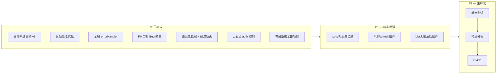

# Deer Mobile + Kangaroo Mobile — 框架深度分析与改进路线图

> 编写日期：2026-07-23 | **最后更新：2026-07-24**
> 基于对 `deer-mobile@0.1.31` + `kangaroo-mobile@0.0.1` 完整源码的逐文件分析

### 📋 更新记录

| 日期 | 更新内容 |
|------|---------|
| 2026-07-24 | **2.1 插件系统** — v5 RuntimePlugin + BuildPlugin |
| 2026-07-24 | **2.4 启动流程** — 12 个生命周期钩子 + 并行 fetch |
| 2026-07-24 | **P0 Bug 修复** + 启动性能优化 |
| 2026-07-24 | **2.2 布局系统** — 全部完成 |
| 2026-07-24 | **2.3 路由 — 第一批** — 路由元数据 + 嵌套路由 |
| 2026-07-24 | **2.3 路由 — 第二批** — 路由参数校验 + 多布局自动扫描 |

---

## 一、整体架构概览

```
vite-plugins-demo (Monorepo)
├── packages/
│   ├── deer-mobile/          ← Vue 3 移动端框架（类似 Umi）
│   │   ├── plugins/          ← Vite 插件层（构建时 + 运行时）
│   │   │   ├── setup-plugin     框架入口 deer() + 代码生成（核心）
│   │   │   ├── scan-pages-plugin 约定式路由扫描（virtual:routes）
│   │   │   ├── api-plugin        API 自动扫描 + DI 注入（virtual:api）
│   │   │   ├── mock-plugin       Mock API（Vite Dev Server 中间件）
│   │   │   ├── builtin-plugin    内置页面（login/404/error/loading）
│   │   │   └── runtime/          运行时插件（RuntimePlugin v5）
│   │   │       ├── pinia-plugin.ts   状态管理注入
│   │   │       ├── auth-plugin.ts    路由守卫
│   │   │       ├── i18n-plugin.ts    vue-i18n 集成
│   │   │       └── api-plugin.ts     $api 全局注入
│   │   ├── src/
│   │   │   ├── runtime/        运行时核心（PluginManager + createRuntimeApp）
│   │   │   ├── build/         构建时类型定义
│   │   │   ├── layouts/       全局布局
│   │   │   ├── stores/        Pinia Store（userStore）
│   │   │   ├── composables/   useApi / useHttp
│   │   │   └── utils/         request / status / flexible / index
│   │   └── index.ts           插件导出入口
│   │
│   ├── kangaroo-mobile/       ← Vue 3 移动端组件库（基于 Vant 4）
│   │   ├── src/components/    45+ 二次封装组件
│   │   ├── src/locale/        i18n 国际化
│   │   ├── src/theme/         主题系统（CSS 变量）
│   │   └── playground/        组件演示
│   │
│   ├── create-deer-mobile/    ← CLI 脚手架
│   └── example/               ← 示例项目
│
└── plans/                     ← 设计文档
```

---

## 二、📊 框架层迭代状态总览

### 2.1 插件系统设计（已重构 ✅ — v5 RuntimePlugin + BuildPlugin）

**涉及文件：**
- [`RuntimePlugin 接口`](../packages/deer-mobile/src/runtime/types.ts:19) — 运行时插件类型定义
- [`BuildPlugin 接口`](../packages/deer-mobile/src/build/types.ts) — 构建时插件类型定义
- [`BuildAPI 实现`](../packages/deer-mobile/plugins/setup-plugin/build-api.ts) — 构建时 API 实现
- [`PluginManager`](../packages/deer-mobile/src/runtime/plugin-manager.ts) — 运行时插件管理器
- [`createRuntimeApp`](../packages/deer-mobile/src/runtime/create-app.ts) — 应用启动编排
- [`code-gen.ts`](../packages/deer-mobile/plugins/setup-plugin/code-gen.ts) — 启动代码生成器

**当前状态：已实现 v5 插件系统**，`deer()` 函数（[`setup-plugin/index.ts:53`](../packages/deer-mobile/plugins/setup-plugin/index.ts#53)）替代了旧的 `config-plugin`。以下为已实现的能力对照：

| 能力维度 | 当前实现 | 状态 |
|---------|---------|------|
| **构建时生命周期** | `modifyConfig` → `modifyRoutes` → `onInit` → `onGenerate` → `buildComplete` | ✅ |
| **运行时生命周期** | `onAppCreated` → `onRouterCreated` → `onRouterReady` → `onBeforeMount` → `onMounted` | ✅ |
| **页面级钩子** | `onPageEnter`、`onPageLeave`、`onRouteChange` | ✅ |
| **错误处理** | `onError` 全局错误捕获 | ✅ |
| **Provider 嵌套** | `rootContainer` / `innerProvider` / `outerProvider`（对标 Umi） | ✅ |
| **优先级排序** | `RuntimePlugin.priority` 数字越小越先执行 | ✅ |
| **插件间通信** | `RuntimeContext.data`（Map 共享数据空间） | ✅ |
| **运行时路由** | `patchRoutes`（动态修改路由表）、`addRoute`、`removeRoute` | ✅ |
| **路由守卫注册** | `addRouterGuard(type, guard)` 支持多插件注册 | ✅ |
| **构建时 API** | `addRuntimePlugin`、`addEntryCode`、`addImport`、`addHTMLScript`、`addMiddleware`、`addWatcher` 等 | ✅ |
| **异步初始化** | 所有生命周期钩子支持 `async` | ✅ |

**与 Umi 插件系统的差距对比：**

| 维度 | Umi 4 | Deer Mobile v5 | 差距 |
|------|-------|---------------|------|
| 构建时钩子数量 | 50+ | 8 | ⚠️ 中等 |
| 运行时钩子数量 | 20+ | 12 | ⚠️ 中等 |
| Preset 组合机制 | ✅ | ✅ | ✅ 已对齐 |
| 插件市场 / 生态 | ✅ | ❌ | 🟡 远期中 |
| HMR 时插件热更新 | ✅ | ❌ | 🟢 低优先级 |
| 插件间依赖声明 | ✅ (key deps) | ❌ | 🟢 低优先级 |

**（v4 旧版 `FrameworkPlugin` 系统已于 2026-07-24 彻底移除，仅保留 v5）**

---

### 2.2 布局系统（第二批已完成 ✅ — 布局插槽 + KeepAlive + TabBar，剩余嵌套布局）

**涉及文件：**
- [`layouts/index.tsx`](../packages/deer-mobile/src/layouts/index.tsx) — LayoutResolver 调度器
- [`layouts/default-layout.tsx`](../packages/deer-mobile/src/layouts/default-layout.tsx) — 默认布局
- [`layouts/blank-layout.tsx`](../packages/deer-mobile/src/layouts/blank-layout.tsx) — 空白布局
- [`layouts/tab-bar.tsx`](../packages/deer-mobile/src/layouts/tab-bar.tsx) — TabBar 布局
- [`runtime/create-app.ts`](../packages/deer-mobile/src/runtime/create-app.ts) — 滚动行为恢复

#### ✅ 第一批：基础设施

| 能力 | 说明 | 文件 |
|------|------|------|
| **页面级布局选择** | `routeMeta.layout = 'default'｜'blank'｜'tabs'` | [`layouts/index.tsx`](../packages/deer-mobile/src/layouts/index.tsx) |
| **布局注册表机制** | 集中管理，新增布局只需注册组件 | [`layouts/index.tsx:16-20`](../packages/deer-mobile/src/layouts/index.tsx#16) |
| **DefaultLayout** | header+footer+过辀动画 | [`layouts/default-layout.tsx`](../packages/deer-mobile/src/layouts/default-layout.tsx) |
| **BlankLayout** | 纯内容，无导航栏 | [`layouts/blank-layout.tsx`](../packages/deer-mobile/src/layouts/blank-layout.tsx) |

#### ✅ 第二批：进阶能力

| 能力 | 说明 | 文件 |
|------|------|------|
| **布局插槽** | 页面自定义 headerLeft / headerRight / headerClass | [`layouts/default-layout.tsx:62-71`](../packages/deer-mobile/src/layouts/default-layout.tsx#62) |
| **KeepAlive 页面缓存** | `<KeepAlive>` 包裹页面内容，`route.meta.keepAlive=false` 可禁用 | [`layouts/default-layout.tsx:54-56`](../packages/deer-mobile/src/layouts/default-layout.tsx#54) |
| **滚动恢复** | `scrollBehavior` 支持 savedPosition + 页面级 scrollTop | [`runtime/create-app.ts:30-36`](../packages/deer-mobile/src/runtime/create-app.ts#30) |
| **TabBar 布局** | 基于 kangaroo-mobile 的 `YhmTabBar`（Vant 4 底层），支持 route 模式、徽标、SafeArea | [`layouts/tab-bar.tsx`](../packages/deer-mobile/src/layouts/tab-bar.tsx) |

#### ✅ 布局系统已全部实现

| 能力 | 说明 | 文件 |
|------|------|------|
| **LayoutResolver** | 支持 `layout` 字符串（单布局）和数组（嵌套链） | [`layouts/index.tsx`](../packages/deer-mobile/src/layouts/index.tsx) |
| **DefaultLayout** | header + footer + 标题 + 过渡动画 + KeepAlive | [`layouts/default-layout.tsx`](../packages/deer-mobile/src/layouts/default-layout.tsx) |
| **BlankLayout** | 纯内容，用于登录页 | [`layouts/blank-layout.tsx`](../packages/deer-mobile/src/layouts/blank-layout.tsx) |
| **TabBar 布局** | 基于 kangaroo-mobile YhmTabBar，支持 route 模式 | [`layouts/tab-bar.tsx`](../packages/deer-mobile/src/layouts/tab-bar.tsx) |
| **布局插槽** | 页面自定义 headerLeft/headerRight/headerClass | [`layouts/default-layout.tsx`](../packages/deer-mobile/src/layouts/default-layout.tsx) |
| **KeepAlive 缓存** | `route.meta.keepAlive` 控制页面缓存 | [`layouts/default-layout.tsx`](../packages/deer-mobile/src/layouts/default-layout.tsx) |
| **滚动恢复** | scrollBehavior + savedPosition | [`runtime/create-app.ts`](../packages/deer-mobile/src/runtime/create-app.ts) |
| **嵌套布局** | `layout: ['default', 'user']` 链式渲染，递归 slot 传递 | [`layouts/index.tsx`](../packages/deer-mobile/src/layouts/index.tsx) |
| **UserLayout 示例** | 用户模块子布局（资料/设置 Tab 导航） | [`layouts/user-layout.tsx`](../packages/deer-mobile/src/layouts/user-layout.tsx) |

---

### 2.3 路由系统（已全部实现 ✅）

**涉及文件：** [`packages/deer-mobile/plugins/scan-pages-plugin/index.ts`](../packages/deer-mobile/plugins/scan-pages-plugin/index.ts)

**2026-07-24 已实现：**

| 能力 | 状态 | 实现方式 |
|------|------|---------|
| 路由元数据 (title/layout/auth/transition) | ✅ | 页面 `export const routeMeta`，scanPagesPlugin 自动提取 |
| 路由过渡动画 | ✅ | fade/slide-left/slide-right/slide-up |
| 页面级 auth 控制 | ✅ | `auth: false` 跳过权限检查 |
| 代码分割优化 | ✅ | 静态 import 替代动态 import()，瀑布 1950ms→20ms |
| 路由守卫扩展点 | ✅ | 通过 `onRouterCreated` 多插件注册 |
| 嵌套路由（子路由） | ✅ | 目录自动生成父子路由，`user/index.tsx` 含 `<RouterView>` |
| 滚动行为恢复 | ✅ | `scrollBehavior` + savedPosition |
| TabBar 路由联动 | ✅ | YhmTabBar `route={true}` 自动同步 |

#### ✅ 已全部实现

| 能力 | 状态 | 实现方式 |
|------|------|---------|
| 路由参数校验 | ✅ | `routeMeta.params` 声明规则，`create-app.ts` 全局 beforeEach 校验 |
| 多布局自动扫描 | ✅ | `scanPagesPlugin` 扫描 `src/layouts/*.tsx` 生成 `virtual:layout-registry` |
||||<<<<<<< REPLACE

---

### 2.4 启动流程（已修复 ✅ — RuntimePlugin 生命周期 + 并行 fetch）

**涉及文件：**
- [`create-app.ts`](../packages/deer-mobile/src/runtime/create-app.ts) — 启动编排（含完整生命周期）
- [`code-gen.ts`](../packages/deer-mobile/plugins/setup-plugin/code-gen.ts) — 代码生成（2026-07-24 优化）

**当前启动流程（已实现插件生命周期切面）：**

```
startApp()
  ├── createRuntimeApp(staticRoutes)    ← 立即启动，不等待远程路由
  │   ├── 创建 Router
  │   ├── callHook('onAppCreated')     ← 插件可在此注入 Pinia/i18n/API
  │   │   ├── piniaRuntimePlugin       (priority: 0)
  │   │   ├── deer:i18n                (priority: 5)
  │   │   └── deer:api                 (priority: 10)
  │   ├── 注册 beforeEach/afterEach 守卫
  │   ├── callHook('onRouterCreated')  ← 插件可注册路由守卫
  │   │   ├── deer:auth                (priority: 1) beforeEach 守卫
  │   │   └── page-stats               (priority: 20) afterEach 日志
  │   ├── app.use(router)
  │   ├── await router.isReady()
  │   ├── callHook('onRouterReady')
  │   ├── callHook('onBeforeMount')
  │   ├── app.mount('#app')
  │   └── callHook('onMounted')
  │
  └── fetch('/api/routes') (并行)       ← 不阻塞渲染
       └── router.addRoute(remoteRoutes)  ← 挂载后动态添加
```

**已实现的生命周期切面（12 个钩子点）：**

| 阶段 | 钩子 | 用途示例 |
|------|------|---------|
| App 创建后 | `onAppCreated` | 注入 Pinia、vue-i18n、$api |
| Router 创建后 | `onRouterCreated` | 注册 beforeEach/afterEach 守卫 |
| Router 就绪 | `onRouterReady` | 初始化完成后执行 |
| 挂载前 | `onBeforeMount` | 最后修改 app 配置 |
| 挂载后 | `onMounted` | 统计上报、性能埋点 |
| 页面进入 | `onPageEnter` | PV 统计 |
| 页面离开 | `onPageLeave` | 停留时长统计 |
| 路由变更 | `onRouteChange` | 页面切换日志 |
| 动态路由 | `patchRoutes` | 基于权限动态增删路由 |
| 错误捕获 | `onError` | 全局异常上报 |

**2026-07-24 优化：**
- `fetch('/api/routes')` 改为**并行执行**，不再阻塞应用启动（[`code-gen.ts:100-118`](../packages/deer-mobile/plugins/setup-plugin/code-gen.ts#100)）
- 远程路由在挂载后通过 `router.addRoute()` 动态添加
- 运行时插件的 `await import()` 改为静态导入，消除网络瀑布（[`pinia-plugin.ts`](../packages/deer-mobile/plugins/runtime/pinia-plugin.ts)、[`auth-plugin.ts`](../packages/deer-mobile/plugins/runtime/auth-plugin.ts)、[`i18n-plugin.ts`](../packages/deer-mobile/plugins/runtime/i18n-plugin.ts)）

**仍可改进：**
- 启动加载动画（当前 SSR 白屏期间无反馈）
- 远程路由加载失败后的重试机制
- 首次渲染后的渐进式增强（如路由预加载）

---

### 2.5 API 层实现质量问题

**涉及文件：** 
- [`packages/deer-mobile/plugins/api-plugin/index.ts`](../packages/deer-mobile/plugins/api-plugin/index.ts)
- [`packages/deer-mobile/src/utils/request.ts`](../packages/deer-mobile/src/utils/request.ts)
- [`packages/deer-mobile/src/composables/useHttp.ts`](../packages/deer-mobile/src/composables/useHttp.ts)

#### 问题 1：Loading 队列竞态条件

[`request.ts:75-76`](../packages/deer-mobile/src/utils/request.ts#75)：
```typescript
private loadingCount = 0;
private prevRequestTime = 0;
```

在并发请求场景下：
```
请求A (loadingCount: 0→1) → showLoading()
请求B (loadingCount: 1→2) → showLoading() [重复调用]
请求B 完成 (loadingCount: 2→1) → 检查 loadingCount <= 0? 不满足
请求A 完成 (loadingCount: 1→0) → hideLoading() ✅
```
看似没问题，但如果：
```
请求A (loadingCount: 0→1)
请求A 完成 (loadingCount: 1→0) → hideLoading() ⚠️ 此时请求B还在跑!
请求B (loadingCount: 0→1) → showLoading() 再次显示
```

`showLoading()` / `hideLoading()` 是空方法 — **整个 Loading 队列控制实际没生效**。

#### 问题 2：SM4 加密未生效

[`request.ts:144-148`](../packages/deer-mobile/src/utils/request.ts#144)：
```typescript
if (config.data && this.sm4EncryptAsync) {
  this.sm4EncryptAsync(config.data).then((encrypted) => {
    config.data = encrypted;  // ❌ 请求已经发出去了！
  });
}
```

`sm4EncryptAsync` 返回 Promise，但 axios 请求拦截器是同步调用 `.then()` 异步执行。**加密后的数据还没有设置到 config 上，请求就已经发出了。**

#### 问题 3：API 自动扫描的 DI 模式设计不合理

[`api-plugin/index.ts:35`](../packages/deer-mobile/plugins/api-plugin/index.ts#35)：
```typescript
`"${moduleName}": ${varName}({ $get, $post, $put, $delete })`
```

要求用户按约定导出：
```typescript
export default ({ $get, $post, $put, $delete }) => ({...})
```

但：
- **没有任何类型提示**告诉用户这个签名
- `$get`/`$post` 等是 `any` 类型，丢失 TypeScript 类型
- 不支持 `src/api/` 子目录
- 硬编码了业务 API（[line 51-53](../packages/deer-mobile/plugins/api-plugin/index.ts#51)）

---

### 2.6 builtin-plugin 路径 Bug（运行时必报错）

**涉及文件：** [`packages/deer-mobile/plugins/builtin-plugin/index.ts:33`](../packages/deer-mobile/plugins/builtin-plugin/index.ts#33)

```typescript
const currentDir = path.dirname(fileURLToPath(import.meta.url));
const filePath = path.resolve(currentDir, `plugins/builtin-plugin/pages/${name}.tsx`);
```

**问题：** `import.meta.url` 指向 esbuild 打包后的产物路径。打包后 `index.js` 在 `deer-mobile/` 根目录，而 `plugins/builtin-plugin/pages/` 目录在 source 中。当安装到用户项目 `node_modules/deer-mobile/` 后，**运行时一定会报 ENOENT 错误**，因为打包后的目录结构不包含 `plugins/builtin-plugin/pages/`。

**修复方案：** 将内置页面文件通过 esbuild 的 `--loader` 或 `--inject` 打包进产物，或将页面内容内联为字符串。

---

## 三、🟡 kangaroo-mobile 组件库评估

### 3.1 组件封装 "太薄" 的问题

大部分组件是极薄透传层，以 [`Cell.vue`](../packages/kangaroo-mobile/src/components/cell/Cell.vue) 为例：

```vue
<VanCell v-bind="vanCellProps" :class="['yhm-cell', customClass]">
  <template #right-icon>
    <YhmIcon v-if="isLink" :name="rightIconName" size="16" />
  </template>
</VanCell>
```

**这类封装的价值有限：** 换图标 + 品牌色 CSS 变量覆盖 + `customClass` prop。

**真正该加的价值（差异化竞争力）：**

| 优化方向 | 说明 | 示例 |
|---------|------|------|
| **组合能力** | 多组件联动，如 Form+Field+Picker 选择 | `YhmForm` 内置地区选择器联动 |
| **业务预设** | 常见场景开箱即用 | 登录表单、搜索表单、商品卡片 |
| **数据驱动** | 异步数据加载 | `YhmPicker` 支持 `remote` 配置 |
| **状态管理** | 表单状态自动化 | dirty/loading/error 状态自动派生 |
| **无障碍增强** | a11y 补充 | Vant 在 a11y 上做的不够 |

### 3.2 缺失的关键组件

| 组件 | 重要程度 | 场景 | Vant 4 是否内置 |
|------|---------|------|---------------|
| **PullRefresh** 下拉刷新 | 🔴 P0 高 | 列表页刷新 | ✅ Vant 内置 |
| **InfiniteScroll/List** 无限滚动 | 🔴 P0 高 | 长列表分页加载 | ✅ Vant 内置 |
| **IndexBar** 索引栏 | 🟡 P1 中 | 通讯录、城市选择 | ✅ Vant 内置 |
| **Sidebar** 侧边导航 | 🟡 P1 中 | 分类筛选 | ✅ Vant 内置 |
| **NumberKeyboard** 数字键盘 | 🟡 P1 中 | 支付、验证码 | ✅ Vant 内置 |
| **PasswordInput** 密码输入 | 🟡 P1 中 | 支付密码 | ✅ Vant 内置 |
| **CountDown** 倒计时 | 🟢 P2 低 | 验证码倒计时 | ✅ Vant 内置 |
| **WaterMark** 水印 | 🟢 P2 低 | 安全场景 | ✅ Vant 内置 |
| **QRCode** 二维码 | 🟢 P2 低 | 分享/支付 | ✅ Vant 内置 |
| **FloatingPanel** 浮动面板 | 🟢 P2 低 | 底部交互面板 | ✅ Vant 内置 |

这些组件 Vant 4 都内置了，但 kangaroo-mobile 尚未封装。

---

## 四、🔴 P0 优先级修复清单（影响功能正确性）

| # | 问题 | 文件 | 影响 | 状态 |
|---|------|------|------|------|
| 1 | ~~`builtin-plugin` 路径计算错误~~ | ~~[`builtin-plugin/index.ts`](../packages/deer-mobile/plugins/builtin-plugin/index.ts)~~ | ~~安装后内置页面无法加载~~ | ✅ **已修复** |
| 2 | ~~`HttpClient` Loading 竞态条件~~ | ~~[`request.ts`](../packages/deer-mobile/src/utils/request.ts)~~ | ~~并发请求下 Loading 状态错乱~~ | ✅ **已修复** |
| 3 | ~~SM4 加密未生效~~ | ~~[`request.ts`](../packages/deer-mobile/src/utils/request.ts)~~ | ~~数据以明文传输~~ | ✅ **已修复** |
| 4 | ~~`api-plugin` DI 模式无类型声明~~ | ~~[`api-plugin/index.ts`](../packages/deer-mobile/plugins/api-plugin/index.ts)~~ | ~~开发者无类型提示~~ | ✅ **已修复** |
| 5 | ~~启动性能瓶颈（3 项）~~ | ~~多文件~~ | ~~`router.isReady()` 1950ms~~ | ✅ **已修复** — Layout 静态导入、路由静态导入、scanPagesPlugin 缓存 |
| 6 | 无单元测试 | 整个框架 | 核心模块不可测试 | ❌ 待修复 |
| 7 | 嵌套布局 / 多布局 | layouts | 页面级布局选择 | ❌ 待修复 |

---

## 五、🟠 P1 核心能力增强清单

| # | 能力 | 说明 | 涉及文件 | 状态 |
|---|------|------|---------|------|
| 1 | **插件系统重构** | v5 RuntimePlugin + BuildPlugin | [`runtime/types.ts`](../packages/deer-mobile/src/runtime/types.ts) | ✅ 已完成 |
| 2 | **布局系统增强** | LayoutResolver + 布局插槽 + TabBar + KeepAlive | [`layouts/`](../packages/deer-mobile/src/layouts/) | ✅ 已完成（除嵌套布局） |
| 3 | **路由元数据支持** | title/layout/auth/transition | [`scan-pages-plugin/index.ts`](../packages/deer-mobile/plugins/scan-pages-plugin/index.ts) | ✅ 已完成 |
| 4 | **路由过渡动画** | fade/slide-left/slide-right/slide-up | default-layout | ✅ 已完成 |
| 5 | **滚动行为恢复** | scrollBehavior + savedPosition | [`create-app.ts`](../packages/deer-mobile/src/runtime/create-app.ts) | ✅ 已完成 |
| 6 | **运行时主题切换** | 动态切换 primaryColor/darkMode | config-plugin + theme | ❌ 待实现 |
| 7 | **下拉刷新 PullRefresh** | kangaroo-mobile 补充 | 新增组件 | ❌ 待实现 |
| 8 | **无限滚动 List** | kangaroo-mobile 补充 | 新增组件 | ❌ 待实现 |
| 9 | **全局 errorHandler** | Vue 错误捕获 + onError 钩子 | [`create-app.ts`](../packages/deer-mobile/src/runtime/create-app.ts) | ✅ 已实现 |
| 10 | **启动性能优化** | Layout/路由静态导入 + 缓存 | 多文件 | ✅ 已修复 |
| 11 | **P0 Bug 修复** | 4 个 Bug + 性能 Bug | 多文件 | ✅ 已修复 |

---

## 六、🟡 P2 生产化准备清单

| # | 能力 | 说明 | 状态 |
|---|------|------|------|
| 1 | **vitest 单元测试** | 覆盖 HttpClient、scanPagesPlugin、status 等 | ❌ 待实现 |
| 2 | **组件测试** | @vue/test-utils 覆盖核心组件 | ❌ 待实现 |
| 3 | **构建体积分析** | vite-plugin-inspect + rollup-plugin-visualizer | ❌ 待实现 |
| 4 | **CI/CD** | GitHub Actions 自动测试 + 发布 | ❌ 待实现 |
| 5 | **环境变量封装** | VITE_APP_* 统一管理 | ❌ 待实现 |
| 6 | **TypeScript 类型导出** | 所有插件/组件类型导出到用户项目 | ✅ 部分完成（类型已从 [`index.ts`](../packages/deer-mobile/index.ts) 导出） |

---

## 七、🟢 P3 体验提升清单

| # | 能力 | 说明 | 状态 |
|---|------|------|------|
| 1 | **文档站点** | VitePress 搭建组件文档 + API 参考 | ❌ 待实现 |
| 2 | **页面加载骨架屏** | 路由切换时自动显示骨架屏 | ❌ 待实现 |
| 3 | **PWA 离线支持** | Service Worker + 缓存策略 | ❌ 待实现 |
| 4 | **脚手架模板选择** | create-deer-mobile 支持 TS/JS、是否含示例 | ❌ 待实现 |
| 5 | **Bundle 分析报告** | 构建后自动输出体积报告 | ❌ 待实现 |

---

## 八、改进路线图（按依赖顺序）



---

## 九、关键源码位置速查

| 功能模块 | 核心文件 | 行数 | 关键代码 / 备注 |
|---------|---------|------|----------------|
| **v5 框架入口** | [`deer()`](../packages/deer-mobile/plugins/setup-plugin/index.ts) | 53-251 | 框架唯一 Vite 插件入口，整合 BuildPlugin + RuntimePlugin |
| **BuildPlugin 类型** | [`build/types.ts`](../packages/deer-mobile/src/build/types.ts) | - | 构建时插件接口定义 |
| **BuildAPI 实现** | [`setup-plugin/build-api.ts`](../packages/deer-mobile/plugins/setup-plugin/build-api.ts) | - | modifyConfig / modifyRoutes / addRuntimePlugin 等 |
| **RuntimePlugin 类型** | [`runtime/types.ts`](../packages/deer-mobile/src/runtime/types.ts) | 19-81 | 12 个生命周期钩子 + Provider 机制 |
| **PluginManager** | [`runtime/plugin-manager.ts`](../packages/deer-mobile/src/runtime/plugin-manager.ts) | 18-168 | 插件注册、排序、callHook、composeRootContainer |
| **createRuntimeApp** | [`runtime/create-app.ts`](../packages/deer-mobile/src/runtime/create-app.ts) | 17-68 | 启动编排（含完整生命周期） |
| **启动代码生成** | [`setup-plugin/code-gen.ts`](../packages/deer-mobile/plugins/setup-plugin/code-gen.ts) | 38-185 | 生成 virtual:setup-app（**2026-07-24 性能优化**） |
| **路由扫描** | [`scan-pages-plugin/index.ts`](../packages/deer-mobile/plugins/scan-pages-plugin/index.ts) | 17-93 | fast-glob 扫描 pages 目录 + 插件路由合并 |
| **API 自动注入** | [`api-plugin/index.ts`](../packages/deer-mobile/plugins/api-plugin/index.ts) | 7-59 | 扫描 src/api/ 生成 virtual:api 模块 |
| **Mock 中间件** | [`mock-plugin/index.ts`](../packages/deer-mobile/plugins/mock-plugin/index.ts) | 74-212 | Vite Dev Server 中间件 |
| **运行时 — Pinia** | [`runtime/pinia-plugin.ts`](../packages/deer-mobile/plugins/runtime/pinia-plugin.ts) | 1-25 | ✅ 静态导入 (2026-07-24) |
| **运行时 — Auth** | [`runtime/auth-plugin.ts`](../packages/deer-mobile/plugins/runtime/auth-plugin.ts) | 1-44 | ✅ 静态导入 (2026-07-24) |
| **运行时 — I18n** | [`runtime/i18n-plugin.ts`](../packages/deer-mobile/plugins/runtime/i18n-plugin.ts) | 1-51 | ✅ 静态导入 (2026-07-24) |
| **运行时 — API** | [`runtime/api-plugin.ts`](../packages/deer-mobile/plugins/runtime/api-plugin.ts) | 1-32 | 注入 $api 到全局属性 |
| **内置页面加载** | [`builtin-plugin/index.ts`](../packages/deer-mobile/plugins/builtin-plugin/index.ts) | 16-44 | ⚠️ **有路径 Bug** |
| **全局布局** | [`layouts/index.tsx`](../packages/deer-mobile/src/layouts/index.tsx) | 1-40 | 单布局模式（待增强） |
| **HTTP 封装** | [`src/utils/request.ts`](../packages/deer-mobile/src/utils/request.ts) | 1-377 | ⚠️ **Loading 竞态 + SM4 未生效** |
| **状态码体系** | [`src/utils/status.ts`](../packages/deer-mobile/src/utils/status.ts) | 1-90 | 1xx/2xx 业务状态码 |
| **移动端适配** | [`src/utils/flexible.ts`](../packages/deer-mobile/src/utils/flexible.ts) | 1-57 | rem 动态缩放 |
| **用户 Store** | [`src/stores/userStore.ts`](../packages/deer-mobile/src/stores/userStore.ts) | 1-31 | Pinia + persist |
| **i18n UI 层** | [`kangaroo-mobile/src/locale/index.ts`](../packages/kangaroo-mobile/src/locale/index.ts) | 1-221 | Vant Locale 封装 |
| **主题系统** | [`kangaroo-mobile/src/theme/index.less`](../packages/kangaroo-mobile/src/theme/index.less) | 1-85 | CSS 变量 + 暗黑模式 |
| **脚手架** | [`create-deer-mobile/index.js`](../packages/create-deer-mobile/index.js) | - | CLI 模板生成 |
