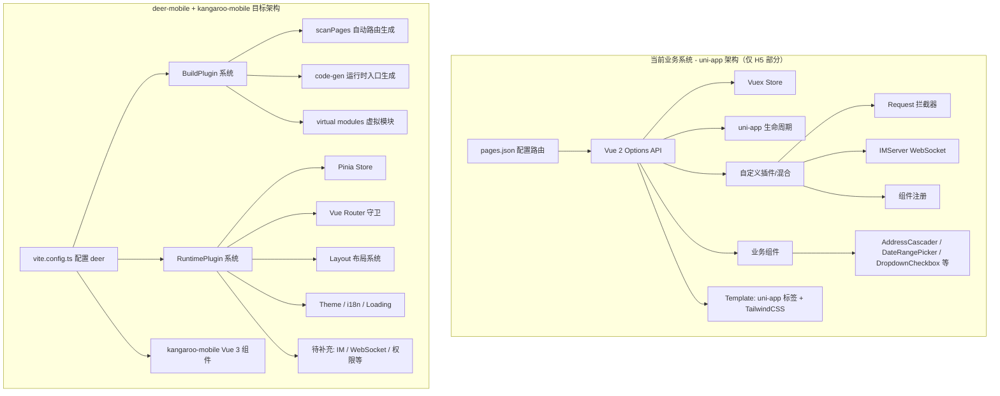
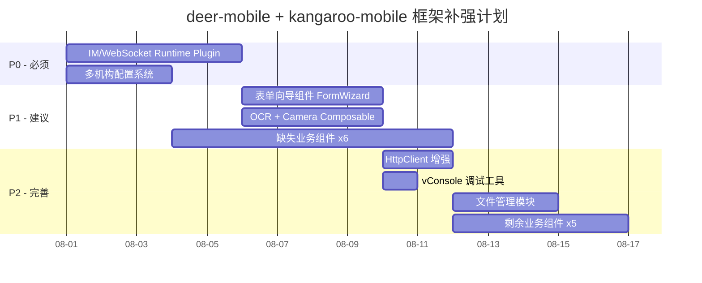

# 框架能力差距分析报告

> 分析日期：2026-07-28
> 分析目标：评估 [`deer-mobile`](../packages/deer-mobile) + [`kangaroo-mobile`](../packages/kangaroo-mobile) 框架对业务系统 [`YH-RM-FD-H5-WEB-develop-2.0`](C:\Users\maoma\Develop\Work\YH-RM-FD-H5-WEB-develop-2.0) 的支撑能力
>
> **前提确认**: 框架定位为 H5 框架，小程序由独立框架处理。技术栈统一 Vue 3 + TypeScript。

---

## 1. 概述

### 1.1 业务系统技术栈

| 维度 | 当前使用 |
|------|---------|
| **框架** | uni-app (DCloud 跨端框架) |
| **Vue** | Vue 2 (`vue >= 2.6.14 < 2.7`) |
| **构建工具** | vue-cli-service (webpack 5) |
| **状态管理** | Vuex 3 |
| **HTTP** | luch-request / flyio + axios |
| **UI 库** | kangaroo-mobile v1 + @dcloudio/uni-ui |
| **CSS** | TailwindCSS 3.4 + weapp-tailwindcss |
| **目标平台** | H5, 微信小程序, 支付宝小程序, 百度小程序, 抖音小程序, QQ 小程序, 快手小程序, App |

### 1.2 框架技术栈

| 维度 | 当前提供 |
|------|---------|
| **框架** | deer-mobile (类 Umi 插件化框架) |
| **Vue** | Vue 3 |
| **构建工具** | Vite 8 |
| **状态管理** | Pinia |
| **HTTP** | 自研 HttpClient (基于 axios) |
| **UI 库** | kangaroo-mobile (基于 Vant 4, Vue 3) |
| **CSS** | TailwindCSS + Less |
| **目标平台** | H5 浏览器 |

---

## 2. 架构对比



---

## 3. 差距分析矩阵

> **前提确认**: Vue 2→3 迁移、uni-app→Vite、webpack→Vite 均为预期变化，不视为框架缺失。

### 3.1 🟡 功能级差距（框架缺失，需要补充）

| # | 能力 | 业务系统需求 | 框架现状 | 优先级 | 建议方案 |
|---|------|-------------|---------|--------|---------|
| F1 | **IM/即时通讯 WebSocket** | socket.io 双向通信 + 心跳 + 自动重连 + 状态追踪 | ❌ 无 | **P0** | 新增 `useWebSocket()` composable + runtime plugin |
| F2 | **多机构/多租户配置** | [`config/organizations/`](C:\Users\maoma\Develop\Work\YH-RM-FD-H5-WEB-develop-2.0\config\organizations\organ-yixing.js) 按租户加载不同 API 地址、SystemCode 等 | ❌ 无 | **P0** | AppConfig 支持 profile 机制，运行时动态切换 |
| F3 | **表单向导（Form Wizard）** | 签约 3 步流程：BasicInfo → ServiceInfo → SignInfo，跨步骤数据共享 | ❌ 无 | **P1** | 提供 FormWizard 容器组件 + composable |
| F4 | **Loading 队列管理** | 并发请求共享一个 loading 状态 + 防抖 + 弹窗防重复 | ⚠️ 部分 | **P1** | HttpClient 已有，需确认对接业务侧 UI |
| F5 | **OCR 实名认证** | 相机拍照 + 身份证识别 | ❌ 无 | **P1** | 封装 camera composable + 对接 OCR 服务 |
| F6 | **文件管理模块** | 文件上传/预览/下载，预览服务 IP 动态配置 | ⚠️ 部分 | **P1** | Uploader 组件已有，缺 file store 和预览服务 |
| F7 | **WebSocket 连接管理** | 连接状态 `clientWebSocket` 在 store 中追踪 | ❌ 无 | **P2** | 与 F1 合并实现 |
| F8 | **vConsole 调试工具** | 非生产环境自动注入 vConsole | ❌ 无 | **P2** | dev 环境条件加载 |
| F9 | **原生权限管理** | 相机/定位/麦克风/相册权限检测与申请 | ❌ 无 | **P3** | H5 端权限相对简单，后续可按需补充 |
| F10 | **动态 API 版本/路径** | `httpMethod.js` 中 `contextV14`、`masterData` 等多版本 API 路径管理 | ❌ 无 | **P2** | API 层支持版本化路径配置 |

### 3.2 🟢 框架已有能力

| # | 能力 | 说明 |
|---|------|------|
| G1 | **插件化架构** | BuildPlugin + RuntimePlugin 双系统，可扩展性强 |
| G2 | **自动路由生成** | scanPagesPlugin 基于文件目录自动生成路由表 |
| G3 | **PWA 离线支持** | `pwa()` 插件封装 `vite-plugin-pwa` |
| G4 | **Mock 数据模拟** | mockPlugin 支持开发环境 API Mock |
| G5 | **主题系统** | themeManager + useTheme 运行时主题切换 |
| G6 | **国际化 i18n** | vue-i18n + i18nRuntimePlugin |
| G7 | **SM4 国密加密** | `sm-crypto` 集成 |
| G8 | **Token 认证** | authRuntimePlugin 路由守卫 + Pinia persistedstate |
| G9 | **请求封装 HttpClient** | 支持 interceptor、loading 队列、token 续约、动态 baseURL |
| G10 | **布局系统** | default-layout / blank-layout / user-layout / tab-bar |
| G11 | **组件库 40+** | kangaroo-mobile 的 Button、Cell、Form、Dialog、Picker、Calendar、Uploader 等 |

### 3.3 业务系统自定义组件 vs 框架组件对照

| 业务组件 | 框架覆盖 | 备注 |
|---------|---------|------|
| [`AddressCascader`](C:\Users\maoma\Develop\Work\YH-RM-FD-H5-WEB-develop-2.0\src\components\AddressCascader\index.vue) | ⚠️ 部分 | Area 组件仅支持静态数据，业务需要异步加载级联 |
| [`DateRangePicker`](C:\Users\maoma\Develop\Work\YH-RM-FD-H5-WEB-develop-2.0\src\components\DateRangePicker\index.vue) | ❌ 缺失 | Calendar 不支持范围选择模式 |
| [`DropdownCheckbox`](C:\Users\maoma\Develop\Work\YH-RM-FD-H5-WEB-develop-2.0\src\components\DropdownCheckbox\index.vue) | ❌ 缺失 | 下拉多选组件 |
| [`DropdownRadio`](C:\Users\maoma\Develop\Work\YH-RM-FD-H5-WEB-develop-2.0\src\components\DropdownRadio\index.vue) | ❌ 缺失 | 下拉单选组件 |
| [`PrimaryTitle`](C:\Users\maoma\Develop\Work\YH-RM-FD-H5-WEB-develop-2.0\src\components\PrimaryTitle\index.vue) | ❌ 缺失 | 简单标题组件 |
| [`RmChatItem`](C:\Users\maoma\Develop\Work\YH-RM-FD-H5-WEB-develop-2.0\src\components\RmChatItem\index.vue) | ❌ 缺失 | IM 聊天消息气泡 |
| [`RmEmpty`](C:\Users\maoma\Develop\Work\YH-RM-FD-H5-WEB-develop-2.0\src\components\RmEmpty\index.vue) | ✅ 已有 | Empty 组件直接可用 |
| [`RmEmptyLoadmore`](C:\Users\maoma\Develop\Work\YH-RM-FD-H5-WEB-develop-2.0\src\components\RmEmptyLoadmore\index.vue) | ❌ 缺失 | 空数据 + 加载更多组合 |
| [`RmFormText`](C:\Users\maoma\Develop\Work\YH-RM-FD-H5-WEB-develop-2.0\src\components\RmFormText\index.vue) | ❌ 缺失 | 表单只读文本展示 |
| [`RudioPreview`](C:\Users\maoma\Develop\Work\YH-RM-FD-H5-WEB-develop-2.0\src\components\RudioPreview\index.vue) | ❌ 缺失 | 音频播放/预览 |
| [`VideoPreview`](C:\Users\maoma\Develop\Work\YH-RM-FD-H5-WEB-develop-2.0\src\components\VideoPreview\index.vue) | ❌ 缺失 | 视频播放/预览 |
| [`UserInfo`](C:\Users\maoma\Develop\Work\YH-RM-FD-H5-WEB-develop-2.0\src\components\UserInfo\index.vue) | ❌ 缺失 | 用户信息展示卡片 |
| [`BlockCard`](C:\Users\maoma\Develop\Work\YH-RM-FD-H5-WEB-develop-2.0\src\components\BlockCard\index.vue) | ❌ 缺失 | 区块卡片容器 |

---

## 4. 框架缺失功能详细说明

### 4.1 P0 — 必须补充

#### P0-1: IM/WebSocket Runtime Plugin

**业务参考**: [`IMServer.js`](C:\Users\maoma\Develop\Work\YH-RM-FD-H5-WEB-develop-2.0\src\plugins\IMServer.js)（199 行）

**功能需求**:
- WebSocket 连接管理（连接/断开/重连）
- 心跳机制（heartbeatStart）
- 自动重连（最大次数限制 + 退避策略）
- 连接状态追踪（store 中 `clientWebSocket` 状态）
- 消息事件总线（onSocketMessage 分发）
- 提供 `useWebSocket()` composable

**输出产物**:
- `packages/deer-mobile/src/composables/useWebSocket.ts`
- `packages/deer-mobile/plugins/runtime/websocket-plugin.ts`
- 单元测试

#### P0-2: 多机构配置系统

**业务参考**: [`config/index.json`](C:\Users\maoma\Develop\Work\YH-RM-FD-H5-WEB-develop-2.0\config\index.json)、[`config/organizations/`](C:\Users\maoma\Develop\Work\YH-RM-FD-H5-WEB-develop-2.0\config\organizations\organ-yixing.js)

**功能需求**:
- AppConfig 支持 profile 机制（如 `appConfig.profiles`）
- 构建时/运行时切换配置 profile
- 配置合并（base config + profile override）
- 运行时动态覆盖 baseURL（如用户自定义 IP 地址）

**输出产物**:
- `AppConfig` 类型扩展 `profiles` 字段
- deer() 插件 `env` 选项增强
- 运行时配置切换 API

### 4.2 P1 — 建议补充

#### P1-1: 表单向导（FormWizard）

**业务参考**: [`pages/sign/add.vue`](C:\Users\maoma\Develop\Work\YH-RM-FD-H5-WEB-develop-2.0\src\pages\sign\add.vue)

**功能需求**:
- 多步骤表单容器组件
- 步骤间数据共享（Pinia store 或 composable）
- 前进/后退/跳转指定步骤
- 步骤验证（每个步骤提交前校验）
- 草稿保存/恢复

**输出产物**:
- `packages/kangaroo-mobile/src/components/form-wizard/` 组件
- `useFormWizard()` composable

#### P1-2: OCR + Camera Composable

**业务参考**: [`pages/login/realname-ocr.vue`](C:\Users\maoma\Develop\Work\YH-RM-FD-H5-WEB-develop-2.0\src\pages\login\realname-ocr.vue)

**功能需求**:
- 浏览器摄像头调用封装
- 拍照 + 图片裁剪
- OCR 识别服务对接（可配置 API）
- loading / error 状态管理

**输出产物**:
- `useCamera()` composable
- `useOCR()` composable

#### P1-3: 缺失业务组件

以下组件需在 `kangaroo-mobile` 中补充：

| 组件名 | 优先级 | 参考实现 |
|--------|--------|---------|
| `DateRangePicker` | P1 | 基于 Calendar 扩展范围选择 |
| `DropdownCheckbox` | P1 | Popup + Checkbox 组合 |
| `DropdownRadio` | P1 | Popup + Radio 组合 |
| `AddressCascader` | P1 | Popup + Picker 级联 + 异步加载 |
| `ChatMessage` | P1 | 消息气泡 UI |
| `AudioPreview` | P2 | 音频播放器 |
| `VideoPreview` | P2 | 视频播放器 |
| `UserInfoCard` | P2 | 用户信息卡片 |
| `BlockCard` | P2 | 区块卡片容器 |
| `FormText` | P2 | 表单只读文本 |
| `EmptyLoadmore` | P2 | 空状态 + 加载更多 |

### 4.3 框架已有但可加强

#### E1: HttpClient 动态配置

[`request.ts`](../packages/deer-mobile/src/utils/request.ts) 已有：
- ✅ Loading 队列控制
- ✅ Token 自动注入 + 续约
- ✅ 动态 BaseURL
- ✅ 登录超时处理

需增强：
- 请求防重复弹窗（参考 `showModalCount` 机制）
- 自定义 API 版本路径管理（参考 `httpMethod.js` 的 `contextV14`）

#### E2: kangaroo-mobile 组件 TailwindCSS 兼容

业务系统大量使用 TailwindCSS 类名（如 `px-4 py-4`、`flex items-center`），kangaroo-mobile 组件使用 Less + 自定义 CSS。需确保两者在项目中能混用。

---

## 5. 补强路线图



### 优先级策略

```
Phase 1 (P0): 框架基础设施补齐
├── IM/WebSocket Runtime Plugin   ← 聊天功能基础
└── 多机构配置系统                  ← 多租户场景基础

Phase 2 (P1): 核心业务能力补充
├── 表单向导组件                    ← 签约流程核心
├── OCR + Camera                   ← 实名认证核心
└── 6 个核心业务组件               ← DateRangePicker / DropdownCheckbox 等

Phase 3 (P2): 体验完善
├── HttpClient 增强                 ← 弹窗防重复 / API 版本管理
├── vConsole 集成                  ← 调试体验
├── 文件管理模块                    ← 文件上传/预览
└── 剩余 5 个业务组件              ← AudioPreview / VideoPreview 等
```

---

## 6. 总结

| 维度 | 评估 |
|------|------|
| **框架核心架构** | ✅ 插件化设计优秀，BuildPlugin + RuntimePlugin 体系完整 |
| **UI 组件覆盖度** | ⚠️ 基础组件齐全，但缺少业务特定组件（约 11 个） |
| **运行时能力** | ⚠️ 缺少 IM/WebSocket 和多机构配置这两个关键能力 |
| **HTTP 请求层** | ✅ 基本完善，少量增强即可 |
| **周边工具链** | ⚠️ 缺少 vConsole、OCR 等开发/业务工具 |

**框架整体成熟度评估: 约 60%** — 核心架构扎实，但需要补充约 2 个 P0 能力和 10+ 个业务组件才能完整支撑该业务系统的 H5 端重建。
