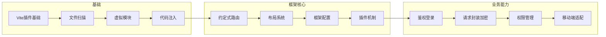

# 从 Vite 插件到移动端框架 — 学习路线图

> 目标：构建一个类似 Umi 的移动端框架，涵盖路由、鉴权、登录、加密等能力

---

## 第一部分：拆解目标框架

一个类似 Umi 的框架，核心由三层组成：

```
┌──────────────────────────────────────────────────┐
│                  用户项目                           │
│  pages/  app.ts  .umirc.ts  plugin.ts            │
└──────────────────────┬───────────────────────────┘
                       │
┌──────────────────────▼───────────────────────────┐
│              框架构建层（Build Time）                │
│  ┌──────────┐ ┌──────────┐ ┌──────────────────┐  │
│  │ Vite插件  │ │ 路由生成  │ │ 配置解析 + 合并   │  │
│  │ 虚拟模块  │ │ 约定扫描  │ │ 插件机制          │  │
│  └──────────┘ └──────────┘ └──────────────────┘  │
└──────────────────────┬───────────────────────────┘
                       │
┌──────────────────────▼───────────────────────────┐
│             框架运行时层（Runtime）                  │
│  ┌──────────┐ ┌──────────┐ ┌──────────────────┐  │
│  │ 路由组件  │ │ 鉴权组件  │ │ 请求库 + 加密     │  │
│  │ 布局系统  │ │ 权限守卫  │ │ 工具函数          │  │
│  └──────────┘ └──────────┘ └──────────────────┘  │
└──────────────────────────────────────────────────┘
```

---

## 第二部分：分阶段学习路线

### 阶段一：深化 Vite 插件能力（你现在在这里）

**目标**：掌握框架构建层所需的所有 Vite 插件技术

| 步骤 | 内容 | 涉及技术 | 练习 |
|------|------|---------|------|
| 1.1 | ✅ 你已经完成 | 基础插件、transform、虚拟模块 | hello/timestamp/greeting/logger 插件 |
| 1.2 | **约定式文件扫描** | `fast-glob` 扫描 pages 目录 | 写一个插件自动扫描 `src/pages/` 下所有文件 |
| 1.3 | **动态虚拟模块** | 根据扫描结果生成代码 | 把扫描结果拼成路由表，通过虚拟模块暴露 |
| 1.4 | **配置文件解析** | 读取用户项目中的配置文件 | 写一个插件读取 `.frameworkrc.ts` 并合并默认配置 |
| 1.5 | **代码注入** | 向入口文件注入代码 | 自动注入路由组件、全局样式等 |

**阶段一完成后，你应该能**：写一个 Vite 插件，扫描用户目录、生成虚拟模块、注入代码到入口文件

---

### 阶段二：理解框架架构设计

**目标**：搞懂 Umi/Next.js 这类框架的设计思路

| 步骤 | 内容 | 关键理解 |
|------|------|---------|
| 2.1 | **认识框架分层** | 构建时 vs 运行时：哪些在编译期做，哪些在浏览器做 |
| 2.2 | **理解约定优于配置** | 为什么 Umi 用 pages 目录结构决定路由 |
| 2.3 | **理解插件机制** | Umi 插件 vs Vite 插件的区别：Umi 插件是框架层面的扩展点 |
| 2.4 | **分析 Umi 源码（选读）** | 看 Umi 的 `preset-built-in` 目录，理解核心插件实现 |

**推荐阅读**：
- Umi 官网的架构说明
- 阅读 Umi 的 `@umijs/preset-umi` 源码（重点看路由生成部分）
- 对比 Next.js 的 App Router 设计思路

---

### 阶段三：搭建最小可用框架

**目标**：从零搭建一个包含路由、布局、配置的最小框架

#### 3.1 项目结构规划

```
my-mobile-framework/
├── packages/
│   ├── framework/              # 框架核心包
│   │   ├── src/
│   │   │   ├── plugins/        # 内置 Vite 插件
│   │   │   │   ├── route-plugin.ts     # 路由生成插件
│   │   │   │   ├── config-plugin.ts    # 配置解析插件
│   │   │   │   └── index.ts
│   │   │   ├── runtime/        # 运行时（浏览器端代码）
│   │   │   │   ├── router.tsx
│   │   │   │   ├── auth.tsx
│   │   │   │   └── index.ts
│   │   │   └── cli/            # CLI 工具
│   │   │       └── create.ts
│   │   ├── package.json
│   │   └── tsconfig.json
│   └── create-app/             # 脚手架工具
│       └── ...
├── examples/
│   └── demo-app/               # 测试项目
└── package.json
```

#### 3.2 核心功能实现步骤

```
Step 3.1 - 约定式路由（核心）
├── Vite 插件扫描 pages/ 目录
├── 生成路由配置虚拟模块
├── 运行时根据 URL 匹配渲染对应页面
└── 支持动态路由 /user/:id

Step 3.2 - 布局系统
├── layouts/index.tsx 作为全局布局
├── 支持页面级布局
└── 通过虚拟模块注入布局组件

Step 3.3 - 框架配置
├── 读取用户项目的 framework.config.ts
├── 合并默认配置
├── 通过 config 钩子修改 Vite 配置
└── 通过虚拟模块暴露配置给运行时

Step 3.4 - 插件机制
├── 定义框架插件接口（和 Vite 插件不同）
├── 允许用户在配置中加载插件
├── 插件可以修改路由、添加虚拟模块
└── 插件可以注入运行时逻辑
```

---

### 阶段四：添加业务能力

**目标**：在框架基础上添加常用业务模块

| 模块 | 实现方式 | 说明 |
|------|---------|------|
| **鉴权系统** | 运行时插件 + 路由守卫 | 基于 JWT，未登录跳转登录页 |
| **登录模块** | 内置页面组件 | 可自定义 UI，框架提供登录逻辑 |
| **请求封装** | 基于 fetch/axios | 自动携带 token、错误处理 |
| **数据加密** | 工具函数库 | AES 加密本地存储、传输加密 |
| **权限管理** | 路由级别权限控制 | 基于角色或权限码 |
| **移动端适配** | Vite 插件注入 | viewport、rem 适配、1px 方案 |

---

## 第三部分：推荐学习路径图



---

## 第四部分：每个阶段的交付物

| 阶段 | 交付物 | 预计步骤数 |
|------|--------|-----------|
| 阶段一 | 一个能扫描目录 + 生成虚拟路由表的 Vite 插件 | 4 个小练习 |
| 阶段二 | 对 Umi 架构的理解笔记 | 阅读 + 分析 |
| 阶段三 | 一个最小可用框架（路由 + 布局 + 配置） | 4 个核心功能 |
| 阶段四 | 添加鉴权、登录、加密等业务模块 | 按需实现 |

---

## 下一步建议

1. 先完成 **阶段一** 的剩余练习（文件扫描、动态虚拟模块、配置解析）
2. 然后分析 Umi 源码的架构设计（阶段二）
3. 再着手搭建最小框架（阶段三）

要开始阶段一的练习吗？先从 **1.2 约定式文件扫描** 开始。
