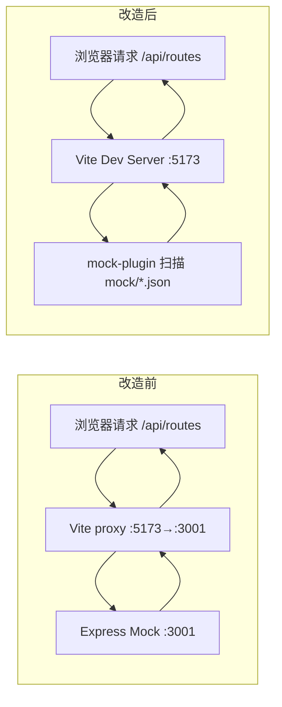

# In-process Mock 方案

> 将独立的 Express mock 服务（port 3001）转为 `deer-mobile` 框架内置 Vite 插件

---

## 一、当前架构 vs 目标架构

### 当前（独立进程）

```
pnpm dev:all
├── pnpm dev        → Vite Dev Server (:5173)  ──proxy──┐
└── pnpm mock       → Express Mock (:3001)  ←──────────────┘
                     ✗ 两个进程，端口占用
                     ✗ 时序问题（mock 晚于 vite 启动）
                     ✗ 需要 concurrently 管理
```

### 目标（In-process）

```
pnpm dev  →  Vite Dev Server (:5173)
              ├─ 前端资源服务
              └─ mock API 中间件 ← 同进程，零延迟
              
              ✓ 一个进程，无需额外端口
              ✓ 无时序问题，同时启动
              ✓ 无需 concurrently
              ✓ 改了 mock 代码 HMR 自动重启
```

---

## 二、最终实现方案

### 架构设计

参照 Umi / vite-plugin-mock 的设计：

1. **`mockPlugin` 作为 `deer-mobile` 框架内置插件**（不是 demo 应用代码），从 `deer-mobile` 导出
2. **`mock/` 目录自动扫描**（类似 Umi 的 mock 机制），存放 `*.json` 文件
3. **`apis` 参数支持动态 handler 函数**，优先级高于目录扫描
4. **`enabled` 参数控制开关**，默认关闭

### 文件结构

```
apps/example/
├── mock/                    ← mock 数据目录
│   ├── routes.json          ← 按业务模块拆分
│   └── user.json
├── vite.config.ts           ← 只写开关，不写数据
└── ...

packages/deer-mobile/
└── plugins/mock-plugin/
    └── index.ts             ← 框架内置 mock 插件
```

### 核心代码

**插件：** [`packages/deer-mobile/plugins/mock-plugin/index.ts`](packages/deer-mobile/plugins/mock-plugin/index.ts)
- 支持 `enabled` 开关
- 支持 `dir` 自定义 mock 目录（默认 `./mock`）
- 自动扫描目录下所有 `*.json` 文件并合并 API
- 支持 `apis` 参数（内联配置，优先级高于目录扫描）
- 支持 `:id` 动态路由参数匹配
- 零外部依赖（仅使用 Node.js 内置 `fs` / `path`）

**使用方式：** [`apps/example/vite.config.ts`](apps/example/vite.config.ts)

```ts
import { mockPlugin } from 'deer-mobile';

export default defineConfig({
  plugins: [
    mockPlugin({ enabled: true }),  // 自动扫描 mock/ 目录
  ],
});
```

### Mock 数据文件

按业务模块拆分：

```json
// mock/routes.json
{
  "GET /api/routes": { "status": 1, "data": [...] }
}

// mock/user.json
{
  "GET /api/user/:id": { "status": 1, "data": { "id": 1, "name": "张三" } },
  "POST /api/user/login": { "status": 1, "data": { "token": "xxx" } }
}
```

---

## 三、改动清单

| 文件 | 操作 | 说明 |
|------|------|------|
| [`packages/deer-mobile/plugins/mock-plugin/index.ts`](packages/deer-mobile/plugins/mock-plugin/index.ts) | **新建** | 框架内置 Mock 插件，支持目录扫描 + 内联配置 |
| [`packages/deer-mobile/index.ts`](packages/deer-mobile/index.ts) | 修改 | 导出 `mockPlugin` |
| [`apps/example/vite.config.ts`](apps/example/vite.config.ts) | 修改 | 改用 `mockPlugin({ enabled: true })`，移除 proxy |
| [`apps/example/mock/routes.json`](apps/example/mock/routes.json) | **新建** | 路由相关 mock 数据 |
| [`apps/example/mock/user.json`](apps/example/mock/user.json) | **新建** | 用户相关 mock 数据 |
| `apps/example/server/` | **删除** | 不再需要独立 Express 服务 |
| `apps/example/plugins/mock-plugin/` | **删除** | 已移到 deer-mobile 框架中 |
| [`package.json`](package.json) | 修改 | 移除 `mock`、`dev:all` 脚本 |
| [`apps/example/package.json`](apps/example/package.json) | 修改 | 移除 `server` 脚本 + `express`/`@types/express` 依赖 |

---

## 四、数据流



---

## 五、验证结果

```
pnpm dev               → 前端 + mock 单进程启动 ✅
GET  /api/routes       → {"status":1,"data":[...]} ✅
POST /api/user/login   → {"status":1,"data":{"token":"mock-token-..."}} ✅
GET  /api/user/5       → {"status":1,"data":{"id":1,"name":"张三"}} ✅
```
