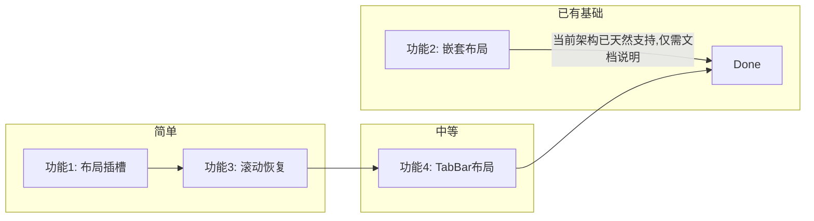

# 布局系统剩余 4 项功能方案

## 功能 1：布局插槽（Layout Slots）

### 目标
允许页面通过 `routeMeta` 向布局注入自定义内容，如自定义 header 按钮、操作栏等。

### 实现方式

**页面声明：**
```typescript
export const routeMeta = {
  title: '设置',
  slots: {
    headerRight: () => h('button', { onClick: save }, '保存'),
    headerTitle: '自定义标题',
    headerClass: 'bg-blue-500',
  },
};
```

**Layout 消费：**
在 [`default-layout.tsx`](../packages/deer-mobile/src/layouts/default-layout.tsx) 中读取 `route.meta.slots`：

```tsx
const headerRight = computed(() => (route.meta?.slots as any)?.headerRight);
// 在 header 中渲染：
{headerRight.value ? headerRight.value() : null}
```

### 改动文件
- `src/layouts/default-layout.tsx` — 添加 slots 读取和渲染
- `types.ts` — 添加 RouteMeta 类型声明

---

## 功能 2：嵌套布局（Nested Layouts）

### 目标
支持布局继承链，如 `DefaultLayout → UserLayout → Page`。

### 实现方式

布局组件内部渲染 `<router-view>`，由 LayoutResolver 递归解析：

```
LayoutResolver
  → route.meta.layout = 'user'
    → UserLayout 渲染用户导航栏
      → 内部 <router-view> 解析子路由
        → 子路由可能使用 'default' 布局的页面
```

**实现：**

1. LayoutResolver 不再直接选择布局，而是**每个布局自己决定是否继续嵌套**
2. 布局通过 `<router-view>` 渲染子路由，子路由由 LayoutResolver 再次处理

实际上，当前架构已经支持：`route.meta.layout = 'default'` → DefaultLayout 渲染 → 内部 `<router-view>` 渲染页面组件。

对于嵌套布局，可以添加一个 `parentLayout` 概念：

```typescript
// layouts/user-layout.tsx
export default defineComponent({
  setup() {
    return () => h('div', { class: 'user-section' }, [
      h('nav', {}, '用户导航'),
      h(RouterView),  // 子路由在此渲染
    ]);
  },
});
```

然后在 `layouts/index.tsx` 中注册：
```typescript
const LAYOUT_REGISTRY = {
  default: DefaultLayout,
  blank: BlankLayout,
  user: UserLayout,  // UserLayout 内部也有 <router-view>
};
```

这样就已经支持嵌套布局了！因为 `LayoutResolver → UserLayout (含 <router-view>) → 子页面组件`。当前架构天然支持。

### 改动文件
- `src/layouts/` — 添加自定义布局示例（如 `user-layout.tsx`）
- 文档说明嵌套方式

---

## 功能 3：布局缓存 / 滚动恢复

### 目标
离开页面再回来时保持滚动位置，结合 `<KeepAlive>` 缓存组件状态。

### 实现方式

**Step 1：在 create-app.ts 添加 scrollBehavior**
```typescript
const router = createRouter({
  history,
  routes,
  scrollBehavior(to, from, savedPosition) {
    if (savedPosition) return savedPosition;
    return { top: 0 };
  },
});
```

**Step 2：在 default-layout.tsx 添加 KeepAlive**
```tsx
<router-view v-slot="{ Component }">
  <keep-alive>
    <component :is="Component" />
  </keep-alive>
</router-view>
```

或者通过 `route.meta.keepAlive` 控制哪些页面需要缓存：
```tsx
const shouldKeepAlive = computed(() => route.meta?.keepAlive !== false);
```

### 改动文件
- `src/runtime/create-app.ts` — 添加 `scrollBehavior`
- `src/layouts/default-layout.tsx` — 添加 KeepAlive 支持

---

## 功能 4：TabBar 布局

### 目标
底部 TabBar 布局，类似微信底部导航，Tab 切换保持页面状态。

### 实现方式

**Step 1：创建 TabBar 组件** `src/layouts/tab-bar.tsx`

```typescript
// 通过 appConfig 或 routeMeta 配置 tab 列表
const TABS = [
  { path: '/', label: '首页', icon: 'home' },
  { path: '/about', label: '关于', icon: 'info' },
  { path: '/user/profile', label: '我的', icon: 'user' },
];
```

**Step 2：TabBarLayout**
- 顶部：页面内容区域（`<router-view>` + KeepAlive）
- 底部：固定 TabBar

**Step 3：注册到 LayoutResolver**
```typescript
const LAYOUT_REGISTRY = {
  default: DefaultLayout,
  blank: BlankLayout,
  tabs: TabBarLayout,  // 新增
};
```

### 改动文件
- `src/layouts/tab-bar.tsx` — TabBar 布局组件
- `src/layouts/index.tsx` — 注册 tabs 布局
- `src/style.css` — TabBar 样式

---

## 执行顺序


