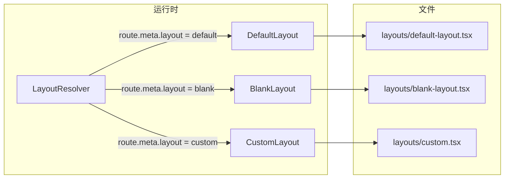
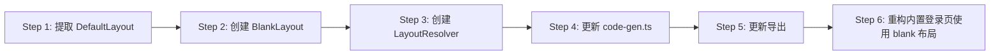

# 布局系统增强方案

## 目标

支持页面级布局选择，通过 `routeMeta.layout` 切换不同布局，内置 default 和 blank 两种布局，并支持用户自定义布局。

---

## 当前状态

- 单布局文件：`src/layouts/index.tsx`（带 header/footer）
- 所有页面共用同一布局
- 仅通过 `noNavPages` 配置隐藏导航栏
- `route.meta.layout` 已存在但仅读取未使用

## 目标架构



---

## 改动方案

### Step 1: 提取 DefaultLayout

**文件：** `src/layouts/default-layout.tsx`

把当前 `layouts/index.tsx` 的内容移到 `default-layout.tsx`，保留所有功能（标题、动画、header/footer）。

### Step 2: 创建 BlankLayout

**文件：** `src/layouts/blank-layout.tsx`

```tsx
// 纯内容布局，无 header/footer，适合登录页等
export default defineComponent({
  setup() {
    return () => h('div', { class: 'min-h-screen' }, h(RouterView));
  },
});
```

### Step 3: 创建 LayoutResolver

**文件：** `src/layouts/index.tsx`

根据 `route.meta.layout` 动态选择布局组件：

```typescript
const LAYOUT_MAP: Record<string, Component> = {
  default: DefaultLayout,
  blank: BlankLayout,
};

// 运行时读取 route.meta.layout 并渲染对应布局
```

### Step 4: 更新 `code-gen.ts`

将生成的布局插件代码从直接导入 `deer-mobile/layouts` 改为使用 `LayoutResolver`。由于 `index.tsx` 本身就变成了 resolver，所以外部导入方式不变。

### Step 5: 更新 exports

确保 `package.json` 的 `exports` 中 `./layouts` 指向 `src/layouts/index.tsx`（已存在，无需修改）。

### Step 6: 示例页面使用

```typescript
// pages/login.tsx
export const routeMeta = { layout: 'blank' };

// pages/user/profile.tsx  
export const routeMeta = { layout: 'default', title: '用户资料' };
```

---

## 执行顺序


