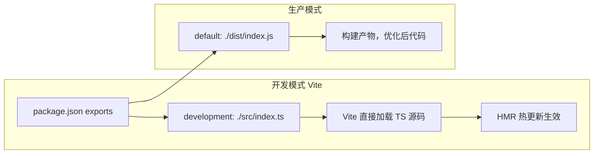

# Monorepo Dev Workflow 优化方案

> 解决 `kangaroo-mobile` 修改后需要手动 build 的问题，以及 `dev` 命令的最佳实践

---

## 一、现状分析

### 两个包的 `exports` 配置对比

| 包 | development 条件 | 默认条件 | 结果 |
|---|:---:|:---:|:---:|
| [`deer-mobile`](packages/deer-mobile/package.json:10) | ✅ `./src/index.ts` | `./index.js` | ✅ Vite dev 模式直接加载源码 |
| [`kangaroo-mobile`](packages/kangaroo-mobile/package.json:9) | ❌ 无 | `./dist/kangaroo-mobile.js` | ❌ 必须 build 才能用 |

这就是为什么 `deer-mobile` 改了代码不用 build 就生效，而 `kangaroo-mobile` 改了 Toast 源码后报 `showToast is not a function`。

### 大厂常见的做法

大厂 monorepo（Vue 3、Vite、Nuxt、Turborepo 官方示例）普遍采用 **双模式** 策略：



Vite 会自动根据 `process.env.NODE_ENV` 选择 `development` 条件。这是 Vite 官方推荐的标准做法。

---

## 二、推荐方案：补充 `development` 条件（优先）

### 修改 [`packages/kangaroo-mobile/package.json:9-15`](packages/kangaroo-mobile/package.json:9-15)

```diff
"exports": {
  ".": {
    "types": "./src/index.ts",
+   "development": "./src/index.ts",
    "default": "./dist/kangaroo-mobile.js"
  },
- "./style.css": "./dist/kangaroo-mobile.css"
+ "./style.css": {
+   "development": "./src/theme/index.less",
+   "default": "./dist/kangaroo-mobile.css"
+ }
}
```

**效果**：
- `pnpm dev` → Vite 会自动选 `development` → 加载 `src/index.ts` 源码
- `turbo run build` → 构建时用 `default` → 打包 dist
- **改了源码不需要 rebuild，HMR 直接生效**

### 为什么现在没报语法错误？

因为 `"types": "./src/index.ts"` 让 TS 能正常识别类型，不会报红。但运行时 Vite 会用 `default` 条件加载 dist，所以运行时出错。

---

## 三、进阶方案：Turbo Pipeline 自动依赖构建

如果你想保留现有方式（不借助 `development` 条件），可以用 Turbo 的 **pipeline 依赖** 机制。

### 新增 [`turbo.json`](turbo.json)

```json
{
  "$schema": "https://turbo.build/schema.json",
  "tasks": {
    "build": {
      "outputs": ["dist/**", "index.js"],
      "dependsOn": ["^build"]
    },
    "dev": {
      "dependsOn": ["^build"],
      "cache": false,
      "persistent": true
    }
  }
}
```

然后改根目录 [`package.json:8`](package.json:8)：

```diff
- "dev": "pnpm --filter example dev",
+ "dev": "turbo run dev",
```

**执行流程**：
```
pnpm dev
  → turbo run dev
    → 发现 dev 依赖 ^build（上游构建）
    → 并行构建 kangaroo-mobile + deer-mobile（如果缓存过期）
    → 然后启动 example 的 dev server
```

**Turbo 缓存机制**：如果源码没变，直接从缓存恢复构建结果，毫秒级完成。

---

## 四、两种方案对比

| 维度 | 方案一：development 条件 | 方案二：Turbo pipeline |
|------|:---:|:---:|
| 实现成本 | 改 3 行配置 | 创建 turbo.json + 改脚本 |
| 是否需要 build | ❌ 不需要 | ✅ 每次 dev 都会检查 |
| HMR 速度 | ⚡ 直接热更新 | 🐢 需要先 build |
| 生产发布 | 正常 build 即可 | 正常 build 即可 |
| 推荐度 | ⭐⭐⭐⭐⭐ | ⭐⭐⭐ |

**结论：推荐两个一起上。**

1. 先用 **方案一** 解决眼前的问题（开发时直接加载源码）
2. 再建 **turbo.json** 规范 pipeline（生产构建时自动处理依赖顺序）

---

## 五、实施结果 ✅

### 已完成的修改

| 文件 | 改动 | 说明 |
|------|------|------|
| [`packages/kangaroo-mobile/package.json`](packages/kangaroo-mobile/package.json:9) | `exports` 添加 `development` 条件 | Vite dev 模式直接加载源码 |
| [`packages/kangaroo-mobile/src/vant-layer.css`](packages/kangaroo-mobile/src/vant-layer.css) | **新建** | 用 `@layer framework` 包裹 Vant CSS，解决与 Tailwind 的 CSS Cascade Layer 冲突 |
| [`packages/kangaroo-mobile/src/components/icon/icon.vue`](packages/kangaroo-mobile/src/components/icon/icon.vue:28) | Deer SVG 内联化 | 消除 unplugin-icons 虚拟模块依赖，用户无需安装额外插件 |
| [`turbo.json`](turbo.json:8) | `dev` 添加 `dependsOn: ["^build"]` | 生产构建时自动先构建依赖包 |
| [`package.json`](package.json:8) | `dev` 改为 `turbo run dev` | 通过 turbo pipeline 管理 dev 流程 |

### 遇到的问题及解决

1. **CSS Cascade Layer 冲突** — Tailwind v4 的工具类在 `@layer utilities` 中，Vant 的 CSS reset 是无 layer 的。根据规范，无 layer 样式优先级高于任何 `@layer`，导致 `button { color: inherit }` 压过 `.text-white`。解决方案：通过 `@import ... layer(framework)` 将 Vant CSS 包裹在低优先级层中。

2. **unplugin-icons 虚拟模块** — `icon.vue` 源码中使用了 `~icons/deer/` 虚拟模块，走源码时需要 unplugin-icons 插件。解决方案：将 deer SVG 内联为 Vue 组件，消除外部依赖。

### 验证

```
pnpm dev       → 前端源码直接加载，HMR 生效 ✅
pnpm build     → turbo pipeline 自动处理依赖顺序 ✅
```
