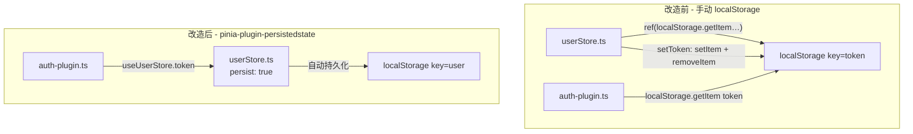

# 迁移到 pinia-plugin-persistedstate 计划

## 改动总览



## 为什么 auth-plugin 也需要改？

`auth-plugin.ts` 目前直接在注入的代码里写 `localStorage.getItem('token')`。迁移后 token 会被 `pinia-plugin-persistedstate` 以 `{token: 'xxx'}` 的 JSON 格式存入 `localStorage` 的 `'user'` 键下（store 的 `$id`），不再是裸字符串。所以路由守卫也需要改为从 `useUserStore().token` 读取。

## 涉及文件（共 7 处改动）

### 1. 安装依赖
- 根目录 `package.json` → 添加 `pinia-plugin-persistedstate`
- `packages/deer-mobile/package.json` → 添加 peerDependency

### 2. [`packages/deer-mobile/src/stores/userStore.ts`](packages/deer-mobile/src/stores/userStore.ts)
- 移除 `localStorage.getItem('token')` 初始化
- 移除 `setToken` 中的 `localStorage.setItem`
- 移除 `logout` 中的 `localStorage.removeItem`
- 添加第三个参数 `{ persist: true }`

### 3. [`packages/deer-mobile/plugins/pinia-plugin.ts`](packages/deer-mobile/plugins/pinia-plugin.ts)
```diff
- onImport: () => `import { createPinia } from 'pinia'`,
- onRuntime: () => `app.use(createPinia())`,
+ onImport: () => [
+   `import { createPinia } from 'pinia'`,
+   `import piniaPluginPersistedstate from 'pinia-plugin-persistedstate'`,
+ ].join('\n'),
+ onRuntime: () => [
+   `const pinia = createPinia()`,
+   `pinia.use(piniaPluginPersistedstate)`,
+   `app.use(pinia)`,
+ ].join('\n'),
```

### 4. [`plugins/pinia-plugin.ts`](plugins/pinia-plugin.ts)
同上，根目录 demo 层做相同改动。

### 5. [`packages/deer-mobile/plugins/auth-plugin.ts`](packages/deer-mobile/plugins/auth-plugin.ts)
在注入的代码中，将 `localStorage.getItem('token')` 改为 `useUserStore().token`，并在模块顶部注入 import。

### 6. [`plugins/auth-plugin.ts`](plugins/auth-plugin.ts)
同上，根目录 demo 层做相同改动。

## 注意事项

1. **向后兼容**：迁移后 localStorage 的 key 从 `'token'`（裸字符串）变为 `'user'`（JSON `{token: 'xxx'}`）。已登录用户的 token 会丢失，需要重新登录。
2. **执行顺序**：`auth-plugin.ts` 的 transform 代码在 `setup-plugin` 生成虚拟模块之后执行，所以可以注入 import 语句。
3. **测试**：改造后启动 dev server，登录 → 刷新 → 确认 token 还在 → 确认路由守卫正常工作。
