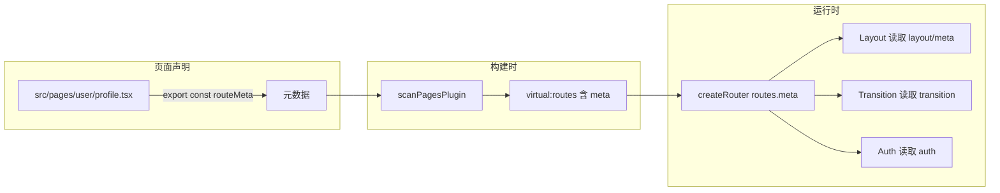
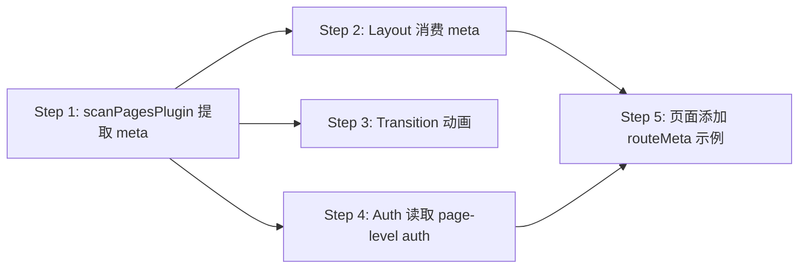

# 路由元数据支持方案

## 目标

支持页面级声明 `routeMeta`，包含 `title` / `layout` / `auth` / `transition`，在路由生成时自动合并到 `route.meta`，布局和插件可消费。

---

## 改动一览



---

## 具体改动

### Step 1: `scanPagesPlugin` — 提取 + 注入路由元数据

**文件：** [`plugins/scan-pages-plugin/index.ts`](../packages/deer-mobile/plugins/scan-pages-plugin/index.ts)

#### 1a. 从页面文件提取 `routeMeta`

用正则读取每个扫描到的 `.tsx` 文件，提取 `export const routeMeta`：

```typescript
function extractRouteMeta(filePath: string): Record<string, unknown> | null {
  const content = fs.readFileSync(filePath, 'utf-8');
  const regex = /export\s+const\s+routeMeta\s*=\s*(\{[^}]+\})/;
  const match = content.match(regex);
  if (!match) return null;
  try {
    return JSON.parse(match[1].replace(/'/g, '"'));
  } catch {
    return null;
  }
}
```

#### 1b. 生成带 `meta` 的路由代码

```typescript
// 改前
`{ path: '${r.path}', component: route${i} }`

// 改后
`{ path: '${r.path}', component: route${i}, meta: ${JSON.stringify(r.meta || {})} }`
```

#### 1c. `pluginRoutes` 也支持 meta

```typescript
export default function scanPagesPlugin(options: {
  pluginRoutes?: (RouteConfig & { meta?: Record<string, unknown> })[];
} = {}): Plugin {
```

---

### Step 2: Layout 读取 `route.meta`

**文件：** [`src/layouts/index.tsx`](../packages/deer-mobile/src/layouts/index.tsx)

#### 2a. 页面标题

```typescript
watch(
  () => route.meta?.title,
  (title) => {
    if (title) document.title = `${title} - ${appConfig.title}`;
  },
  { immediate: true },
);
```

#### 2b. 布局选择

```typescript
const layoutType = computed(() => route.meta?.layout || 'default');
// layoutType 决定渲染哪个布局组件
```

---

### Step 3: 页面过渡动画

**文件：** [`src/runtime/create-app.ts`](../packages/deer-mobile/src/runtime/create-app.ts)

在 `<router-view>` 外层包裹 `<Transition>`，读取 `route.meta.transition`：

```typescript
// composeRootContainer 中
const renderRoot = pluginManager.composeRootContainer(() =>
  h(Transition, { name: transitionName }, () => h(RouterView)),
);
```

`transitionName` 根据当前路由的 `meta.transition` 动态变化（通过 `watch` 监听）。

---

### Step 4: Auth 插件读取页面级 `auth: false`

**文件：** [`plugins/runtime/auth-plugin.ts`](../packages/deer-mobile/plugins/runtime/auth-plugin.ts)

当前 auth 守卫检查是否在 `noAuthPages` 列表中。新增支持页面级 `auth: false`：

```typescript
router.beforeEach((to) => {
  // 页面级 auth: false 优先级高于全局配置
  if (to.meta?.auth === false) return;
  // 原有逻辑...
});
```

---

### Step 5: 页面添加 routeMeta 示例

**文件：** `apps/example/src/pages/user/profile.tsx`

```typescript
export const routeMeta = {
  title: '用户资料',
  layout: 'default',
  auth: true,
  transition: 'slide-left',
};
```

---

## 执行顺序


