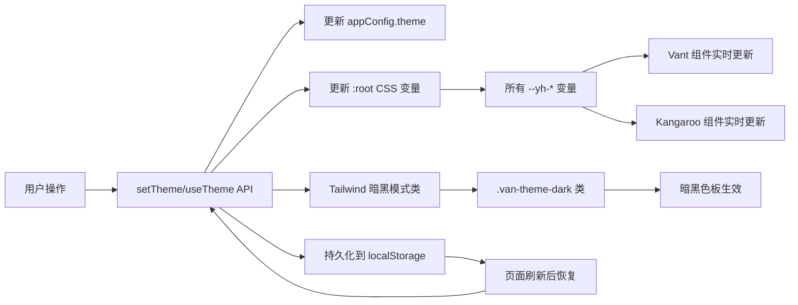

# 运行时主题切换方案

## 1. 现有基础分析

当前主题系统已具备：

| 机制 | 文件 | 说明 |
|------|------|------|
| CSS 变量体系 | [`kangaroo-mobile/src/theme/index.less`](../packages/kangaroo-mobile/src/theme/index.less) | `--yh-*` 品牌色变量 + `--van-*` Vant 覆盖变量 |
| CSS 变量级联 | 同上 | `--van-primary-color: var(--yh-primary-color)` — 修改 `--yh-*` 自动同步到 Vant |
| 暗黑模式 | 同上 `.van-theme-dark` | 已定义暗黑色板 |
| appConfig 配置 | [`setup-plugin/index.ts`](../packages/deer-mobile/plugins/setup-plugin/index.ts:33) | `theme.primaryColor` / `theme.darkMode` 字段已存在 |

**关键优势**：由于 Vant 4 和 Kangaroo 都已使用 CSS 变量体系，**修改 `:root` 上的 `--yh-*` 变量即可实时更新所有组件**，无需重新构建样式文件。

---

## 2. 方案设计

### 2.1 整体架构



### 2.2 API 设计

```typescript
// 主题配置接口（已有）
interface ThemeConfig {
  primaryColor: string;   // 主色，如 '#1677ff'
  darkMode: boolean;      // 是否暗黑模式
}

// 运行时主题 API（新增）
interface ThemeAPI {
  // 获取当前主题
  getTheme(): ThemeConfig;
  
  // 设置主色（实时生效）
  setPrimaryColor(color: string): void;
  
  // 切换暗黑模式（实时生效）
  setDarkMode(enabled: boolean): void;
  
  // 切换暗黑模式
  toggleDarkMode(): void;
  
  // 重置为主题默认值
  resetTheme(): void;
  
  // 订阅主题变化
  onThemeChange(callback: (theme: ThemeConfig) => void): () => void;
}
```

### 2.3 实现策略

#### 策略选择：CSS 变量方案（推荐）

| 方案 | 优点 | 缺点 | 选择 |
|------|------|------|------|
| **CSS 变量** | 零运行时开销，原生级联，Vant 天然支持 | 不支持 IE11 | ✅ **推荐** |
| CSS-in-JS | 动态能力强 | 运行时开销，增加 bundle | ❌ 不必要 |
| 多样式文件切换 | 构建时预生成 | 管理复杂，色值数量爆炸 | ❌ 不必要 |

#### 核心实现

```typescript
// packages/kangaroo-mobile/src/theme/useTheme.ts

const DEFAULT_THEME: ThemeConfig = {
  primaryColor: '#1677ff',
  darkMode: false,
};

class ThemeManager {
  private currentTheme: ThemeConfig;
  private listeners: Set<(theme: ThemeConfig) => void> = new Set();

  constructor() {
    // 从 localStorage 恢复主题
    const saved = loadThemeFromStorage();
    this.currentTheme = saved ?? DEFAULT_THEME;
    this.applyTheme(this.currentTheme);
  }

  /** 应用主题到 :root 和 html */
  private applyTheme(theme: ThemeConfig) {
    const root = document.documentElement;
    
    // 1. 主色：直接修改 CSS 变量（Vant 组件自动级联更新）
    root.style.setProperty('--yh-primary-color', theme.primaryColor);
    
    // 2. 暗黑模式：切换 html 类名（Vant 官方方案）
    root.classList.toggle('van-theme-dark', theme.darkMode);
    
    // 3. Tailwind 暗黑模式（class 策略）
    root.classList.toggle('dark', theme.darkMode);
    
    // 4. 持久化
    saveThemeToStorage(theme);
    
    // 5. 通知监听器
    this.listeners.forEach(fn => fn(theme));
  }

  setPrimaryColor(color: string) {
    this.currentTheme.primaryColor = color;
    this.applyTheme(this.currentTheme);
  }

  setDarkMode(enabled: boolean) {
    this.currentTheme.darkMode = enabled;
    this.applyTheme(this.currentTheme);
  }

  toggleDarkMode() {
    this.setDarkMode(!this.currentTheme.darkMode);
  }

  getTheme(): ThemeConfig {
    return { ...this.currentTheme };
  }

  onThemeChange(callback: (theme: ThemeConfig) => void) {
    this.listeners.add(callback);
    return () => this.listeners.delete(callback);
  }

  resetTheme() {
    this.currentTheme = { ...DEFAULT_THEME };
    this.applyTheme(this.currentTheme);
  }
}

export const themeManager = new ThemeManager();
```

---

## 3. 与 Deer Mobile 框架的集成

### 3.1 运行时插件（RuntimePlugin）

创建 [`runtime/theme-plugin.ts`](../packages/deer-mobile/plugins/runtime/theme-plugin.ts)：

```typescript
const themeRuntimePlugin: RuntimePlugin = {
  name: 'deer:theme',
  priority: 0,  // 最高优先级，主题需最先初始化

  onAppCreated: (app, ctx) => {
    const { theme } = ctx.config;
    if (theme) {
      if (theme.primaryColor) themeManager.setPrimaryColor(theme.primaryColor);
      if (theme.darkMode) themeManager.setDarkMode(true);
    }
    
    // 注入 $theme API 到 Vue 全局
    app.config.globalProperties.$theme = themeManager;
  },
};

// 提供组合式 API
export function useTheme() {
  const theme = reactive(themeManager.getTheme());
  
  onMounted(() => {
    const unsubscribe = themeManager.onThemeChange((t) => {
      Object.assign(theme, t);
    });
    onUnmounted(unsubscribe);
  });
  
  return {
    theme: readonly(theme),
    setPrimaryColor: themeManager.setPrimaryColor.bind(themeManager),
    setDarkMode: themeManager.setDarkMode.bind(themeManager),
    toggleDarkMode: themeManager.toggleDarkMode.bind(themeManager),
    resetTheme: themeManager.resetTheme.bind(themeManager),
  };
}

export { themeManager };
```

### 3.2 响应式集成

主题变化需要通知到 Vue 响应式系统：

```typescript
// 在 useTheme 中使用 Vue 的 reactive
import { reactive, readonly, onMounted, onUnmounted } from 'vue';
```

---

## 4. 实现步骤

| # | 步骤 | 文件 | 说明 |
|---|------|------|------|
| 1 | 创建 ThemeManager 类 | `kangaroo-mobile/src/theme/theme-manager.ts` | 核心：CSS 变量操作 + localStorage 持久化 |
| 2 | 创建 useTheme composable | `kangaroo-mobile/src/theme/useTheme.ts` | Vue 响应式封装 |
| 3 | 导出 API | `kangaroo-mobile/src/index.ts` | 添加 `useTheme`, `themeManager`, `setPrimaryColor` 等导出 |
| 4 | 创建 deer-mobile 运行时插件 | `deer-mobile/plugins/runtime/theme-plugin.ts` | 从 `appConfig.theme` 初始化 + 注入 `$theme` |
| 5 | 注册到代码生成 | `deer-mobile/plugins/setup-plugin/code-gen.ts` | 添加 `deer_themePlugin` 到 `BUILTIN_PLUGIN_PATHS` |
| 6 | 更新示例配置 | `apps/example/vite.config.ts` | 用户只需配置 `theme: { darkMode: true }` |
| 7 | 测试 | 单元测试 + 手动验证 | 验证主题切换实时生效 |

---

## 5. 优势总结

| 维度 | 优势 |
|------|------|
| **性能** | CSS 变量方案零 JS 运行时开销，浏览器原生级联 |
| **Vant 兼容** | Vant 4 已用 `var(--van-*)`，修改 `--yh-*` 即可联动 |
| **Tailwind 兼容** | Tailwind 的 `dark:` 变体通过 `html.dark` 类控制 |
| **持久化** | 自动保存到 `localStorage`，刷新后恢复 |
| **框架集成** | 通过 RuntimePlugin 机制自动从 `appConfig.theme` 初始化 |
| **开发者体验** | 提供 `useTheme()` composable + `$theme` 全局属性 |
