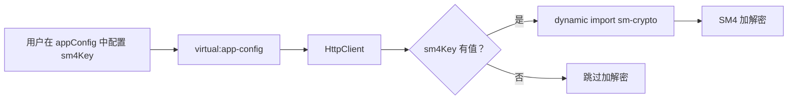

# SM4 加密方案：从 `@business/plugin-sm4` 迁移到 `sm-crypto`

## 背景

- `@business/plugin-sm4` 来自私有 registry（`registry.npm.corp.yxkj.com`），其自身依赖 `kangaroo: "2.x"`（也是私有包），导致 pnpm 解析失败
- 公有包 [`sm-crypto`](https://www.npmjs.com/package/sm-crypto) 支持 SM4 加解密，纯 JS 实现，无外部依赖

## 设计原则

1. **不硬编码密钥** — `secretKey` 通过 app config 传入，无默认值
2. **不设置默认值** — 如果未配置 `sm4Key`，SM4 操作自动跳过
3. **兼容 PC 端** — PC 端同样可以读取 `virtual:app-config` 中的 `sm4Key`，使用 `sm-crypto` 做加解密
4. **可选依赖** — `sm-crypto` 保持为 optional peerDependency

## 改动清单（共 5 步）

---

### Step 1：更新类型声明

**文件：** [`packages/deer-mobile/env.d.ts`](packages/deer-mobile/env.d.ts:8)

将 `@business/plugin-sm4` 的类型声明替换为 `sm-crypto`：

```ts
// 删除
declare module '@business/plugin-sm4' { ... }

// 添加 sm-crypto 类型声明
declare module 'sm-crypto' {
  const sm4: {
    encrypt(data: string | Buffer, key: string, config?: { mode?: 'cbc' | 'ecb'; iv?: string; padding?: 'pkcs7' | 'none' }): string;
    decrypt(data: string | Buffer, key: string, config?: { mode?: 'cbc' | 'ecb'; iv?: string; padding?: 'pkcs7' | 'none' }): string;
  };
  export { sm4 };
}
```

---

### Step 2：更新 peerDependencies

**文件：** [`packages/deer-mobile/package.json`](packages/deer-mobile/package.json:21)

```json
// 之前
"@business/plugin-sm4": "*"

// 之后
"sm-crypto": "^1.0.0"
```

保持 `peerDependenciesMeta` 中标记为 optional。

---

### Step 3：更新 `virtual:app-config` 类型

**文件：** [`packages/deer-mobile/src/virtual-modules.d.ts`](packages/deer-mobile/src/virtual-modules.d.ts:22)

在 `appConfig` 中添加 `sm4Key` 字段（**无默认值**）：

```ts
declare module 'virtual:app-config' {
  export const appConfig: {
    // ... 现有字段
    sm4Key?: string;   // SM4 密钥（hex 格式，16 字节 = 32 位 hex），不配置则不启用加解密
  };
}
```

---

### Step 4：更新 ConfigPlugin 类型

**文件：** [`packages/deer-mobile/plugins/config-plugin/index.ts`](packages/deer-mobile/plugins/config-plugin/index.ts:6)

在 `AppConfig` 接口中添加 `sm4Key`（**不写入 DEFAULT_CONFIG**）：

```ts
interface AppConfig {
  // ... 现有字段
  sm4Key?: string;  // 不设默认值
}
```

---

### Step 5：更新 HttpClient SM4 实现

**文件：** [`packages/deer-mobile/src/utils/request.ts`](packages/deer-mobile/src/utils/request.ts:278)

修改 `sm4EncryptAsync` 和 `sm4DecryptAsync` 方法：

```ts
private async sm4EncryptAsync(data: unknown): Promise<unknown> {
  // sm4Key 从 appConfig 读取（无默认值，不配置则不加密）
  const key = appConfig.sm4Key;
  if (!key || !data) return data;
  try {
    const { sm4 } = await import('sm-crypto');
    const jsonStr = typeof data === 'string' ? data : JSON.stringify(data);
    return { data: sm4.encrypt(jsonStr, key) };
  } catch {
    return data;
  }
}

private async sm4DecryptAsync(data: unknown): Promise<unknown> {
  const key = appConfig.sm4Key;
  if (!key || !data) return data;
  try {
    const { sm4 } = await import('sm-crypto');
    const encrypted = (data as Record<string, unknown>)?.data as string;
    if (!encrypted) return data;
    const decrypted = sm4.decrypt(encrypted, key);
    return JSON.parse(decrypted);
  } catch {
    return data;
  }
}
```

**改动要点：**
- `import('@business/plugin-sm4')` → `import('sm-crypto')`
- `sm4Key` 从 `this.options.sm4Key` → `appConfig.sm4Key`
- API 从 `new SM4Util().encryptData_ECB()` → `sm4.encrypt()`
- 移除 `HttpClientOptions` 中的 `enableSM4` 和 `sm4Key` 字段（统一走 appConfig）

> **注意：** `sm-crypto` 的 key 是 **hex 格式**（32 位十六进制字符串），与旧 `@business/plugin-sm4` 的字符串 key 不同。用户需要提供正确的 hex key。

---

### 可选清理

**文件：** [`.npmrc`](.npmrc:2)

如果 monorepo 中没有其他包使用 `@business` 私有 registry，可以移除：

```
# 删除或注释掉
# @business:registry=http://registry.npm.corp.yxkj.com
```

---

## 数据流



## 兼容性

| 维度 | 说明 |
|------|------|
| PC 端 | PC 项目同样可以 `import { sm4 } from 'sm-crypto'`，使用同一份 key |
| 密钥格式 | hex 字符串（32 位），与旧 `@business/plugin-sm4` 不兼容，需要运维转换 |
| 无默认值 | 用户必须显式配置 `sm4Key` 才能启用加解密 |
| 降级安全 | 如果 `sm-crypto` 加载失败，请求/响应原样透传，不抛异常 |
