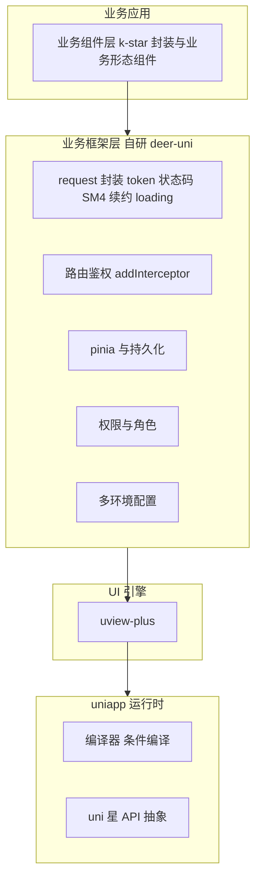
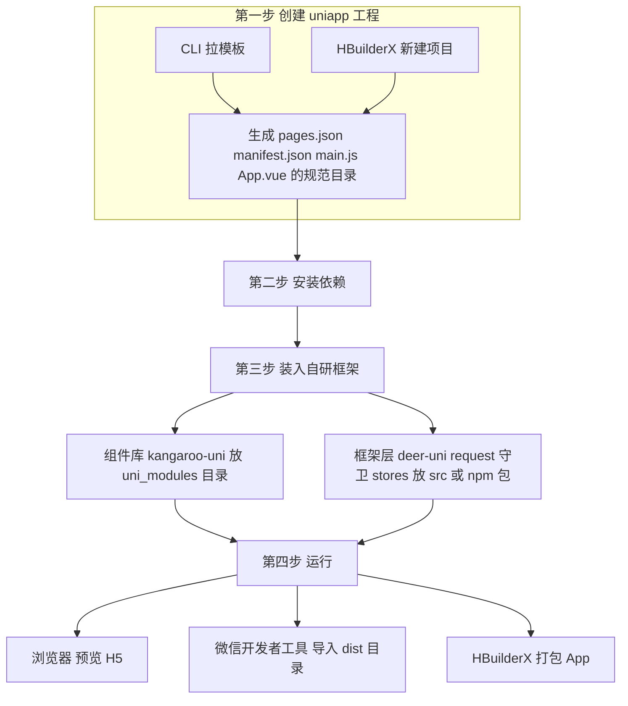
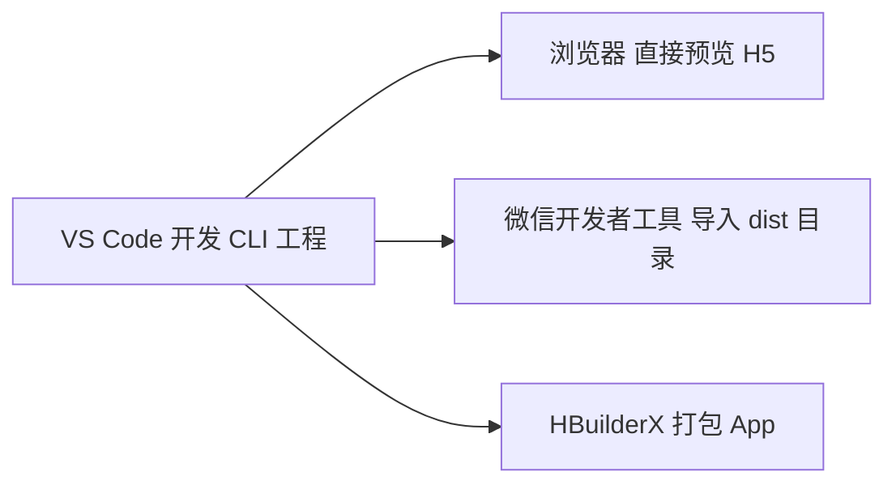
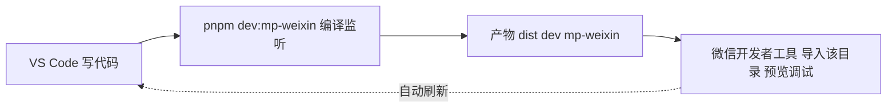

# uniapp + uview-plus：组件库封装与业务框架建设方案

> **文档日期**：2026-08-07
> **背景**：公司要求使用 uniapp 开发，计划采用 **uniapp + uview-plus + Vue3 + Vite** 技术栈。
> **核心问题**：① 如何像「vant4 + 中间层」一样封装基于 uview-plus 的自有 UI 库；② uniapp 是否还需要业务框架（登录、状态码等）；③ 市面上有哪些成熟的 uniapp 框架；④ 其他公司是否针对 uniapp 自研业务系统框架；⑤ 框架要完成哪些模块、能否用 Vite、开发时用什么打开；⑥ 项目目录放哪、如何命名（H5 的 deer-mobile 暂保留）。
> **现状资产**：已有 [`deer-mobile`](../packages/deer-mobile/index.ts)（企业级 H5 框架）、[`kangaroo-mobile`](../packages/kangaroo-mobile/src/index.ts)（vant4 二次封装 UI 库）、[`chs-app`](../apps/chs-app/src/utils/http.ts)（业务应用）、[`create-deer-mobile`](../packages/create-deer-mobile/index.js)（脚手架）。

---

## 目录

| # | 章节 | 要点 |
|---|------|------|
| 一 | 结论速览 | 核心判断一句话 |
| 二 | 现状资产盘点 | 可平移的 90% 方法论 |
| 三 | uview-plus UI 库封装方案 | easycom / uni_modules / 三种路线 / 核心技巧 / 主题 |
| 四 | uniapp 业务框架层方案 | 请求 / 路由守卫 / Pinia / 权限 / 多环境 + **交付清单** |
| 五 | 市面成熟框架盘点 | UI 库 + 业务框架 |
| 六 | 行业实践 | 其他公司是否自研 |
| 七 | 工程形态与概念澄清 | uniapp 是什么、Vite、用什么打开 |
| 八 | 目录规划与命名 | 放哪、deer-uni 成套命名、pnpm 兼容 |
| 九 | 落地路线 | 分阶段行动项 |
| 十 | 风险与注意事项 | 踩坑清单 |

---

## 一、结论速览

1. **UI 库封装**：uview-plus 的地位等价于你们现在的 vant4。封装方法论的 90% 可平移（透传 / v-model / 插槽 / 主题 / locale），**变的是机制**：`app.component()` 全局注册 → **easycom 约定式自动引入**；npm 包 → **uni_modules 标准插件包**；px → **rpx**；增加 **条件编译**。
2. **uniapp 需要业务框架**：uniapp 只是「编译器 + `uni.*` API 抽象」，**不提供** HTTP 封装、路由守卫、状态管理、权限、多环境。登录 / 状态码逻辑必须自研，本质是把 [`deer-mobile`](../packages/deer-mobile/index.ts) 的能力「平移成 uniapp 版」。
3. **Vite 可以用且推荐**：选用 **CLI 方式（Vue3 + Vite）** 创建工程，能自定义 `vite.config.ts`，与现有 monorepo 工程体系一致；**开发直接用 VS Code 打开**，小程序端用微信开发者工具导入编译产物。
4. **市面生态**：UI 库主选 **uview-plus**（备选 wot-design-uni）；业务后台可参考 **uni-admin + uniCloud / uni-id**；请求层可用 **luch-request** 作底层。
5. **行业实践**：**多数公司确实自研 uniapp 业务框架层**，形态高度同构（request 封装 + Pinia + `uni.addInterceptor` 守卫 + easycom 组件库）；而大厂主流是「各端独立 + 共享业务逻辑层」，少用 uniapp 承载核心业务。
6. **工程形态**：uniapp 不是「一个 npm 框架包」，而是「**编译器 + 工程规范**」——先按 uniapp 规范**建一个工程**，再把自己写的框架层 / UI 库**装进这个工程**（详见第七章）。
7. **命名与目录**：uniapp 框架定名 **deer-uni**，成套命名 **deer-uni / kangaroo-uni / create-deer-uni**，与现有 monorepo 并列共存（详见第八章）。

---

## 二、现状资产盘点（可平移的能力）

| 现有资产 | 能力 | 平移到 uniapp 的方式 |
|---|---|---|
| [`kangaroo-mobile`](../packages/kangaroo-mobile/src/index.ts) | vant4 二次封装 54 组件 + 透传 + 主题 + locale | 封装方法论保留，落点改为 easycom + uni_modules |
| [`deer-mobile`](../packages/deer-mobile/index.ts) | HttpClient / auth-plugin / Pinia 持久化 / 插件系统 / i18n / 主题 | 请求与鉴权降级平移；插件系统改为入口函数组合 |
| [`chs-app`](../apps/chs-app/src/utils/http.ts) | 业务状态码 `^[1]`、登录超时 712/205/209、token 直放 header | 请求协议约定原样保留 |
| [`create-deer-mobile`](../packages/create-deer-mobile/index.js) | CLI 脚手架 | 产出 `create-deer-uni` 对应物 |

---

## 三、uview-plus UI 库封装方案

### 3.1 uniapp 组件库与 Web 组件库的 5 个本质差异

| 维度 | Web（vant4 + kangaroo-mobile） | uniapp（uview-plus 生态） |
|---|---|---|
| 组件引入 | `import` + `app.component()` 全局注册 | **easycom 约定式自动引入**（路径即组件名，免 import） |
| 包形态 | npm 包 | **uni_modules 标准插件包**（含 easycom 规则声明） |
| 跨端差异 | 无（纯 H5） | **条件编译** `#ifdef MP-WEIXIN / APP-PLUS / H5` |
| 单位 | px / rem（flexible 动态缩放） | **rpx**（内置 750 基准，各端自动换算） |
| 运行时 | 有 DOM/BOM、`$router` | 无 DOM、路由是**页面栈**（`navigateTo`），无全局路由守卫 |

### 3.2 三种封装路线对比

| 路线 | 做法 | 适用场景 | 工作量 |
|---|---|---|---|
| **A** | 完全自研原子组件（从零写） | 对性能和包体极致要求、不想依赖第三方 | 巨大 |
| **B** ★ | uview-plus 作底层引擎 + 中间层业务封装（等价「vant4 + 中间层」） | **推荐**，与现有模式一致 | 中 |
| **C** | 只封装「业务形态组件」（医生工作台卡片 / 手机号验证码等组合组件） | 配合 B 使用，对应 [`business.ts`](../apps/chs-app/src/utils/business.ts) 逻辑组件化 | 小 |

**推荐组合：B + C**。基础交互交给 uview-plus，中间层做「设计规范统一 + 业务 props + 组合组件」。

### 3.3 推荐方案：uni_modules + easycom 二次封装

#### 3.3.1 包结构（easycom 自动引入）

```
uni_modules/
└── kangaroo-uni/
    ├── package.json            # uni_modules 声明 + easycom 规则
    ├── components/
    │   ├── k-button/k-button.vue
    │   └── k-field/k-field.vue
    └── libs/theme/             # 主题变量、工具
```

`package.json`（easycom 约定写法）：

```json
{
  "name": "kangaroo-uni",
  "version": "1.0.0",
  "uni_modules": {
    "components": [
      { "name": "k-button", "path": "components/k-button/k-button.vue" }
    ]
  }
}
```

页面中直接写 `<k-button />` 即可自动按需引入，无需 import —— 这是 kangaroo-mobile 中 `app.component()` 全量注册的 uniapp 版替代。

#### 3.3.2 核心技巧（透传 + v-model 转发 + 插槽透传）

```vue
<!-- uni_modules/kangaroo-uni/components/k-button/k-button.vue -->
<template>
  <view class="k-button">
    <u-button
      v-bind="$attrs"
      :type="uiType"
      :loading="loading"
      :disabled="disabled"
      @click="onClick"
    >
      <!-- 具名 + 作用域插槽全量透传 -->
      <template v-for="(_, name) in $slots" #[name]="slotProps">
        <slot :name="name" v-bind="slotProps" />
      </template>
    </u-button>
  </view>
</template>

<script setup lang="ts">
import { computed } from 'vue';

const props = withDefaults(
  defineProps<{
    biz?: 'submit' | 'cancel' | 'danger';   // 业务态 -> 统一映射主题
    loading?: boolean;
    disabled?: boolean;
  }>(),
  { biz: 'submit', loading: false, disabled: false }
);

const emit = defineEmits<{ (e: 'click', ev: unknown): void }>();

// 关键：关闭属性继承，让 $attrs 透传给 u-button
defineOptions({ inheritAttrs: false, name: 'KButton' });

// 业务态 -> uview-plus 原生 type 的映射（统一设计规范的关键）
const uiType = computed(() =>
  ({ submit: 'primary', cancel: 'info', danger: 'error' } as const)[props.biz]
);

const onClick = (ev: unknown) => emit('click', ev);
</script>
```

**v-model 转发模板（封装表单类组件时常用）：**

```ts
const model = computed({
  get: () => props.modelValue,
  set: (v) => emit('update:modelValue', v),
});
```

#### 3.3.3 主题定制

对应 kangaroo-mobile 的 [`theme-manager.ts`](../packages/kangaroo-mobile/src/theme/theme-manager.ts)：

- uview-plus 提供 `<u-config-provider :theme="...">` 做运行时主题（等价 vant4 的 ConfigProvider + CSS 变量）；
- 支持 SCSS 变量覆盖（`@import 'uview-plus/theme.scss'` 改主色 / 圆角 / 字号）；
- 中间层统一收敛「业务品牌色」为一套变量，禁止业务侧散落颜色值 —— 这是中间层的核心价值。

#### 3.3.4 TS 类型声明（easycom 组件全局类型）

```ts
declare module 'vue' {
  export interface GlobalComponents {
    KButton: typeof import('@/uni_modules/kangaroo-uni/components/k-button/k-button.vue')['default'];
  }
}
```

### 3.4 与 kangaroo-mobile 方法论对照

| 保留 | 替换 |
|---|---|
| `inheritAttrs: false` + `$attrs` 透传 | 全局注册 → **easycom** |
| v-model computed get/set 转发 | npm 包 → **uni_modules** |
| 具名 + 作用域插槽透传 | px/rem → **rpx** |
| locale / 多语言接管 | 无多端概念 → **条件编译** |
| CSS 变量主题 | — |

---

## 四、uniapp 业务框架层方案

### 4.1 uniapp 不提供的能力（必须自研）

| 能力 | Web（deer-mobile 已有） | uniapp 现状 | 是否自研 |
|---|---|---|---|
| HTTP 封装（token / 状态码 / 登录超时 / 续约 / 加密 / loading 队列） | 自研 `HttpClient` | 只有 `uni.request` 裸 API | ✅ 必须 |
| 路由鉴权 / 登录拦截 | auth-plugin 全局守卫 | 无全局守卫，只有页面栈 | ✅ `uni.addInterceptor` |
| 状态管理 + 持久化 | Pinia + persistedstate | 无 | ✅ 接 Pinia |
| 多环境 / 构建变量 | Vite `.env` | CLI 工程支持 `.env` | ✅ 组织好 |
| 页面权限 / 角色 | 插件系统 | 无 | ✅ 自研 |
| 组件自动引入 | `app.component()` | easycom 内置 | ✅ 用现成 |

### 4.2 框架分层架构



### 4.3 各模块设计要点

#### 4.3.1 请求层（对照 [`http.ts`](../apps/chs-app/src/utils/http.ts)）

```ts
// utils/http.ts（uniapp 版）
export const request = <T>(options: UniApp.RequestOptions) => {
  return new Promise<T>((resolve, reject) => {
    uni.request({
      ...options,
      header: { 'Authorization': uni.getStorageSync(TOKEN_KEY), ...options.header },
      success: (res) => {
        // 业务状态码：^[1] 成功；712/205/209 登录超时 -> 清 token 跳登录
        if (/^[1]/.test(String(res.data.code))) return resolve(res.data.data);
        if (LOGIN_EXPIRED_CODES.includes(res.data.code)) return handleLoginExpired();
        uni.showToast({ title: res.data.msg, icon: 'none' });
        reject(res.data);
      },
      fail: reject,
    });
  });
};
```

协议约定原样保留：`Authorization` 不带 Bearer 前缀、token 直放 header、成功状态码 `^[1]`、登录超时 712/205/209。

#### 4.3.2 路由鉴权（`uni.addInterceptor` 实现全局守卫）

```ts
uni.addInterceptor('navigateTo', {
  invoke(args) {
    if (!isLoggedIn() && !args.url.startsWith('/pages/login')) {
      uni.navigateTo({ url: `/pages/login/index?redirect=${encodeURIComponent(args.url)}` });
      return false; // 拦截
    }
    return true;
  },
});
// 同样拦截 redirectTo / switchTab / reLaunch
```

#### 4.3.3 状态管理

- 使用 **Pinia + 持久化**（`persist` 插件或自封装 `uni.setStorageSync`）；
- 用户态 / token / 字典 / 主题统一进 store，与 [`chs-app`](../apps/chs-app/src/stores/index.ts) 的 store 结构对齐。

#### 4.3.4 权限与多环境

- 权限：跳转拦截 + 页面级 meta 声明（存全局配置对象）；
- 多环境：CLI 工程 `.env` / `.env.development` / `.env.production`，配合 `uni.getSystemInfoSync` 做基础适配。

### 4.4 框架交付清单（deer-uni 具体要完成哪些模块）

以模块粒度列出的**最小完整交付**，可直接作为研发任务的拆解依据：

| 模块 | 子项 | 说明 |
|---|---|---|
| **请求层** | `request` 封装、拦截器、token 注入、业务状态码、登录超时处理、token 续约、SM4 加密、loading 队列、错误 toast、请求取消、并发控制 | 等价 deer-mobile `HttpClient` |
| **路由鉴权** | `addInterceptor` 拦截 `navigateTo/redirectTo/switchTab/reLaunch`、登录守卫、未登录回跳、白名单 | 等价 auth-plugin |
| **状态管理** | Pinia：`userStore` / `dictionaryStore` / `appStore` / `themeStore`，持久化 | 对齐 chs-app stores |
| **权限角色** | 页面级 meta、按钮级权限、角色判断 | 自研 |
| **多环境** | `.env.development` / `.env.production` / `.env`、API baseURL、Vite mode | CLI 工程 |
| **工具层** | `upx2px`、格式化、校验、加解密、防抖节流、字典枚举 | 对应 [`utils`](../apps/chs-app/src/utils/enumerate.ts) |
| **全局样式主题** | SCSS 变量、设计规范、uview-plus 主题覆盖、暗黑模式 | 对应 kangaroo-mobile theme |
| **通用页面** | 登录页、404、错误页、空状态、网络异常页 | 对应 deer-mobile 内置页 |
| **组件库 kangaroo-uni** | 业务组件 + 主题 + locale + `GlobalComponents` 类型声明 | easycom 形态 |
| **脚手架 CLI** | `create-deer-uni`：一键生成工程 + 上述骨架 | 对标 create-deer-mobile |
| **工程规范** | ESLint + Prettier + Husky + lint-staged + 单元测试 | 对齐 monorepo 根配置 |

---

## 五、市面成熟框架盘点

### 5.1 UI 组件库

| 库 | 定位 | 评价 |
|---|---|---|
| **uview-plus** | uview 2.x 的 Vue3 维护版 | 目前 uniapp Vue3 下组件最全（60+）、最常用，含表单 / 弹出 / 日历 / 上传等，社区活跃，**首选** |
| **wot-design-uni** | Vue3 + TS 全新编写 | 设计语言接近 Vant，质量高、无运行时依赖、维护活跃，**最强备选** |
| **uni-ui** | DCloud 官方基础库 | 最稳定朴素，配套 uni-helper，适合官方控团队，风格与组件数偏弱 |
| zebra-ui / tuniao-ui / thorui / FirstUI / GraceUI | 社区 / 商业库 | 部分收费、更新参差，仅备选 |
| nut-ui uniapp 版 | 京东 | 无官方 uniapp 版，第三方移植不推荐 |

> 建议：**主选 uview-plus**；若团队喜欢 Vant 风格可评估 wot-design-uni。两者都是 uni_modules 包，可通过「中间层」做底层替换，这正是低耦合红利。

### 5.2 业务 / 后台框架

| 方案 | 说明 |
|---|---|
| **uni-admin + uniCloud** | DCloud 官方后台系统（用户 / 权限 / RBAC），配合 **uni-id**（登录鉴权用户体系）、uni-pay、uni-open-bridge，构成「后端即服务」 |
| **luch-request** | 最流行的 uniapp 请求库（拦截器 / 请求取消 / 并发），**可作 request 层底层**，等价你们 `HttpClient` 之于 axios |
| flyio / uni-request | 老牌请求库，备选 |
| 插件市场企业模板 | DCloud 插件市场有大量付费「企业级 uniapp 脚手架」，质量参差，仅参考 |

**没有统一的「企业级 uniapp 业务框架标准」**——生态碎片化，自己基于 deer-mobile 平移框架层是性价比最高的路线。

---

## 六、行业实践：其他公司是否自研 uniapp 业务系统框架？

**是，非常普遍，且是行业常态。**

1. **有强多端诉求的公司（App + 微信/支付宝小程序 + H5 都要、不想维护三套代码）**：普遍**自研 uniapp 业务框架层**，形态高度同构——request 统一封装（token / 状态码 / 超时 / 加密）+ Pinia 持久化 + `uni.addInterceptor` 路由守卫 + easycom 组件库（自研或 uview-plus 二次封装）+ 条件编译 + 多环境。**这跟「把 deer-mobile 平移成 uniapp 版」是同一件事。**
2. **大厂 / 头部公司**：正如 [`deer-vs-uniapp-h5-comparison.md`](./deer-vs-uniapp-h5-comparison.md) 的分析——主流是「各端 UI 独立 + 共享业务逻辑层」，App 用 Flutter / RN / 原生，小程序用 Taro / 原生，**几乎不用 uniapp 承载核心业务**。uniapp 是中小团队和强多端诉求公司的务实选择。

**结论**：公司要求 uniapp → 就用它，但要建立「**uniapp 业务框架层（deer-uni）+ uview-plus 中间层（kangaroo-uni）**」，这正是其他公司做 uni 业务的标准姿势。

---

## 七、工程形态与概念澄清：uniapp 到底是什么、Vite 与打开方式

### 7.0 先搞懂：uniapp 工程到底长什么样（概念澄清）

**一句话：uniapp 不是「一个 npm 框架包」，而是一套「编译器 + 工程规范」。它决定整个工程的形态，不能「装进」一个普通 Vue3 工程里；而是你「按 uniapp 规范建一个工程」，然后把自己写的框架层 / UI 库「装进这个工程」。**

用你熟悉的 H5 做类比：

| | 普通 H5（你们现在的 deer-mobile） | uniapp 工程 |
|---|---|---|
| 工程从哪来 | 自己搭 vite + vue，自由定义 | **必须按 uniapp 模板建**（HBuilderX 新建 或 CLI 拉模板） |
| 路由 | vue-router + `router.ts` | **`pages.json` 注册页面** + `uni.navigateTo` |
| 请求 | axios / 自定义 HttpClient | **`uni.request`** + 你自研的封装 |
| 存储 | localStorage | **`uni.setStorageSync`** |
| 页面写法 | `.vue` / `.tsx` | `.vue`（组件标签用 `view` / `text` 等 uniapp 规范标签） |
| DOM | 有，可直接用 | **无**，必须用 `uni.*` API |
| 构建 | vite 原生 | **`@dcloudio/vite-plugin-uni`**（包装过的 vite）或 HBuilderX 内置 |
| 产物 | 一份 H5 | **H5 + 小程序 + App 多份** |

**所以你问的流程，正确写法是：**

```
第 1 步：建 uniapp 工程（二选一，本质都是生成同一套规范目录）
   ├─ 方式 A（推荐）：CLI 命令拉模板  →  VS Code 打开开发
   └─ 方式 B：HBuilderX 新建项目      →  HBuilderX 打开开发
第 2 步：pnpm install（CLI 方式）安装依赖
第 3 步：把「你的框架」装进来
   ├─ 组件库 kangaroo-uni → 放工程 uni_modules/ 目录（或做成 npm 包 install）
   └─ 框架层 deer-uni（request / 守卫 / stores）→ 放工程 src/ 或抽成 npm 包
第 4 步：pnpm dev:h5 / pnpm dev:mp-weixin 运行
```

**关键修正你的一句话**：「先用 HBuilderX 建一个项目，然后 npm install 框架包」——方向对了一半：

- ✅ 对的：确实**先有一个 uniapp 工程**，你的框架是**装在工程之上**的（install 或拷进 `uni_modules/`）；
- ❌ 修正：uniapp 本身**不是要 npm install 的包**，而是**工程本身就是 uniapp**；你不必用 HBuilderX（CLI 方式用 VS Code 即可）；你要 install / 放入的是**你自己写的 deer-uni 框架层和 kangaroo-uni 组件库**。



### 7.1 能使用 Vite 吗？——能，且推荐

uniapp 创建工程有两条路径，**只有 CLI 方式用 Vite**：

| 方式 | 构建工具 | 工程形态 | 适合谁 |
|---|---|---|---|
| **HBuilderX 方式** | HBuilderX 内置（Vue2 用 webpack；HBuilderX 4+ 支持 Vue3+Vite 但配置受限） | 由 HBuilderX 管理，`vite.config` 支持有限 | 不熟悉 CLI、追求可视化 |
| **CLI 方式（★ 推荐）** | **Vite**（`@dcloudio/vite-plugin-uni`） | 标准 node 工程 + `vite.config.ts`，可用 pnpm / TS / ESLint | 追求工程化，与现有 deer-mobile 体系一致 |

**结论：选 CLI 方式（Vue3 + Vite）**，与本仓库的 pnpm monorepo、ESLint/Prettier 体系完全契合，可以像新包一样纳入工作区。

CLI 创建工程：

```bash
# Vue3 + Vite 官方模板（等价 npx create-uni 的 vue3 分支）
npx degit dcloudio/uni-preset-vue#vite uni-mobile-app
cd uni-mobile-app
pnpm install
pnpm dev:h5          # 运行到浏览器
pnpm dev:mp-weixin   # 运行到微信小程序，产物在 dist/dev/mp-weixin
```

**Vite 使用要点：**

- uniapp 的 Vite 是「包装过的 Vite」，通过 `@dcloudio/vite-plugin-uni` 做 uni 专属转换；你仍可在 `vite.config.ts` 自定义别名、插件、环境变量；
- **依赖 DOM/BOM 的通用 Vite 插件在小程序端无效**，跨端能力以 uniapp 编译模型为准；
- 与现有工程一样，`.env` 环境变量、TS、按需引入均可正常使用。

### 7.2 安装完框架是用 uniapp 打开吗？——澄清

**uniapp 不是 IDE，是一套编译框架。** 三种「打开」别混淆：

1. **你自研的「业务框架层」**（deer-uni + kangaroo-uni）是**装进 uniapp 工程里的代码模块**（npm 包或 uni_modules），不是"被打开"的程序；
2. **工程开发**：CLI + Vite 方式下，直接用 **VS Code**（当前环境）打开工程根目录即可，命令行跑 `pnpm dev:*`，**不需要 HBuilderX**；
3. **运行目标**：
   - **H5** → 浏览器直接预览；
   - **微信小程序** → `pnpm dev:mp-weixin` 产出 `dist/dev/mp-weixin`，用**微信开发者工具**导入该目录调试（"用微信开发者工具打开"的是编译产物，不是源码工程）；
   - **App** → 用 **HBuilderX** 的云打包 / 本地打包（CLI 工程打 App 包需要 HBuilderX 配合）。



> 只有当你选择 **HBuilderX 方式**创建工程时，才需要「用 HBuilderX 打开」项目源码。CLI + Vite 路线用 VS Code 即可。

### 7.3 VS Code 开发工作流：微信小程序怎么预览（关键实操）

**结论：开发人员用 VS Code 写代码；小程序预览必须借助微信开发者工具——这在 HBuilderX 和 VS Code 两种方式下都一样**（微信官方要求，小程序只能在其 IDE 里预览调试）。

`pnpm dev:mp-weixin` 的作用是**编译 + 监听（watch）**，产物输出到 `dist/dev/mp-weixin`；真正的「预览」由**微信开发者工具**完成。HBuilderX 的「运行到小程序模拟器」本质也是把同一份产物目录交给微信开发者工具，只是少了手动导入这一步。

**VS Code 下完整预览步骤（一次性配置）：**

```
第 1 步：安装并登录微信开发者工具（微信官方 IDE）
第 2 步：微信开发者工具 → 设置 → 安全设置 → 开启「服务端口」（关键！否则无法接收编译产物）
第 3 步：VS Code 终端运行：pnpm dev:mp-weixin   （持续 watch 编译，保持运行）
第 4 步：微信开发者工具 → 导入项目
        → 目录选择：dist/dev/mp-weixin
        → AppID：填你的小程序 AppID 或「测试号」
第 5 步：导入后即可预览；之后 VS Code 改动保存 → 自动增量编译 → 微信工具自动热更新
```

**三端预览方式总结：**

| 端 | 谁负责写代码 | 谁负责预览 | 命令 / 动作 |
|---|---|---|---|
| H5 | VS Code | 浏览器 | `pnpm dev:h5` |
| 微信小程序 | VS Code | **微信开发者工具**（导入 dist 产物） | `pnpm dev:mp-weixin` |
| App | VS Code | 真机 / 模拟器 | HBuilderX 打包（云打包 / 本地打包） |

**常见疑问澄清：**

- 「VS Code 是不是没法小程序预览？」→ 不是。VS Code 负责写码 + 编译，**预览交给微信开发者工具**，两者配合即可——这是所有小程序开发的标准姿势（**即使 HBuilderX 用户，也必须装微信开发者工具**）。
- 「为什么不直接用 VS Code 预览？」→ 小程序没有浏览器地址可看，运行环境是微信客户端，官方只提供微信开发者工具这一个预览入口。
- 「要不要每次手动导入？」→ 首次导入一次，之后项目会留在微信开发者工具里；`dev` 模式是 watch 的，改动自动增量编译并刷新。



---

## 八、目录规划与命名

### 8.1 项目目录放哪里（在现有 monorepo 内新增，H5 系列保留）

H5 的 [`deer-mobile`](../packages/deer-mobile/index.ts) 与 [`kangaroo-mobile`](../packages/kangaroo-mobile/src/index.ts) 保留不动（后续可能需要），uniapp 系列作为**并列的新包**加入同一 monorepo：

```
vite-plugins-demo/                        # 根（pnpm workspace: packages/* + apps/*）
├── apps/
│   ├── chs-app/                          # H5 业务应用（deer-mobile，保留）
│   ├── example/
│   └── deer-uni-demo/                    # ★ 新增：uniapp 演示/验证工程（框架 playground）
├── packages/
│   ├── deer-mobile/                      # H5 框架（保留，后续可能需要）
│   ├── kangaroo-mobile/                  # H5 UI 库（保留）
│   ├── create-deer-mobile/               # H5 脚手架（保留）
│   ├── deer-uni/                         # ★ 新增：uniapp 业务框架（request / 守卫 / stores 逻辑）
│   ├── kangaroo-uni/                     # ★ 新增：uview-plus 二次封装组件库（uni_modules 源）
│   └── create-deer-uni/                  # ★ 新增：uniapp 脚手架（模板 = deer-uni + kangaroo-uni）
```

- [`pnpm-workspace.yaml`](../pnpm-workspace.yaml:1) 已覆盖 `packages/*` 与 `apps/*`，**无需改动**即可纳入新包；
- 关键点：uniapp 是**应用工程**（`pages.json` / `manifest.json` / `main.js`），不是纯库，所以**演示工程放 `apps/deer-uni-demo`**，纯 TS 逻辑骨架放 `packages/deer-uni`；
- H5 与 uniapp 两条线完全独立、互不干扰，H5 后续可继续复用。

### 8.2 命名建议（deer-uni 合理，建议成套命名）

`deer-uni` 与 `deer-mobile` 对照清晰，命名没问题。建议**成系列命名**，与现有「框架 = deer、组件库 = kangaroo、脚手架 = create-」约定保持一致：

| 命名 | 定位 | 对应现有 |
|---|---|---|
| **deer-uni** | uniapp 业务框架层（request / 守卫 / stores） | [`deer-mobile`](../packages/deer-mobile/index.ts) |
| **kangaroo-uni** | uview-plus 二次封装组件库 | [`kangaroo-mobile`](../packages/kangaroo-mobile/src/index.ts) |
| **create-deer-uni** | uniapp 脚手架 CLI | [`create-deer-mobile`](../packages/create-deer-mobile/index.js) |

> 组件库不叫 zoo-uni 而叫 **kangaroo-uni**，是与「组件库 = kangaroo」既有约定对齐；前文示例中的 `zoo-ui` / `create-uni-mobile` 仅为占位示例名，统一改为上表命名。

### 8.3 pnpm + uniapp 兼容性（落地前必须处理）

uniapp CLI 工程 + pnpm monorepo 有已知坑，先处理根 [`.npmrc`](../.npmrc:1)：

```ini
shamefully-hoist=true
```

原因：`@dcloudio/*` 构建脚本（`@dcloudio/vite-plugin-uni`、postcss 等）依赖从 `node_modules` 平铺解析依赖，pnpm 的符号链接结构会导致「找不到模块」。`shamefully-hoist=true` 可解决；也可用 `public-hoist-pattern[]=*@dcloudio/*` 做更精准的收窄。

其他注意：

- easycom 对 **npm 包内组件**支持已由 `^yhu-(.*)` custom 规则验证可行（指向 `kangaroo-uni/components/yhu-$1/yhu-$1.vue`），`kangaroo-uni` 以 npm 包形态分发（见 8.4）；
- turbo 的 `dev` / `build` pipeline 需排除 `deer-uni`（其脚本为 `dev:h5` / `dev:mp-weixin`，与 turbo `dev` 不冲突，但 `build` 需单独处理或排除）；
- `@dcloudio/*` 依赖版本要求整体一致，Vue3 线 lock 在 `^3.0.0-alpha` 系列。

### 8.4 kangaroo-uni 部署形态定案（多项目框架场景）

**决策**：kangaroo-uni 为**独立 npm 包**，发布到私有 registry，业务项目 `npm install` 真实安装 + semver 升级。

**背景与坑**：P1 用 pnpm workspace 链接（`workspace:*`）时，微信开发者工具「过滤无依赖文件」无法识别符号链接包的依赖，报「已被代码依赖分析忽略」。真实 npm 包（如 wot-design-uni）无此问题。

| 阶段 | 使用方式 | 微信工具表现 |
|---|---|---|
| monorepo 开发期 | workspace 链接 | 开发预览需临时关「过滤无依赖文件」（一次设置）；`build:mp` 发布不受影响 |
| 业务项目使用 | 私有 registry `npm install kangaroo-uni@^0.x`（真实目录） | ✅ 正常 |
| 组件升级 | 新增组件 = minor 发版，业务方 `pnpm update kangaroo-uni` | ✅ 正常 |

配套：
- 发布：`kangaroo-uni/package.json` 配 `publishConfig` 指向私有 registry（根 [`.npmrc`](../.npmrc) 的 @business 源）；
- easycom 指向包路径 `"^yhu-(.*)": "kangaroo-uni/components/yhu-$1/yhu-$1.vue"`（已落地）；
- peerDependencies：`vue` + `wot-design-uni`（业务项目需自行安装 wot-ui）。

---

## 九、落地路线（分阶段行动项）

> **执行顺序**：P0 底座 → **P1 kangaroo-uni（第一步：UI 库）** → **P2 deer-uni（第二步：框架层）** → P3 脚手架 → P4 业务验证。kangaroo-uni 与 deer-uni 技术上相对独立，但按「先视觉层、后逻辑层」推进，与你们 H5 组织习惯（kangaroo-mobile 独立于 deer-mobile）一致。

| 阶段 | 目标 | 关键产出 |
|---|---|---|
| **P0 底座** | 创建**全新自研 deer-uni 工程**（**参考 unibest 实现**）+ 处理 pnpm 兼容 + 跑通三端链路 | 全新工程跑通 `dev:h5` / `dev:mp-weixin` + 根 `.npmrc` + wot-ui 接入 + 首个 k- 组件渲染 |
| **P1 UI 库层（第一步）** | 搭建 `kangaroo-uni`，**基于 wot-ui 二次封装** | uni_modules 骨架 + easycom + 主题变量 + 透传模板 + `GlobalComponents` 类型声明；封装核心组件（yhu-button / yhu-cell / yhu-field / yhu-tag）双端验证 |
| **P2 框架层（第二步）** | 平移 deer-mobile 能力到 `deer-uni` | request 封装（公司协议 SM4 / 状态码）/ `addInterceptor` 守卫 / Pinia 持久化 / 权限 / 多环境 / 通用页面 |
| **P3 脚手架** | 对标 `create-deer-mobile` | `create-deer-uni` CLI + 页面骨架模板 |
| **P4 业务验证** | 迁移一个真实页面验证全链路 | 登录 + 列表 + 表单的完整走通（H5 + 小程序双端） |

---

## 十、风险与注意事项

1. **组件库维护成本**：中间层组件越多越难维护，建议基础交互尽量直接用 wot-ui，中间层只封装「有业务语义」的组件。
2. **wot-ui 依赖路径**：二次封装时不要直接 import 内部路径，尽量走 `wot-design-uni` 公开导出，避免升级破坏。
3. **rpx 陷阱**：组件内部必须用 rpx，业务侧避免混用 px；动态尺寸需用 `uni.upx2px`。
4. **条件编译污染**：`#ifdef` 尽量收敛在框架层和组件内部，业务页面少写，避免多端漂移难排查。
5. **请求协议统一**：状态码约定（`^[1]` / 712 / 205 / 209）必须全端统一，和 [`http.ts`](../apps/chs-app/src/utils/http.ts) 保持一致。
6. **TS 与 easycom**：easycom 组件无类型提示，务必维护 `GlobalComponents` 声明，否则 TS 形同虚设。
7. **Vite 插件跨端限制**：依赖 DOM/BOM 的插件只在 H5 端有效，选择插件时注意多端兼容性。
8. **CLI vs HBuilderX 切换成本**：CLI 工程打 App 包仍需 HBuilderX，团队需统一工作流，避免两种创建方式混用。
9. **pnpm 依赖提升**：`shamefully-hoist=true` 会放宽依赖隔离，可能影响 lint / 构建可复现性，必要时用 `public-hoist-pattern` 收窄范围。
10. **两套框架并行维护**：deer-mobile 与 deer-uni 共存期间，公共逻辑（如状态码约定、加密算法）应抽公共层或文档化，避免漂移。

---

## 附：待办事项

> **P0 已完成 ✅**，详见 [`p0-feasibility-report.md`](./p0-feasibility-report.md)（结论：uniapp + Vue3 + Vite + wot-ui + kangaroo-uni 双端编译可行）。

- [x] P0：用官方 uniapp CLI（Vue3 + Vite 模板）创建全新 deer-uni 工程（参考 unibest 的 vite.config / @uni-helper 插件链）
- [x] P0：根 `.npmrc` 配置 `shamefully-hoist=true`（或 `public-hoist-pattern`）以兼容 pnpm + uniapp
- [x] P0：接入 wot-ui（easycom 配置），页面渲染首个 wd- 组件
- [x] P0：`deer-uni` 跑通 `pnpm dev:h5`（VS Code 开发，浏览器预览）
- [x] P0：跑通 `pnpm dev:mp-weixin` 小程序编译（产物完整；微信开发者工具导入 `dist/dev/mp-weixin` 预览）
- [x] P0：搭建 `kangaroo-uni` 首个 k- 组件（easycom 生效）双端渲染验证
- [x] P1：搭建 `kangaroo-uni` 独立 uni_modules 包（`packages/kangaroo-uni`）+ 主题系统（品牌色 -> wot-ui CSS 变量）
- [x] P1：封装核心组件（yhu-button / yhu-cell / yhu-field / yhu-tag），验证透传 / v-model 转发 / 业务态映射
- [x] P1：`kangaroo-uni` 在 `deer-uni` 双端验证渲染一致（H5 + 小程序 easycom 均生效）+ `GlobalComponents` 类型声明
- [ ] P2：编写 `deer-uni` request 封装（token / 状态码 / 超时 / 续约 / 加密）
- [ ] P2：实现 `uni.addInterceptor` 路由鉴权与登录拦截
- [ ] P2：接入 Pinia 持久化与权限模块
- [ ] P2：落地通用页面（登录 / 404 / 错误 / 空状态）
- [ ] P3：产出 `create-deer-uni` CLI 脚手架
- [ ] P4：迁移一个真实业务页面，H5 + 微信小程序双端验证全链路
