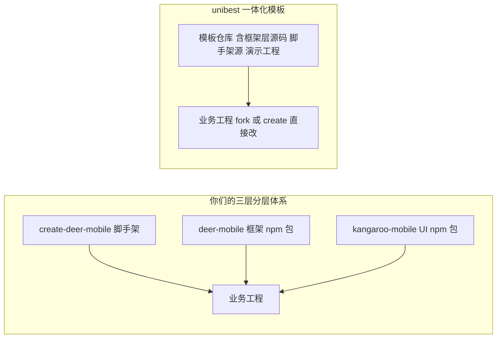
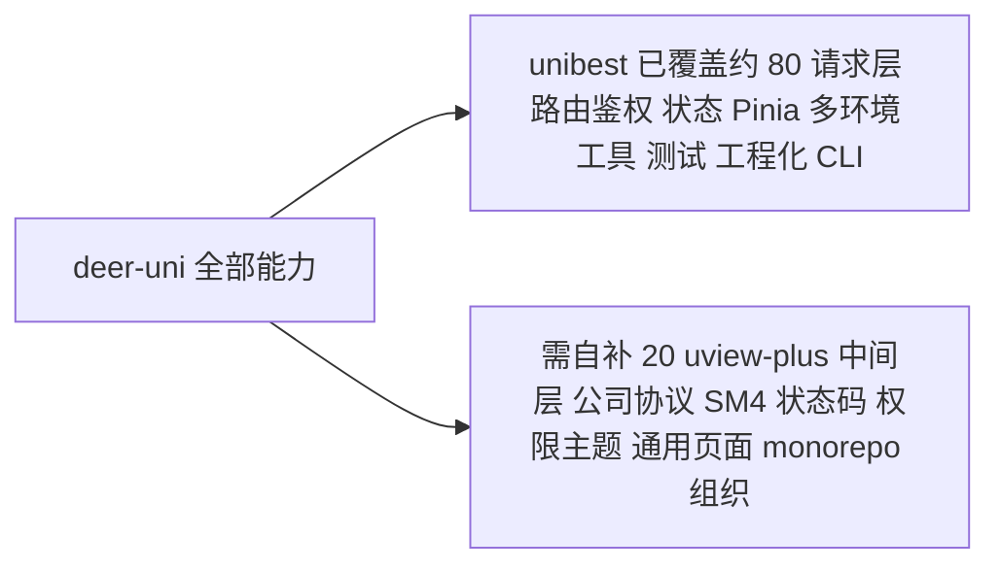

# unibest 对照分析：与 deer-uni 的关系与取舍

> **文档日期**：2026-08-07
> **分析对象**：unibest v4.4.1（`C:\Users\maoma\Develop\Personal\unibest`，开源仓库 `feige996/unibest`）
> **分析目的**：判断 unibest 是否与计划自研的 uniapp 业务框架 **deer-uni**（见 [`uniapp-uviewplus-architecture.md`](./uniapp-uviewplus-architecture.md)）类似，以及是「直接采用 / 改造」还是「从零自研」。
> **结论速览**：**非常类似，unibest 就是 uniapp 领域的「脚手架最佳实践模板」，已覆盖 deer-uni 约 80% 的框架层能力**。**但 deer-uni 定位为「全新自研项目」，不以 unibest 为底座**——unibest 仅作为**参考实现 / 抄作业来源**，借鉴其框架层写法（interceptor / permission / @uni-helper 插件链 / vite 配置）后，按你们三层体系（deer-uni + kangaroo-uni + create-deer-uni）从零搭建。

---

## 一、unibest 是什么

| 项 | 内容 |
|---|---|
| 定位 | uniapp「最佳实践」开发模板 / 脚手架（`pnpm create unibest` 创建项目） |
| 技术栈 | uniapp + Vue3 + TS + **Vite5** + **UnoCSS** + **wot-design-uni（wot-ui）** + **z-paging** + **alova** 请求库 + Pinia + persistedstate + vue-i18n + vue-router4 |
| 运行方式 | **无需 HBuilderX**，命令行 `pnpm dev:h5` / `dev:mp` / `dev:app`，编辑器推荐 VSCode |
| 平台兼容 | H5 / iOS / 安卓 / 微信 / 字节 / 快手 / 支付宝 / 钉钉 / 百度 |
| 工程化 | husky + lint-staged + commitlint + eslint（@uni-helper/eslint-config）+ vitest + changeset + openapi-ts + miniprogram-ci |

**与你们 dee-rmobile 的关系**：unibest 在 uniapp 世界的定位 ≈ deer-mobile 在 H5 世界的定位（都是「工程化脚手架 + 业务框架层」），但它没有插件系统，扩展靠目录约定 + hooks。

---

### 1.1 unibest 的角色定位：脚手架？框架？UI？

**一句话：unibest 是一个「一体化模板」——脚手架 + 框架层 + 演示工程耦合在同一个仓库里，而不是你们那样的三层分层 npm 包体系。**

对应你们现有分工：

| 你们的分工 | unibest 的对应 | 差异 |
|---|---|---|
| **create-deer-mobile**（脚手架，只生成骨架） | `pnpm create unibest`（CLI 生成工程） | 都有 CLI；unibest 生成的是「完整模板含框架源码」，create-deer-mobile 生成的是「空骨架 + 依赖框架包」 |
| **deer-mobile**（框架，npm 包可独立升级） | **无独立框架包**——框架层代码（http / router / store / interceptor）直接内嵌在模板里 | unibest 的框架逻辑与工程耦合，无法像 deer-mobile 那样 `npm install` + 独立升级 |
| **kangaroo-mobile**（UI 库，npm 包 + 中间层） | wot-ui（base-wot-ui 分支**直接裸用，无中间层**） | unibest 没有「基于 wot-ui 的二次封装中间层」 |

**核心差异（两种工程哲学）：**

- **你们的体系（推荐沿用）**：框架 / UI / 脚手架是独立 npm 包，多业务项目共享一份、可独立升级、monorepo 管理——企业级、可演进；
- **unibest 的模式**：一个模板 = 框架 + 脚手架 + 演示，用户 create / fork 后在模板上直接写业务，框架升级靠拉新模板对比合并——简单、上手快，但不利于多项目统一升级维护。

**对你们的含义**：不建议把 unibest 整个当「deer-uni」，而应**把它当作 deer-uni 的参考实现 + 脚手架模板来源**——按你们三层体系重建：借鉴它的框架层实现（interceptor / permission / @uni-helper 插件链 / vite 配置）放进 `packages/deer-uni`，wot-ui 二次封装放进 `packages/kangaroo-uni`，模板与 CLI 放进 `packages/create-deer-uni`。

---

## 二、unibest 已实现的能力（模块盘点）

| 模块 | 实现位置 | 说明 |
|---|---|---|
| 请求封装 | [`http/http.ts`](../unibest/src/http/http.ts)、[`http/alova.ts`](../unibest/src/http/alova.ts) | `uni.request` Promise 封装 + **alova** 双轨（alova 支持缓存 / 请求共享） |
| 请求拦截 | [`http/interceptor.ts`](../unibest/src/http/interceptor.ts) | `uni.addInterceptor('request'/'uploadFile')`：baseUrl 拼接、H5 代理、超时 60s、**token 注入**（`Authorization: Bearer`） |
| 登录拦截 | [`router/interceptor.ts`](../unibest/src/router/interceptor.ts)、[`router/permission.ts`](../unibest/src/router/permission.ts) | `addInterceptor('navigateTo'/'reLaunch'/'redirectTo'/'switchTab')` + 白名单 `EXCLUDE_LOGIN_PATH_LIST` + `toLoginPage` |
| 状态管理 | [`store/`](../unibest/src/store/index.ts)（token / user） | Pinia + persistedstate 持久化，token 带时间校验（`updateNowTime().validToken`） |
| 约定式路由 | `pages.config.ts` + `@uni-helper/vite-plugin-uni-pages` | 类约定式路由 + `vue-router4` 集成，页面生成类型提示 |
| 布局 / TabBar | [`layouts/default.vue`](../unibest/src/layouts/default.vue)、[`tabbar/`](../unibest/src/tabbar/config.ts) | layout 布局系统 + 自研 TabBar（含 store 状态） |
| Hooks | [`hooks/`](../unibest/src/hooks/useRequest.ts)（useRequest / useScroll / useUpload） | 组合式复用层 |
| 多语言 | vue-i18n（base-i18n 分支） | 基础分支不含，独立分支提供 |
| API 生成 | `openapi-ts-request` | 由后端 OpenAPI 自动生成请求代码与类型 |
| 工具层 | [`utils/`](../unibest/src/utils/index.ts)（systemInfo / debounce / uploadFile / toLoginPage / updateManager.wx） | 常用工具 + 微信更新管理器 |
| 测试 | vitest（store / hooks / tabbar） | 单元测试已就绪 |
| 小程序上传 | `miniprogram-ci` + [`scripts/upload-weixin.js`](../unibest/scripts/upload-weixin.js) | 命令行上传微信小程序 |

---

## 三、与 deer-uni 需求逐项对比

以主方案 [`4.4 框架交付清单`](./uniapp-uviewplus-architecture.md) 为基准：

| deer-uni 模块 | unibest 是否覆盖 | 差异 / 待补 |
|---|---|---|
| **请求层**（request / token / 状态码 / 超时 / 续约 / 加密 / loading / 取消） | ⚠️ 部分 | 有 request + token + 超时 + alova；**无业务状态码协议、无 SM4 加密、无 token 续约、无 loading 队列** |
| **路由鉴权**（addInterceptor + 白名单 + 回跳） | ✅ 已覆盖 | 白名单 / 登录拦截 / toLoginPage 都有 |
| **状态管理**（Pinia + 持久化 + user/dict/app/theme store） | ⚠️ 部分 | 有 token / user + 持久化；**无 dictionary / app / theme store** |
| **权限角色** | ❌ 未覆盖 | 需自研 |
| **多环境**（.env / mode / baseURL） | ✅ 已覆盖 | `getEnvBaseUrl` + `--mode test/production` |
| **工具层** | ✅ 已覆盖 | systemInfo / debounce / upload 等 |
| **全局样式主题** | ⚠️ 部分 | 有 UnoCSS + uni.scss；**无 uview-plus 主题定制、无暗黑** |
| **通用页面**（登录 / 404 / 错误 / 空状态） | ⚠️ 部分 | 有 demo 页，**无开箱登录 / 404 / 错误页** |
| **组件库中间层（kangaroo-uni）** | ❌ 未覆盖 | unibest 直接裸用 wot-ui + UnoCSS，**没有「基于 uview-plus 二次封装」的中间层** |
| **脚手架 CLI（create-deer-uni）** | ✅ 可复用 | `pnpm create unibest` 已是成熟 CLI，可直接改名沿用 |
| **工程规范** | ✅ 已覆盖 | husky / lint-staged / commitlint / eslint / vitest 全齐 |
| **monorepo 组织** | ❌ 不匹配 | unibest 是独立工程模板，不是 packages/ 结构，需纳入现有 monorepo |

**关键差异点：**

1. **UI 引擎不是 uview-plus**：unibest 用的 **wot-design-uni（wot-ui）**，而公司要求 **uview-plus**。两者都是 uni_modules 包，替换成本可控，但会连带主题变量 / 组件名 / 文档引用全部更换；
2. **无公司后端协议**：你们后端网关约定的「`Authorization` 不带 Bearer、成功 `^[1]`、登录超时 712/205/209、SM4 加密」在 unibest 中完全没有，需按 [`chs-app`](../apps/chs-app/src/utils/http.ts) 的协议平移补齐；
3. **请求库选型冲突**：unibest 深度集成 alova（缓存 / 请求共享 / adapter），而你们习惯自研 `HttpClient`（可控性高）。可保留 alova 亦可换回自研 `uni.request` 封装，二选一需定夺；
4. **形态差异**：unibest 是独立模板仓库，若要纳入 `packages/` monorepo，需改造为「`deer-uni` 骨架 + `create-deer-uni` 模板」的双包形态。

---

## 四、覆盖度结论

- **已覆盖（可直接继承）**：请求拦截（addInterceptor + token）、登录/路由拦截、Pinia 持久化、多环境、约定式路由 + vue-router、i18n、layout / tabbar、hooks、测试、工程规范、CLI 脚手架、openapi 代码生成。
- **需自补（unibest 没有的）**：基于 uview-plus 的中间层组件库（kangaroo-uni）、公司后端协议（SM4 / 状态码 `^[1]` / 712 / 205 / 209 / token 无 Bearer / 续约）、权限角色、通用页面（登录 / 404 / 错误 / 空状态）、theme 暗黑、monorepo 化。

---

## 五、三条路线建议

| 路线 | 做法 | 优点 | 缺点 | 建议 |
|---|---|---|---|---|
| **A** | 基于 unibest fork 改造为 deer-uni | 少踩坑、快 | 受其约定约束、非「自研」、与 unibest 升级耦合 | 不采用 |
| **B** ★ | **全新自研 deer-uni，参考 unibest 实现**（interceptor / permission / @uni-helper 插件链 / vite 配置） | 完全自主、与 deer-mobile 风格统一；照搬 unibest 已验证方案可少踩坑 | 工程化坑仍需自己验证一遍 | **用户已选定** |
| **C** | 完全从零且不看 unibest | 最纯粹 | 重复造轮子、交付慢 | 不推荐 |

> 关键判断：**deer-uni 走全新自研路线（B）**。unibest 当作「已验收的最佳实践源码」参考——它的 interceptor / permission / @uni-helper 插件链 / vite 配置都是被验证过的，直接借鉴能省大量踩坑时间，同时保持代码与 deer-mobile 风格一致、无第三方模板耦合。

---

## 六、对主方案的影响与调整建议

1. **P0 定位**：deer-uni 为**全新自研项目**，不以 unibest 为底座；先创建独立工程验证可行性（P0），再逐步建设；
2. **参考范围明确**：参考 unibest 的框架层实现（http / interceptor、router / permission、store 持久化、@uni-helper 插件链、vite.config 配置），照搬其被验证的工程化方案；
3. **请求层**：自研 `uni.request` 封装承载公司协议（SM4 / 状态码 `^[1]` / 712 / 205 / 209 / token 续约），不依赖 alova，保持与 deer-mobile `HttpClient` 一致；
4. **UI 引擎**：wot-ui 作为底层，自建 `kangaroo-uni` 中间层（easycom + 主题 + 透传）；
5. **组织形态**：独立工程先行（P0 验证），后续再决定 monorepo 化与 `create-deer-uni` 脚手架；
6. **版权**：借鉴实现不受 unibest MIT 约束，但若直接复制其代码片段，需保留原作者 LICENSE 注明。

---

## 七、wot-ui 引入方式澄清（unibest 是多分支设计）

你问「unibest 是直接安装 wot-ui 来使用吗？」——**不完全是**：

- 当前这份 unibest（v4.4.1）是 **base 主分支，并未内置 wot-ui**：`package.json` 的 dependencies 里**没有** `wot-design-uni`，[`TabbarItem.vue`](../unibest/src/tabbar/TabbarItem.vue:23) 里也注释着「请根据选择的 UI 库自行替换」；
- unibest 采用**多 UI 库分支**设计（git 可见 `base-wot-ui`、`base-uview-pro`、`wot-ui`、`uview-pro` 等分支）：**主分支不带 UI 库**，各 UI 库有独立分支，或由用户自行安装；
- 规则文档（`.cursor` / `.trae`）明确支持 `wot-ui` / `uview-pro` / `uv-ui` / `sard-ui` / `uview-plus` 等多种第三方组件库 + z-paging。

**对你的含义**：你已决定用 **wot-ui**，两条路任选：

1. 直接切 unibest 的 **`base-wot-ui` 分支**作为 deer-uni 底座（官方已配好 wot-ui + 主题变量）；
2. 或在 base 分支自行 `pnpm add wot-design-uni` 并配置（[`tabbar/types.ts`](../unibest/src/tabbar/types.ts:23) 的 `uiLib` 字段本就支持多 UI 库切换）。

> 这也意味着主方案里「是否强制 uview-plus」的决策可关闭——**你已决定用 wot-ui**。若公司后续强制 uview-plus，再从 wot-ui 切换到 unibest 的 uview-pro 分支即可（低成本）。

---

## 八、UnoCSS 是什么、为什么建议用它而不是 Tailwind

### 8.1 UnoCSS 是什么

**UnoCSS 是一个「原子化 CSS 引擎」**，和 Tailwind 是同一类东西，但实现不同：

- **按需生成**：扫描代码里的 class 名，只生成用到的原子类对应 CSS；
- **零运行时、零构建产物**：不产出完整 CSS 文件，构建时动态生成；
- **高度可定制**：preset / rules / shortcuts / transformers 体系；
- uniapp 里用 [`@uni-helper/unocss-preset-uni`](https://www.npmjs.com/package/@uni-helper/unocss-preset-uni) 适配：自动处理 `rpx`、平台差异、小程序选择器兼容、低端安卓颜色兼容（unibest 的 [`uno.config.ts`](../unibest/uno.config.ts:15) 已配好）。

它给你的体验就是 Tailwind 那套：`flex justify-center items-center text-primary`、`@apply` 指令、`hover:` 变体、`()` 分组（unibest 的 [`uno.config.ts`](../unibest/uno.config.ts:63) 已启用 transformerDirectives + transformerVariantGroup）。

### 8.2 为什么 uniapp 里不建议直接用 Tailwind

- Tailwind 官方面向 Web，**小程序端 WXSS 不支持它生成的部分复杂选择器**（`:hover`、后代 `>`、任意值 `[` 等受限），类名含 `:` `/` `[` 等字符在小程序有兼容 / 转义问题；
- 要用需引入 **weapp-tailwindcss** 做桥接，方案链脆弱、社区维护一般；
- 而 **UnoCSS 的 `preset-wind`（wind 预设）提供与 Tailwind 100% 兼容的类名与语法**（`flex`、`px-4`、`bg-red-500`、`sm:`、`@apply`），引擎更轻、跨端兼容更好。

### 8.3 结论

| 方案 | 跨端（小程序 / App） | Tailwind 语法体验 | 维护成本 |
|---|---|---|---|
| Tailwind + weapp-tailwindcss | 需桥接，有坑 | ✅ 原生 | 中 |
| **UnoCSS + preset-wind**（★） | ✅ unibest 已配好 | ✅ 100% 兼容 | 低 |

**建议：直接沿用 unibest 的 UnoCSS，不引入 tailwindcss**。你想要 Tailwind 的写法，通过 `@unocss/preset-wind`（unibest 默认 `presetUni` 内含 wind 语义）即可获得，且已适配 uniapp 各端，无需额外桥接层。

---

## 附：待办事项（在主方案基础上追加）

- [ ] P0：确认 UI 库选型（已倾向 wot-ui，关闭 uview-plus 议题，除非公司强制）
- [ ] P0：fork unibest 作为 deer-uni 底座，跑通 `pnpm dev:h5` 与 `dev:mp`
- [ ] P0：决策请求层走 alova 保留 or 自研 uni.request 封装
- [ ] P1：将 unibest 改造为 monorepo 双包形态（deer-uni + create-deer-uni）
- [ ] P1：按公司协议重写 http 层（SM4 / 状态码 `^[1]` / 712 / 205 / 209 / token 无 Bearer / 续约）
- [ ] P1：接入 wot-ui（切 base-wot-ui 分支或自行安装）并开始封装 kangaroo-uni 中间层
- [ ] P1：沿用 unibest 的 UnoCSS（含 wind 预设），不引入 tailwindcss
- [ ] P2：补齐权限角色、通用页面（登录 / 404 / 错误 / 空状态）、theme 暗黑
- [ ] P4：迁移一个真实业务页面，H5 + 微信小程序双端验证全链路
