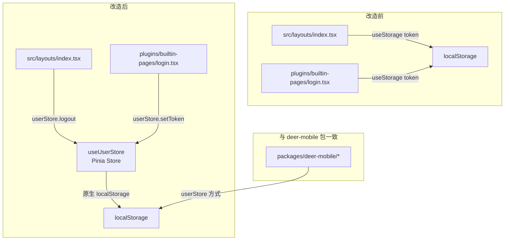

# 统一 Token 管理方案：消除 useStorage，统一使用 Pinia userStore

## 背景

项目是 monorepo 结构，三个发布包：`create-deer-mobile`（脚手架）、`deer-mobile`（框架）、`kangaroo-mobile`（UI 组件库）。根目录 `src/` 和 `plugins/` 是 demo 开发调试层。

当前 token 管理存在 **两套写法不一致** 的问题：

| 层级 | 文件 | Token 管理方式 |
|------|------|---------------|
| **deer-mobile 包** | `packages/deer-mobile/src/layouts/index.tsx` | ✅ `useUserStore().logout()` |
| **deer-mobile 包** | `packages/deer-mobile/plugins/builtin-pages/login.tsx` | ✅ `userStore.setToken()` |
| **deer-mobile 包** | `packages/deer-mobile/src/stores/userStore.ts` | ✅ 原生 localStorage |
| **deer-mobile 包** | `packages/deer-mobile/plugins/auth-plugin.ts` | ✅ `localStorage.getItem('token')` |
| **demo 层** | `src/layouts/index.tsx` | ❌ `useStorage('token', '')` ← 旧写法 |
| **demo 层** | `plugins/builtin-pages/login.tsx` | ❌ `useStorage('token', '')` ← 旧写法 |

## 改造目标

将 demo 层两处残留的 `useStorage` 替换为 Pinia `userStore`，与 deer-mobile 包的写法保持一致。

## 架构影响图

## 详细步骤

### 步骤 1：改造 `plugins/builtin-pages/login.tsx`

**文件：** [`plugins/builtin-pages/login.tsx`](plugins/builtin-pages/login.tsx)
**参考对象：** [`packages/deer-mobile/plugins/builtin-pages/login.tsx`](packages/deer-mobile/plugins/builtin-pages/login.tsx)

改动点：
1. 移除 `import { useStorage } from '@vueuse/core'`
2. 新增 `import { useUserStore } from 'deer-mobile/stores'`
3. 将 `const token = useStorage('token', '')` 替换为 `const userStore = useUserStore()`
4. 将 `token.value = res.data.token` 替换为 `userStore.setToken(res.data.token)`

### 步骤 2：处理 `src/layouts/index.tsx`

**⚠️ 关键发现：** 根目录的 [`plugins/setup-plugin.ts:39`](plugins/setup-plugin.ts) 生成的虚拟模块中，Layout 是 `import Layout from 'deer-mobile/layouts'`，它引用的是 deer-mobile 包的布局（即 [`packages/deer-mobile/src/layouts/index.tsx`](packages/deer-mobile/src/layouts/index.tsx)），**而非** 根目录的 `src/layouts/index.tsx`。

因此 [`src/layouts/index.tsx`](src/layouts/index.tsx) 很可能是**死代码**（遗留下来的旧文件）。处理方法：

**选项 A（推荐）：直接删除 `src/layouts/index.tsx`**
- 理由：setup-plugin 已使用 `deer-mobile/layouts`，此文件不再被引用
- 需要先确认没有其他文件 import 它（搜索 `@/layouts` 或 `src/layouts` 引用）

**选项 B：保留并按 deer-mobile 风格改造**
- 如果未来想要让 demo 层可以独立于 deer-mobile 运行，则保留并改造
- 将 `useStorage` 替换为 `useUserStore`

### 步骤 3：验证与清理

1. 运行 `npm run build` 或 `npx vite build` 验证构建通过
2. 确认 `@vueuse/core` 是否还有其他地方使用（如无可考虑移除依赖）

## 注意事项

1. `plugins/builtin-pages/login.tsx` 中的 `useApi` 用的是 `@/composables/useApi`（通过 vite alias），需要保留
2. `auth-plugin.ts` 中路由守卫直接用 `localStorage.getItem('token')` 不需改动，因为这是 server 端 transform 代码，不需要响应式
3. 改造后记得检查 `noUnusedLocals: true` 的 tsconfig 配置不会报错
